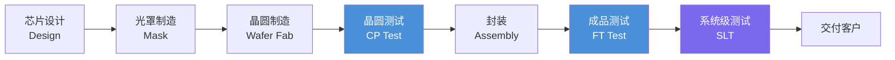
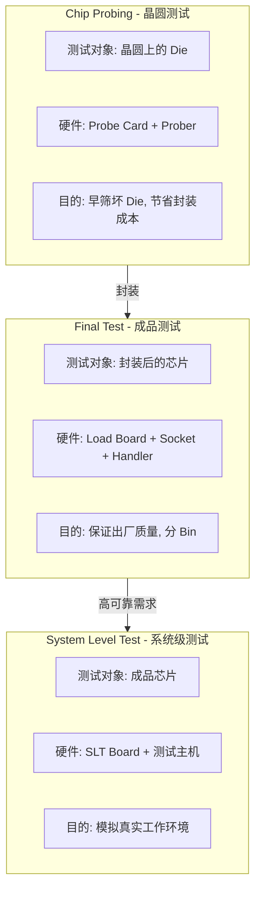
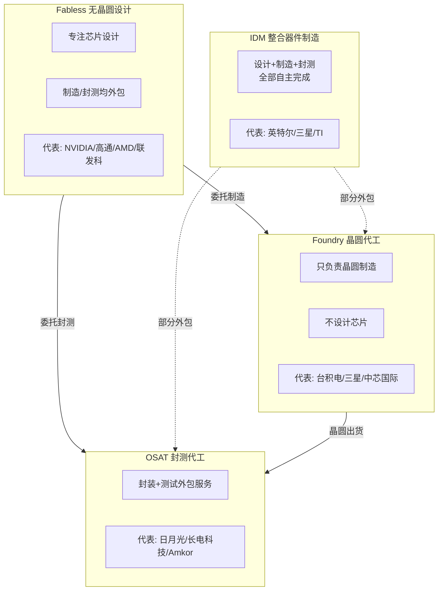
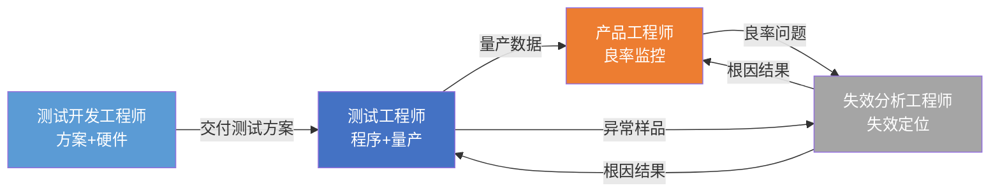

---
tags:
  - ate
  - industry
  - semiconductor
created: 2026-06-14
---

# 1. 行业认知

> 🔗 文中的 **彩色高亮词** 均可点击跳转到文末 [[#术语解释|术语解释]] 查看详细说明。

## 什么是ATE测试

> 图：Advantest V93000 单一可扩展平台，从 A 级到 L 级全系列兼容。[来源：CSDN](https://blog.csdn.net/flomingo1/article/details/139294697)

> 图：数字测试与模拟测试——ATE 最基本的两大测试类型。[来源：CSDN](https://blog.csdn.net/qq_50998481/article/details/138493220)

简单来说，**ATE（Automatic Test Equipment，自动化测试设备）** 就是一台"芯片质检员"——它通过计算机控制精密仪器，向被测芯片（[[#dut|DUT]]）施加电信号（[[#stimulus|Stimulus]]），然后"听"芯片的回答（[[#response|Response]]），从而判断这颗芯片的功能、性能和可靠性是否合格。

> 💡 **核心价值**：ATE 测试是芯片出厂前的**最后一道质量关卡**。测试程序的一个 Bug 可能导致整批芯片错判，直接关系到工厂的 [[#yield|良率（Yield）]] 和客户信任。

### ATE测试的特点

相比人工测试，ATE 有四大核心优势，这也是为什么芯片量产测试必须依赖 ATE：

| 特点 | 说明 | 为什么重要 |
|------|------|-----------|
| **高速度** | 毫秒级完成数千个 [[#test vector\|测试向量（Test Vector）]] 执行 | 一颗芯片测试成本直接取决于测试时间 |
| **高精度** | pA级电流、μV级电压测量精度 | 芯片参数越先进，精度要求越高 |
| **高并行度** | 可同时测试 32/64/128 颗芯片 | 并行度越高，单颗测试成本越低 |
| **可编程** | 不同芯片只需更换测试程序和硬件 | 同一台 ATE 可以测试多种芯片 |

> 图：晶圆（Wafer）——芯片制造的"画布"，所有电路都刻在上面。[来源：CSDN](https://blog.csdn.net/chenhuanqiangnihao/article/details/114963311)

### 参考链接

- [ATE测试是什么？半导体自动化测试完整指南 - 上海德垲检测](https://www.jiancechip.com/ate-testing-complete-guide.html)
- [ATE测试概述 - ICTest8 专业集成电路测试网](http://www.ictest8.com/a/Principle/2025/01/ATE3.html)
- [ATE测试—新手入门学习 - ICTest8](http://www.ictest8.com/a/engineering/2024/10/ATE.html)
- [Semiconductor Testing Basics - Power's Wiki](https://wiki-power.com/en/%E5%8D%8A%E5%AF%BC%E4%BD%93%E6%B5%8B%E8%AF%95%E5%9F%BA%E7%A1%80-%E5%9F%BA%E6%9C%AC%E6%A6%82%E5%BF%B5/)
- [Automated Test Equipment Market Report - Grand View Research](https://www.grandviewresearch.com/industry-analysis/automated-test-equipment-market)

---

## 测试在半导体产业链中的位置

一颗芯片从"概念"到"产品"，需要经过设计、制造、封装、测试等多个环节。**ATE 测试处于后道工序（Back-End）**，是芯片交付前的最后一道质量关卡。

> 图：测试机分类——模拟/混合、SoC、存储、RF 等。[来源：CSDN](https://blog.csdn.net/flomingo1/article/details/139294697)

### 芯片生产全流程

> 图：泰瑞达 UltraFLEXplus——行业仅有的两款 3nm 测试首发平台之一。[来源：CSDN](https://blog.csdn.net/flomingo1/article/details/139294697)

### 关键说明

> 🔑 三个必须记住的要点：

1. 测试贯穿整个制造流程，但**核心 ATE 测试集中在 [[#cp / ft / slt 区别|CP 和 FT]] 两个环节**
2. 典型流程：在 [[#fab|Fab]] 端完成 [[#wafer|晶圆]] 制造 → CP 测试剔除坏 [[#die|Die]] → 封装 → FT 测试保证成品质量
3. **测试成本**约占芯片总制造成本的 **5%~15%**，先进制程芯片可达 20% 以上——这意味着测试效率的提升直接影响利润

### 参考链接

- [芯片ATE测试基础——从流片到大规模量产 - 21ic视频公开课](https://open.21ic.com/open/lesson/6333)
- [Chip Testing: A Comprehensive Overview - Boardor](https://boardor.com/blog/chip-testing-a-comprehensive-overview)
- [Semiconductor Test Equipment Market Analysis - Mordor Intelligence](https://www.mordorintelligence.com/industry-reports/semiconductor-test-equipment-market)

---

## CP / FT / SLT 区别

这是 ATE 测试工程师必须掌握的**核心概念**。简单理解：CP 是"体检"（封装前筛掉坏的），FT 是"终检"（封装后确保质量），SLT 是"模拟实战"（在真实环境下验证）。

### 流程关系图

下图展示了三种测试的流转关系。涉及的硬件包括：[[#probe card|Probe Card（探针卡）]]、[[#prober|Prober（探针台）]]、[[#load board|Load Board（负载板）]]、[[#socket|Socket（测试座）]]、[[#handler|Handler（分选机）]]。

> 图：探针台（Prober）——CP 测试中负责传送晶圆、精准定位的设备。[来源：CSDN](https://blog.csdn.net/qq_50998481/article/details/138493220)

> 图：分选机（Handler）——FT 测试中自动搬运芯片、按 Bin 分拣的设备。[来源：CSDN](https://blog.csdn.net/qq_50998481/article/details/138493220)

**CP 测试的核心硬件**是 [[#probe card|Probe Card]] + [[#prober|Prober]]，常见的探针卡有三种类型：

> 图：刀片探针卡（Blade Probe Card）——最常见的类型，探针从侧面伸出。[来源：CSDN](https://blog.csdn.net/flomingo1/article/details/141652432)

> 图：悬臂式探针卡（Cantilever）——探针从悬臂梁伸出，适合中低密度测试。[来源：CSDN](https://blog.csdn.net/qq_50998481/article/details/138493220)

> 图：垂直式探针卡（Vertical）——探针垂直排列，适合高密度 SoC/Memory 测试。[来源：CSDN](https://blog.csdn.net/qq_50998481/article/details/138493220)

**FT 测试的核心硬件**是 [[#load board|Load Board]] + [[#socket|Socket]] + [[#handler|Handler]]：

> 图：负载板（Load Board）——ATE 信号到芯片之间的"桥梁"。[来源：CSDN](https://blog.csdn.net/qq_50998481/article/details/138493220)

> 图：测试座（Socket）——芯片的"临时插座"，不同封装需要定制 Socket。[来源：CSDN](https://blog.csdn.net/qq_50998481/article/details/138493220)

> 📌 **小贴士**：CP 测试的对象是晶圆上未经切割的 [[#die|Die（晶粒）]]；FT 测试完成后根据结果对芯片进行 [[#bin|Bin（分档）]]，Bin1 为合格品。

### 详细对比

| 对比维度 | CP (晶圆测试) | FT (成品测试) | SLT (系统级测试) |
|---------|-------------|-------------|----------------|
| **测试时机** | 封装前 | 封装后 | 最终出厂前 |
| **硬件** | [[#probe card|Probe Card]] + [[#prober|Prober]] | [[#load board|Load Board]] + [[#handler|Handler]] | SLT Board |
| **温度** | 常/高/低温 | 常/高/低温 | 通常常温 |
| **并行度** | 32~128 [[#die|Die]] 同时 | 4~32 颗同时 | 单颗或多颗 |
| **成本** | 中等 | 较高 | 最高 |
| **覆盖率** | 中 | 高 | 最高 |
| **主要目的** | 早筛坏 [[#die|Die]] | 质量把关 | 系统级验证 |

### 参考链接

- [What Tests Are Required for Chips? - Boardor](https://boardor.com/blog/what-tests-are-required-for-chips)
- [Semiconductor IC Testing: Comprehensive Analysis - Substack](https://tspasemiconductor.substack.com/p/semiconductor-ic-testing-a-comprehensive)
- [Commonly used methods for chip testing - Perceptive](http://www.perceptive-ic.com/news-detailed/What-are-the-commonly-used-methods-for-chip-testing)

---

## OSAT / Fabless / Foundry / IDM 模式

半导体行业有四种主流商业模式。理解它们的关键在于搞清楚一个问题：**谁做设计？谁做制造？谁做封测？**

### 商业模式关系图

> 图：芯片封装测试全流程概览。[来源：CSDN](https://blog.csdn.net/chenhuanqiangnihao/article/details/114963311)

### 四种模式对比

| 模式 | 设计 | 制造 | 封测 | 典型公司 | 特点 |
|------|------|------|------|---------|------|
| **[[#idm\|IDM]]** | ✅ | ✅ | ✅ | 英特尔、三星、TI | 垂直整合、资产重 |
| **[[#fabless\|Fabless]]** | ✅ | ❌外包 | ❌外包 | NVIDIA、高通、AMD | 轻资产、专注设计 |
| **[[#foundry\|Foundry]]** | ❌ | ✅ | ❌ | 台积电、中芯国际 | 工艺领先、规模效应 |
| **[[#osat\|OSAT]]** | ❌ | ❌ | ✅ | 日月光、长电科技 | 封测专业服务 |

### 对ATE测试工程师的意义

不同模式下，测试工程师的工作环境和侧重点差异很大：

- 在 **[[#osat\|OSAT]]** 工作：接触最多样的芯片类型，测试流程标准化，适合快速积累经验
- 在 **[[#idm\|IDM]]** 工作：参与全流程，能深入理解设计→制造→测试的完整链路
- 在 **[[#fabless\|Fabless]]** 工作：负责测试方案制定，需要频繁与 [[#osat\|OSAT]] 和 [[#foundry\|Foundry]] 沟通协调

### 参考链接

- [Fab/Foundry/Fabless/OSAT/EMS 半导体供应链解析 - ResearchMFG](https://www.researchmfg.com/2026/03/fab-foundry-fabless-osat-ems/)
- [半导体产业全貌：从IDM到无厂半导体](https://jyforex.com/semiconductor-industry-structure-2026/)
- [IDM/Fabless/Foundry模式的区别与竞争 - ETime](https://www.etime.net.cn/site/articalInfo.php?NewsID=76040&Type=1)
- [半导体三大模式：IDM/Fabless/Foundry - CSDN](https://blog.csdn.net/qq_42078934/article/details/147126470)

---

## 测试工程师岗位类型

芯片测试领域有多种细分岗位，各自侧重点不同。下面这张图说明了测试机在整个后道检测设备中的重要地位——占比超过 60%。

> 图：所有后道检测设备中，测试机占比 63.1%。[来源：CSDN](https://blog.csdn.net/flomingo1/article/details/139294697)

### 岗位职责对比

| 岗位名称 | 英文 | 核心职责 | 技能侧重 |
|---------|------|---------|---------|
| **测试工程师** | [[#te\|Test Engineer (TE)]] | ATE程序开发、调试与Release | ATE平台操作、编程、Debug |
| **测试开发工程师** | [[#tde\|Test Development Engineer (TDE)]] | 测试方案制定、硬件设计、测试IP开发 | 硬件设计、[[#dft\|DFT]]、系统架构 |
| **产品工程师** | [[#pe\|Product Engineer (PE)]] | 良率监控、测试数据分析、量产维护 | 数据分析、统计、沟通协调 |
| **良率工程师** | Yield Engineer | [[#yield\|良率]]提升、缺陷分析、工艺改善 | 数据分析、SPC、Fault分析 |
| **失效分析工程师** | [[#fa\|FA Engineer]] | 失效定位、根因分析、物理分析 | 分析仪器(SEM/FIB/X-Ray)、电路分析 |

### 岗位协作关系

> 各岗位职责和技能要求详见 [[#te|TE]]、[[#tde|TDE]]、[[#pe|PE]]、[[#fa|FA]] 术语解释。

### 薪资与发展前景（2026 参考）

| 岗位 | 应届起薪（国内） | 3~5年经验 | 发展路径 |
|------|----------------|----------|---------|
| **测试工程师 TE** | 12~18K/月 | 20~35K/月 | TE → 高级 TE → 测试经理 |
| **测试开发 TDE** | 15~22K/月 | 25~40K/月 | TDE → 架构师 → 技术总监 |
| **产品工程师 PE** | 12~18K/月 | 20~35K/月 | PE → 高级 PE → 产品经理 |
| **失效分析 FA** | 10~16K/月 | 18~30K/月 | FA → 高级 FA → 实验室负责人 |

> 💡 **入行建议**：对于初学者，**测试工程师（TE）** 是最友好的入门岗位——门槛相对较低，能快速接触 ATE 平台和实际测试流程，是后续转 TDE 或 PE 的绝佳跳板。

### 参考链接

- [ATE测试工程师需要具备什么能力？ - ICCOACH](https://ic.coachip.cn/article/detail/750)
- [ATE测试工程师的职业展望 - 电子工程专辑](https://www.eet-china.com/mp/a258357.html)
- [ATE怎么入门？如何进阶？薪资天花板 - 与非网](https://www.eefocus.com/article/1784157.html)
- [ATE测试工程师究竟是干啥的？ - ICTest8](http://www.ictest8.com/a/experience/2024/11/ATE.html)
- [ATE测试工程师的职业展望 - SegmentFault](https://segmentfault.com/a/1190000044303592)
- [2026 Semiconductor Industry Outlook - Deloitte](https://www.deloitte.com/us/en/insights/industry/technology/technology-media-telecom-outlooks/semiconductor-industry-outlook.html)

---

## 术语解释

> 本章专业名词统一解释。**点击正文中的蓝色词**即可跳转到对应的解释位置。

### 芯片与晶圆相关

#### Stimulus
**全称**：—　｜　**中文**：激励/刺激信号

ATE 向 DUT 施加的输入信号（电压、电流、时序波形等），用来"问"芯片问题。

#### Response
**全称**：—　｜　**中文**：响应/应答信号

DUT 接收到 Stimulus 后产生的输出信号，ATE 采集它来判断芯片是否合格。

#### Die
**全称**：—　｜　**中文**：晶粒/裸片

晶圆上每一个独立的小方块就是一个 Die，切割后就是一个芯片。一片晶圆上有成百上千个 Die。

#### Wafer
**全称**：—　｜　**中文**：晶圆/晶片

圆形的硅薄片，芯片就是在它上面"刻"出来的。常见尺寸有 6/8/12 英寸。

#### DUT
**全称**：Device Under Test　｜　**中文**：被测器件

正在被 ATE 机台测试的那颗芯片。无论什么测试，被测试的对象都叫 DUT。

#### IC
**全称**：Integrated Circuit　｜　**中文**：集成电路

就是我们常说的"芯片"，把晶体管、电阻、电容等集成在一个半导体基片上。

### CP测试硬件

#### Probe Card
**全称**：—　｜　**中文**：探针卡

CP 测试用的"接口"。上面有很多细如发丝的探针，精确扎到晶圆上每个 Die 的焊盘（Pad）上，建立电气连接。

#### Prober
**全称**：—　｜　**中文**：探针台

CP 测试用的"机械手"。负责传送晶圆、精准定位、让 Die 对准 Probe Card 的探针，测试完一个就移到下一个。

### FT测试硬件

#### Load Board
**全称**：DIB (Device Interface Board)　｜　**中文**：负载板

FT 测试用的"接口板"。上面装有 Socket，ATE 机台的信号通过 Load Board 传到芯片引脚。

#### Socket
**全称**：—　｜　**中文**：测试座

芯片插进去的"插座"，用于建立芯片引脚与 Load Board 之间的连接。不同封装（QFP/BGA/SOP 等）需要不同的 Socket。

#### Handler
**全称**：—　｜　**中文**：分选机/机械手

FT 测试用的"搬运工"。自动把芯片送入测试位，测完根据 Bin 结果分到不同料盘（Pass/Fail/Retest）。

### ATE机台核心部件

#### Test Head
**全称**：—　｜　**中文**：测试头

ATE 机台的"脑袋"，里面集成了 Pin Electronics 板卡，负责产生测试信号和采集响应。

#### Pin Electronics
**全称**：Pin Electronics　｜　**中文**：引脚电子

每一根芯片引脚对应的驱动/比较电路，负责向引脚发信号并检测输出。

#### DPS
**全称**：Device Power Supply　｜　**中文**：器件电源

给 DUT 供电的精密电源，可以精确控制电压/电流。

#### PMU
**全称**：Parametric Measurement Unit　｜　**中文**：参数测量单元

精密测量单元，用于测电压、电流、电阻等直流参数，精度可达 pA/μV 级别。

#### Timing Generator
**全称**：—　｜　**中文**：时序发生器

产生精确的测试时序信号（周期、边沿位置、脉冲宽度等），决定测试向量的时域精度。

#### Digitizer
**全称**：—　｜　**中文**：数字化仪

把模拟信号（如 ADC 输出波形）采集并转换成数字数据进行分析。

### 测试流程与数据相关

#### Test Vector
**全称**：—　｜　**中文**：测试向量

一组预先定义好的输入信号组合，ATE 将其施加到 DUT 引脚，同时检测输出是否与预期一致。类似"考卷的答案"。

#### Test Pattern
**全称**：—　｜　**中文**：测试图样/模式

由多个 Test Vector 组成的序列，通常用来测试芯片的某个特定功能或扫描链。

#### Bin
**全称**：—　｜　**中文**：分档

根据测试结果给芯片分类。Bin1=Pass，其余 Bin=不同类型的 Fail。例如"Bin2=短路"、"Bin3=功能异常"。

#### Yield
**全称**：—　｜　**中文**：良率

Pass 的芯片数 / 总测试芯片数 × 100%。这是工厂最核心的 KPI 之一。

#### Test Coverage
**全称**：—　｜　**中文**：测试覆盖率

测试能检测到的故障占所有可能故障的比例。覆盖率越高，漏测风险越低。

#### Guard Band
**全称**：—　｜　**中文**：保护带

在规格限内部预留的安全余量。例如芯片要求 1.0V，实际测到 0.98V~1.02V 范围才判 Pass，留下余量应对环境波动。

### 产业链相关

#### Fab
**全称**：Fabrication Facility　｜　**中文**：晶圆厂

制造晶圆的工厂。投资巨大，一座先进 Fab 要上百亿美元。

#### Foundry
**全称**：—　｜　**中文**：晶圆代工厂

专门帮别人代工晶圆的公司，如台积电、中芯国际。

#### Fabless
**全称**：—　｜　**中文**：无晶圆设计公司

只设计芯片、不自己建厂的公司，如 NVIDIA、高通。

#### OSAT
**全称**：Outsourced Semiconductor Assembly and Test　｜　**中文**：封测代工厂

专门做封装和测试外包的公司，如日月光、长电科技。

#### IDM
**全称**：Integrated Device Manufacturer　｜　**中文**：整合器件制造商

设计、制造、封测全都自己干的公司，如英特尔、三星、TI。

### 测试工程师相关

#### TE
**全称**：Test Engineer　｜　**中文**：测试工程师

负责 ATE 程序开发、调试和量产 Release，一线测试工程师。

#### TDE
**全称**：Test Development Engineer　｜　**中文**：测试开发工程师

制定测试方案、设计测试硬件、开发测试 IP。

#### PE
**全称**：Product Engineer　｜　**中文**：产品工程师

监控良率、分析测试数据、协调量产维护。

#### FA
**全称**：Failure Analysis　｜　**中文**：失效分析

分析芯片失效原因，用 SEM/FIB/X-Ray 等设备定位缺陷。

#### DFT
**全称**：Design for Test　｜　**中文**：可测性设计

在设计阶段就加入测试友好的电路结构（如 Scan Chain），让 ATE 更容易测试芯片。

> 💡 **提示**：这些术语会随着学习进度不断出现，建议建立自己的 [[术语表]] 随时记录。
