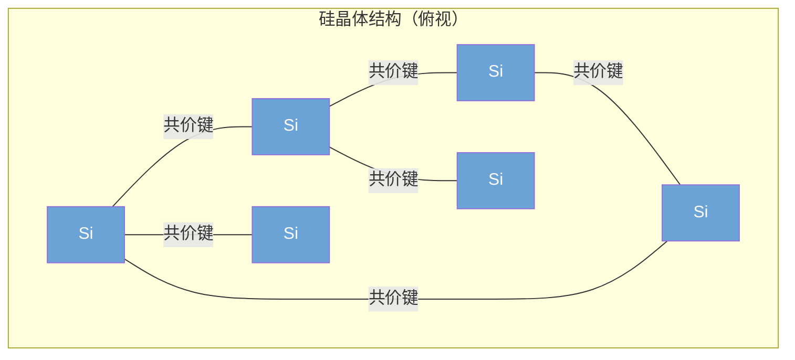
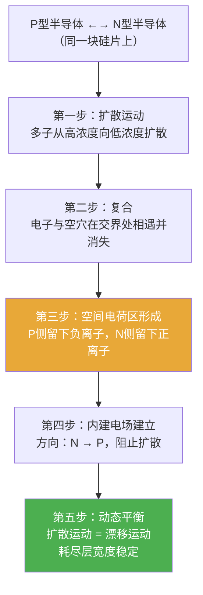
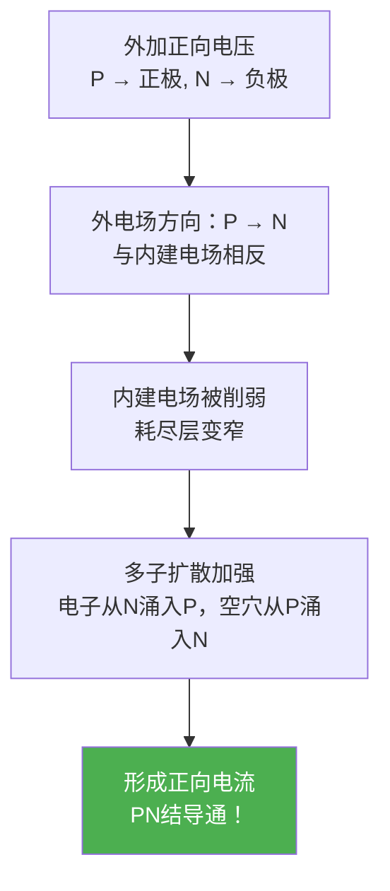
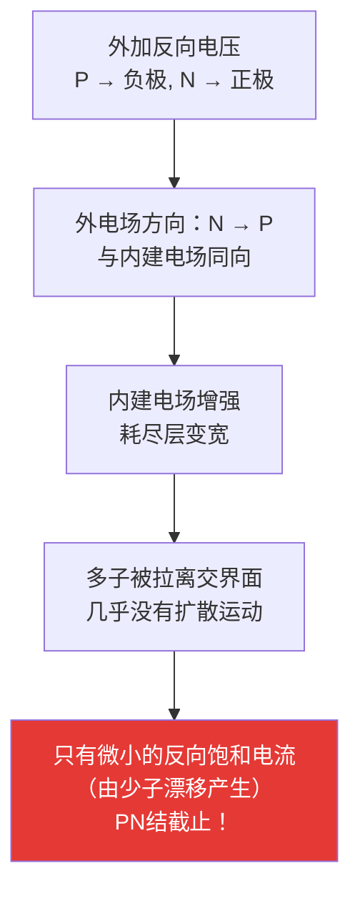
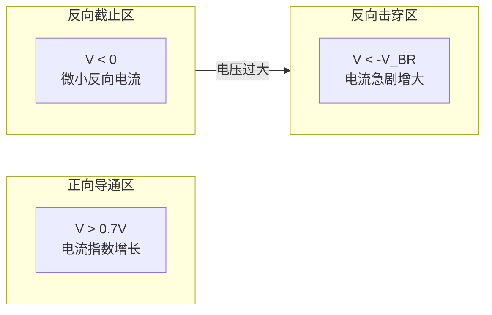

---
tags:
  - ate
  - semiconductor
  - physics
  - chapter2
created: 2026-06-14
---

# 2.1 PN结与载流子

> 🔗 文中的 **彩色高亮词** 均可点击跳转到文末 [[#术语解释|术语解释]] 查看详细说明。
> 📌 **前置要求**：建议先阅读 [[01.行业与基础认知/01.行业认知|第1章：行业认知]]。

## 为什么测试工程师要学半导体物理？

很多同学会问：我是做 ATE 测试的，为什么要学 PN 结？

答案很简单：**你测的每一颗芯片，本质上都是由无数个 PN 结组成的。** 如果你不理解 PN 结的正向导通、反向截止、漏电流（[[#leakage|Leakage]]）和击穿机制，你就无法真正理解芯片测试中的 [[#iddq|IDDQ]] 测试、Open/Short 测试和 [[#esd|ESD]] 失效。

> 💡 **一句话总结**：PN 结是半导体器件的"原子"——二极管、三极管、MOSFET、CMOS，全都建立在 PN 结之上。

---

## 硅：半导体的基础材料

### 为什么是硅？

硅（Silicon, Si）是地壳中第二丰富的元素。它之所以成为半导体工业的基石，有三个关键原因：

| 特性 | 说明 |
|------|------|
| **带隙适中** | 1.12 eV — 既不是导体也不是绝缘体，可以通过掺杂精确控制导电性 |
| **氧化物优良** | SiO₂ 是天然的优质绝缘层，这是硅基 MOSFET 成功的关键 |
| **资源丰富** | 沙子（SiO₂）中提取，成本可控 |

### 硅的晶体结构

硅原子有 4 个价电子，每个硅原子与周围 4 个硅原子形成**共价键**（Covalent Bond），构成稳定的金刚石晶体结构：

> 在绝对零度（0K）下，硅的共价键非常稳定，没有自由电子，因此不导电——表现得像绝缘体。

### 本征激发：电子-空穴对的产生

当温度升高时，一些价电子获得足够的能量挣脱共价键，变成**自由电子**（Free Electron），同时在原来的位置留下一个**空穴**（Hole）。这个过程叫做**本征激发**（Intrinsic Excitation）。

- 一个电子离开 → 产生一个自由电子 + 一个空穴
- 它们总是**成对产生**的，称为**电子-空穴对**

> 图：载流子的扩散运动——电子和空穴从高浓度区向低浓度区移动。[来源：CSDN](https://blog.csdn.net/m0_54689021/article/details/133236126)

> 📌 **温度越高，导电性越强**——这就是为什么芯片在高温下更容易出问题，也是为什么 ATE 测试要做 High-Temperature 模拟。

---

## N型半导体与P型半导体

纯净的本征半导体导电性很差。为了让硅变得"有用"，我们需要**掺杂**（Doping）——故意添加杂质原子来改变其导电特性。

### N型半导体：掺五价元素

在硅中掺入**磷（Phosphorus, P）**或砷（As）、锑（Sb）等**五价元素**：

| 特性 | 说明 |
|------|------|
| **为什么** | 磷有 5 个价电子，其中 4 个与硅形成共价键，**多出 1 个自由电子** |
| **多数载流子（多子）** | 自由电子（e⁻） |
| **少数载流子（少子）** | 空穴（h⁺） |
| **固定离子** | 带正电的磷离子（P⁺），被锁在晶格中不能移动 |
| **整体电性** | **电中性**（自由电子的负电荷 = 磷离子的正电荷） |

### P型半导体：掺三价元素

在硅中掺入**硼（Boron, B）**等**三价元素**：

| 特性 | 说明 |
|------|------|
| **为什么** | 硼有 3 个价电子，与硅形成共价键后**缺少 1 个电子**，产生一个空穴 |
| **多数载流子（多子）** | 空穴（h⁺） |
| **少数载流子（少子）** | 自由电子（e⁻） |
| **固定离子** | 带负电的硼离子（B⁻），被锁在晶格中 |
| **整体电性** | **电中性**（空穴的正电荷 = 硼离子的负电荷） |

> ⚠️ **常见误区**：P 型半导体带正电？❌ 错！P 型和 N 型都是**电中性**的。"P"代表 Positive（空穴多），"N"代表 Negative（电子多），不是指带电。

### 对比表

| 特性 | N型半导体 | P型半导体 |
|------|----------|----------|
| **掺杂元素** | 五价（磷/砷/锑） | 三价（硼/镓/铝） |
| **多子** | 自由电子 e⁻ | 空穴 h⁺ |
| **少子** | 空穴 h⁺ | 自由电子 e⁻ |
| **固定离子** | 正离子 P⁺ | 负离子 B⁻ |
| **导电依靠** | 电子导电为主 | 空穴导电为主 |

---

## PN结的形成

PN结是将 N 型半导体和 P 型半导体制作在同一块硅片上，它们的交界面处形成的**空间电荷区**。

### 形成过程

> 图：PN结形成——扩散运动产生的电子和空穴在交界处复合，形成耗尽层。[来源：CSDN](https://blog.csdn.net/m0_54689021/article/details/133236126)

### 关键概念

1. **扩散运动（Diffusion）**：多子从高浓度区向低浓度区自发移动
2. **复合（Recombination）**：电子填补空穴，两者同时消失
3. **空间电荷区（Space Charge Region）**：交界面附近由固定离子组成的带电区域
4. **耗尽层（Depletion Layer）**：空间电荷区内几乎没有自由载流子——"被耗尽了"
5. **内建电场（Built-in Electric Field）**：方向从 N 区指向 P 区，阻碍扩散运动
6. **电势垒（Potential Barrier）**：内建电场形成的电压差，室温下硅约为 0.6~0.7V

### 动态平衡

> 扩散运动（多子驱动） ⇄ 漂移运动（少子驱动）
> 
> 当两者达到平衡时，耗尽层宽度不再变化，内建电场保持稳定。

---

## 正向偏置：导通

将 P 区连接电源**正极**，N 区连接电源**负极**，这种接法叫做**正向偏置**（Forward Bias）。

> 图：正向偏置——外电场削弱内建电场，耗尽层变窄，电流导通。[来源：CSDN](https://blog.csdn.net/m0_54689021/article/details/133236126)

### 正向导通原理

> 📌 **导通电压**：硅二极管约 **0.6~0.7V**，锗二极管约 **0.2~0.3V**

---

## 反向偏置：截止

将 P 区连接电源**负极**，N 区连接电源**正极**，这种接法叫做**反向偏置**（Reverse Bias）。

> 图：反向偏置——外电场增强内建电场，耗尽层变宽，电流被阻断。[来源：CSDN](https://blog.csdn.net/m0_54689021/article/details/133236126)

### 反向截止原理

> 📌 **反向饱和电流**（Iₛ）非常小（nA 级），但它**对温度极其敏感**——温度每升高 10°C，Iₛ 约增大一倍。这就是为什么芯片测试中温度控制如此重要。

---

## I-V 特性曲线

PN结的电流-电压关系可以用以下公式描述（**Shockley 方程**）：

$$I = I_s \left( e^{V/V_T} - 1 \right)$$

其中：
- $I_s$ = 反向饱和电流（约 10⁻¹² A 量级）
- $V$ = 外加电压
- $V_T$ = 热电压 = kT/q ≈ 26mV（室温 300K）

### 三个工作区域

| 区域 | 条件 | 电流 | 应用 |
|------|------|------|------|
| **正向导通** | V > 0.7V（硅） | 指数增长 | 二极管导通、整流 |
| **反向截止** | V < 0 | 极小（nA 级） | 隔离、保护 |
| **反向击穿** | V < -V_BR | 急剧增大 | 稳压管（Zener） |

---

## 反向击穿：两种机制

### 雪崩击穿（Avalanche Breakdown）

- 当反向电压足够大时，耗尽层内的电场将少子加速到极高动能
- 高能电子撞击晶格原子，将价电子撞出共价键 → 产生新的电子-空穴对
- 新产生的载流子又被加速 → 撞击更多原子 → **雪崩效应**
- 通常发生在**掺杂浓度较低**的 PN 结中

### 齐纳击穿（Zener Breakdown）

- 当掺杂浓度很高时，耗尽层非常窄
- 即使电压不太大，电场强度也非常高（~10⁶ V/cm）
- 强电场直接将价电子从共价键中"拉"出来 → **场致发射**
- 通常发生在**掺杂浓度较高**的 PN 结中

> 📌 **稳压二极管（Zener Diode）** 就是利用反向击穿区工作的——击穿后电压保持恒定，可用于稳压。

---

## 与ATE测试的关联

理解 PN 结后，你会更明白以下测试项目的物理意义：

| 测试项目 | 与PN结的关系 |
|---------|------------|
| **Open/Short 测试** | 检测 PN 结是否正确形成（Open=断路，Short=短路） |
| **IDDQ 测试** | 测量静态漏电流，本质是测量 PN 结的反向饱和电流 |
| **Leakage 测试** | PN 结反向漏电流，温度越高漏电流越大 |
| **ESD 测试** | 过大的电压/电流会击穿 PN 结，造成永久损伤 |
| **高温测试** | 温度升高 → 少子增多 → 漏电流增大 → 测试参数漂移 |
| **ESD 失效分析** | ESD 本质上是 PN 结被过压击穿导致的物理损伤 |

> 🔑 **核心认知**：芯片测试中的很多"异常"，追根溯源都与 PN 结的特性有关。理解了 PN 结，你就理解了芯片为什么会"坏"。

---

## 参考链接

- [一文彻底搞懂PN结及其单向导电性 - CSDN](https://blog.csdn.net/m0_54689021/article/details/133236126)
- [模拟电路基础--PN结的形成与半导体二极管 - CSDN](https://blog.csdn.net/qq_58663492/article/details/153739219)
- [PN结相关知识全解 - CSDN](https://blog.csdn.net/weixin_43492562/article/details/125546658)
- [PN结概念详解 - CSDN](https://blog.csdn.net/weixin_63026364/article/details/127200144)
- [PN结的形成及特性 - CSDN](https://blog.csdn.net/qq_35912930/article/details/109295063)
- [Semiconductor Physics - HyperPhysics](http://hyperphysics.phy-astr.gsu.edu/hbase/Semi.html)
- [PN Junction Tutorial - Electronics-Tutorials](https://www.electronics-tutorials.ws/diode/diode_1.html)

---

## 术语解释

> 本章专业名词统一解释。**点击正文中的蓝色词**即可跳转到对应的解释位置。

### 半导体基础

#### Semiconductor
**全称**：—　｜　**中文**：半导体

导电性介于导体和绝缘体之间的材料。常见半导体材料有硅（Si）、锗（Ge）、砷化镓（GaAs）等。

#### Intrinsic Semiconductor
**全称**：—　｜　**中文**：本征半导体

纯净的、不含杂质的半导体。导电性很差，但在温度升高时会产生电子-空穴对。

#### Extrinsic Semiconductor
**全称**：—　｜　**中文**：杂质半导体

通过掺杂（Doping）改变了导电特性的半导体。分为 N 型和 P 型。

### 载流子相关

#### Carrier
**全称**：—　｜　**中文**：载流子

能够自由移动并参与导电的带电粒子。半导体中有两种载流子：**自由电子**和**空穴**。

#### Hole
**全称**：—　｜　**中文**：空穴

价电子离开后留下的"空位"。在电场作用下，相邻电子填补空穴，空穴看起来就像在"移动"。空穴带**正电**，是 P 型半导体的多子。

#### Majority Carrier
**全称**：—　｜　**中文**：多数载流子（多子）

半导体中数量占多数的载流子。N 型中多子是电子，P 型中多子是空穴。

#### Minority Carrier
**全称**：—　｜　**中文**：少数载流子（少子）

半导体中数量较少的载流子。N 型中少子是空穴，P 型中少子是电子。**少子对温度极其敏感**。

### 掺杂与PN结

#### Doping
**全称**：—　｜　**中文**：掺杂

向纯净半导体中添加微量杂质元素的过程。通过控制掺杂类型和浓度，可以精确控制半导体的导电特性。

#### Diffusion
**全称**：—　｜　**中文**：扩散运动

载流子从**高浓度区域**向**低浓度区域**自发移动的过程。PN结形成的第一步就是多子的扩散运动。

#### Drift
**全称**：—　｜　**中文**：漂移运动

载流子在**电场力**作用下的定向移动。与扩散运动相反，漂移运动是少子在内建电场中的运动。

#### Depletion Layer
**全称**：—　｜　**中文**：耗尽层/空间电荷区

PN结交界面附近几乎没有自由载流子的区域。由不能移动的固定离子组成，方向从 N 区指向 P 区。

#### Built-in Potential
**全称**：—　｜　**中文**：内建电位差/接触电位

PN结平衡时，耗尽层两端的电位差。硅的内建电位约 0.6~0.7V。

### 测试相关

#### Leakage
**全称**：—　｜　**中文**：漏电流

PN结反向偏置时，由少子漂移产生的微小电流。温度越高，漏电流越大。是芯片功耗和可靠性的重要指标。

#### IDDQ
**全称**：IDD Quiescent Current　｜　**中文**：静态电源电流

芯片在静态（无开关活动）时从电源吸取的电流。本质是所有 PN 结反向漏电流的总和。IDDQ 测试可以检测芯片的制造缺陷。

#### ESD
**全称**：Electrostatic Discharge　｜　**中文**：静电放电

瞬间的静电释放现象。ESD 脉冲的电压可达数千伏，能量足以击穿 PN 结，造成芯片永久损坏。ESD 防护是芯片设计和测试的重要环节。

> 💡 **提示**：这些术语会随着学习进度不断出现，建议建立自己的 [[术语表]] 随时记录。
