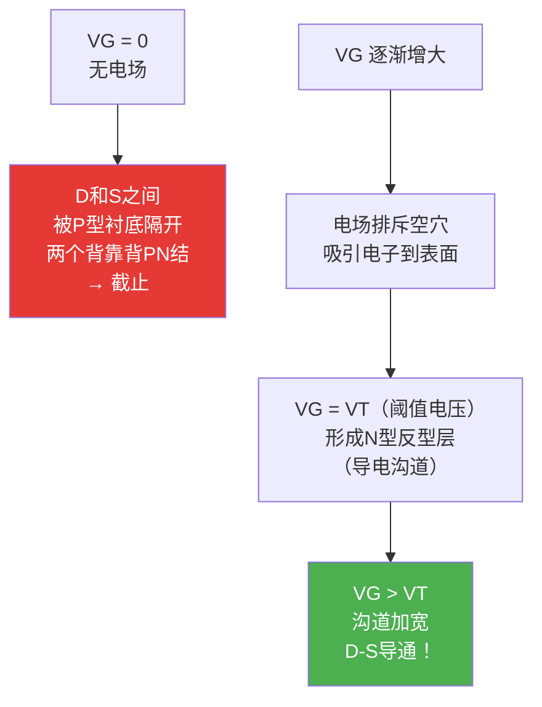
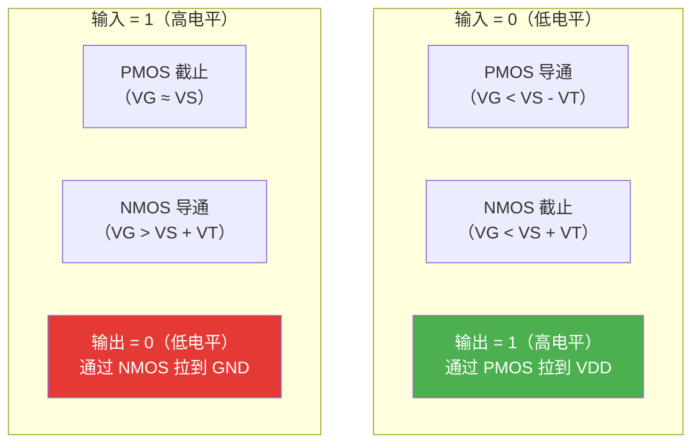
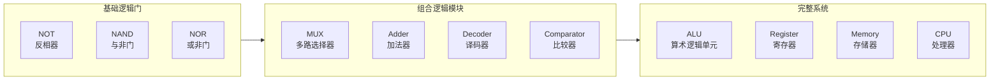
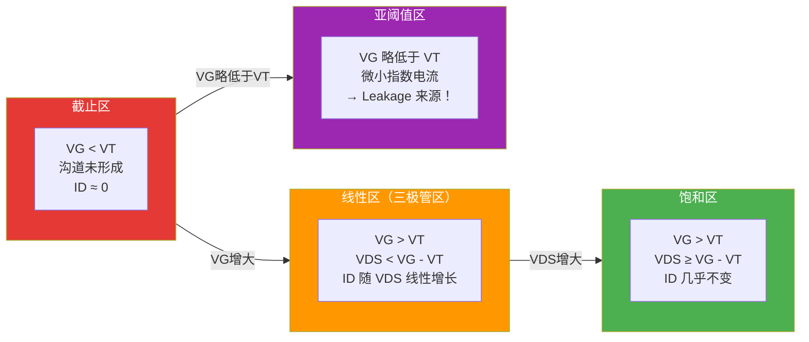

---
tags:
  - ate
  - semiconductor
  - mosfet
  - cmos
  - chapter2
created: 2026-06-14
---

# 2.2 MOSFET / CMOS 原理

> 🔗 文中的 **彩色高亮词** 均可点击跳转到文末 [[#术语解释|术语解释]] 查看详细说明。
> 📌 **前置要求**：建议先阅读 [[01.PN结与载流子|2.1 PN结与载流子]]。

## 为什么测试工程师要学 MOSFET？

如果说 [[01.PN结与载流子|PN结]] 是半导体的"原子"，那么 **MOSFET** 就是集成电路的"细胞"。

你测试的每一颗数字芯片——无论是 MCU、SoC 还是 Memory——其内部的逻辑门（AND、OR、NOT）全都是由 **CMOS（互补MOS）** 结构搭建的。理解 MOSFET 的工作原理，你才能真正理解：

- 为什么芯片会有**静态功耗**（Leakage）
- 为什么 **IDDQ 测试** 能检测制造缺陷
- 为什么 **ESD** 会永久损坏芯片
- 为什么先进制程芯片的测试越来越复杂

> 💡 **一句话总结**：MOSFET 就是一个**电压控制的开关**——栅极电压决定 D 和 S 之间是导通还是截止。

---

## 从电场效应说起

还记得 [[01.PN结与载流子|PN结]] 中的**内建电场**吗？MOSFET 的核心思想是：**用外部电场来控制半导体的导电性**。

### MOS 三明治结构

MOSFET 的名字来源于它的三层结构：

| 层 | 材料 | 作用 |
|----|------|------|
| **M**etal（金属） | 铝/多晶硅 | 栅极（Gate）——施加控制电压 |
| **O**xide（氧化物） | SiO₂ | 绝缘层——隔离栅极与衬底 |
| **S**emiconductor（半导体） | 硅衬底 | 导电沟道形成的地方 |

> 图：在 P 型半导体上方施加电场，氧化层下方形成电子聚集的反型层（沟道）。[来源：CSDN](https://blog.csdn.net/malcolm_110/article/details/96477442)

> 📌 **关键洞察**：栅极和衬底之间隔着绝缘的 SiO₂，所以栅极**几乎不流电流**——MOSFET 是**电压控制型**器件（不同于三极管的电流控制型）。

---

## NMOS：N沟道 MOSFET

### 结构

在 P 型硅衬底上，通过掺杂制造两个高浓度的 N+ 区域，分别作为**源极（Source）**和**漏极（Drain）**：

> 图：NMOS 结构——P 型衬底上有两个 N+ 区（源极和漏极），栅极通过 SiO₂ 绝缘。[来源：CSDN](https://blog.csdn.net/malcolm_110/article/details/96477442)

### 工作原理

### 三个端口的关键点

| 端口 | 全称 | 功能 | 接法 |
|------|------|------|------|
| **G** | Gate（栅极） | 控制沟道形成 | 接控制电压 |
| **S** | Source（源极） | 载流子（电子）的来源 | 低电位 |
| **D** | Drain（漏极） | 载流子的去向 | 高电位 |
| **B** | Body（衬底） | 基底半导体 | 接低电位（通常连S） |

> ⚠️ **为什么要衬底连S？** 如果衬底接高电位，衬底与 D 之间的 PN 结就会正向导通，MOSFET 就失去控制了！

### 电路符号

> 图：NMOS 电路符号——虚线表示增强型（默认不导通），箭头指向栅极表示 P 型衬底。[来源：CSDN](https://blog.csdn.net/malcolm_110/article/details/96477442)

---

## PMOS：P沟道 MOSFET

### 结构

在 N 型硅衬底上，制造两个高浓度的 P+ 区域：

- **沟道类型**：P 沟道（空穴导电）
- **衬底类型**：N 型
- **导通条件**：VG < VS（栅极电位比源极低）
- **电流方向**：从 S 到 D（空穴从源极流向漏极）

### 电路符号

> 图：NMOS 和 PMOS 的简化电路符号对比。[来源：CSDN](https://blog.csdn.net/malcolm_110/article/details/96477442)

### NMOS vs PMOS 对比

| 特性 | NMOS | PMOS |
|------|------|------|
| **衬底类型** | P 型 | N 型 |
| **沟道载流子** | 电子（e⁻） | 空穴（h⁺） |
| **导通条件** | VG > VS + VT | VG < VS - VT |
| **电流方向** | D → S | S → D |
| **迁移率** | ~400-600 cm²/Vs | ~150-250 cm²/Vs |
| **开关速度** | **快 2-3 倍** | 较慢 |
| **导通电阻** | 低 | 高（约2-3倍） |
| **应用** | 下拉网络（到GND） | 上拉网络（到VDD） |

> 💡 **为什么 NMOS 更快？** 因为电子的迁移率比空穴高约 2-3 倍。所以在同等条件下，NMOS 的开关速度更快、导通电阻更低。

---

## CMOS：互补 MOS

### 核心思想

**CMOS（Complementary MOS）** 将 NMOS 和 PMOS 集成在同一块芯片上，通过**同一个信号**控制——这就是现代数字集成电路的基石！

> 图：CMOS 反相器结构——PMOS 接 VDD（上拉），NMOS 接 GND（下拉），输入同时控制两个管子。[来源：CSDN](https://blog.csdn.net/malcolm_110/article/details/96477442)

### CMOS 反相器：最基础的逻辑门

### CMOS 的革命性优势

| 优势 | 说明 |
|------|------|
| **极低静态功耗** | 输入=0 时 NMOS 截止，输入=1 时 PMOS 截止——**任意时刻只有一个管子导通**，几乎没有静态电流 |
| **满摆幅输出** | 输出可以达到完整的 VDD 或 GND |
| **高噪声容限** | 对噪声干扰有很强的抵抗能力 |
| **可扩展** | 非常适合大规模集成（VLSI） |

> 🔑 **这就是为什么 CMOS 统治了数字芯片世界**——几十亿个晶体管同时工作，但静态功耗依然可控。

### CMOS 能做什么？——从逻辑门到整个芯片

CMOS 最核心的功能是**搭建数字逻辑电路**。通过不同方式组合 NMOS 和 PMOS，可以构建出所有数字逻辑功能：

#### 基础逻辑门

| 逻辑门 | 功能 | CMOS 实现 | 真值表 |
|--------|------|----------|--------|
| **NOT（反相器）** | A → NOT A | 1 个 PMOS + 1 个 NMOS | 0→1, 1→0 |
| **NAND（与非）** | A,B → NOT(A AND B) | 2 个 PMOS（并联）+ 2 个 NMOS（串联） | 仅 1,1→0 |
| **NOR（或非）** | A,B → NOT(A OR B) | 2 个 PMOS（串联）+ 2 个 NMOS（并联） | 仅 0,0→1 |
| **AND（与）** | A AND B | NAND + NOT | 仅 1,1→1 |
| **OR（或）** | A OR B | NOR + NOT | 仅 0,0→0 |
| **XOR（异或）** | A ⊕ B | 4 个 NMOS + 4 个 PMOS | 不同→1, 相同→0 |

> 💡 **万能门**：NAND 和 NOR 是"万能门"——仅用 NAND 或仅用 NOR 就可以搭建出**任何**逻辑功能。这也是为什么早期半导体工艺优先优化 NAND Flash。

#### 组合逻辑：从门到功能模块

将基础逻辑门组合起来，就能构建更复杂的功能：

#### 时序逻辑：让芯片"记住"东西

CMOS 不仅能做"组合逻辑"（输出只取决于当前输入），还能做"时序逻辑"（输出取决于当前输入+历史状态）：

| 时序元件 | 功能 | CMOS 实现 |
|---------|------|----------|
| **SR 锁存器** | 存储 1 bit | 2 个交叉耦合的 NOR/NAND |
| **D 触发器** | 在时钟边沿锁存数据 | 多个反相器 + 传输门 |
| **寄存器** | 存储多位数据 | 多个 D 触发器并联 |
| **计数器** | 按时钟脉冲计数 | 多个触发器串联 |
| **状态机** | 按状态转移执行控制逻辑 | 寄存器 + 组合逻辑 |

> 📌 **这就是为什么理解 CMOS 如此重要**：你测试的每一颗芯片——MCU、SoC、Memory——内部的 CPU 核心、寄存器、存储器，全都是由 CMOS 搭建的。

#### 从门到芯片：一颗 SoC 里有多少 CMOS？

| 芯片类型 | 典型晶体管数量 | CMOS 的角色 |
|---------|--------------|------------|
| 8-bit MCU | ~10 万 | CPU + 寄存器 + Flash + 外设 |
| 手机 SoC（如骁龙 8 Gen3） | ~100 亿 | CPU + GPU + NPU + ISP + Modem |
| 高端 GPU（如 NVIDIA H100） | ~800 亿 | CUDA 核心 + Tensor 核心 + HBM 控制器 |
| DDR5 内存芯片 | ~数百亿 | 存储单元阵列 + 读写电路 + 刷新控制 |

> 🔑 **核心认知**：现代芯片 = 数十亿个 CMOS 晶体管的精密协作。你的测试工作，本质上就是在验证这些晶体管是否都按预期工作。

### CMOS 测试的特殊意义

由于 CMOS 结构的特殊性，测试工程师需要特别关注以下几点：

| CMOS 特性 | 测试影响 |
|-----------|---------|
| **静态功耗极低** | IDDQ 测试可以灵敏地检测出制造缺陷——任何异常漏电都是"坏事" |
| **互补结构** | 任何一个管子出问题（Open 或 Short），都会导致逻辑错误或功耗异常 |
| **栅氧极薄** | 先进制程栅氧只有几个原子厚，极易被 ESD 或过压击穿 |
| **温度敏感** | 亚阈值漏电流随温度指数增长，高温测试必须严格控制 |

---

## MOSFET 的四个工作区

MOSFET 根据 VG 和 VDS 的不同，有四种工作状态：

| 区域 | 条件 | 特征 | 测试相关 |
|------|------|------|---------|
| **截止区** | VG < VT | 无电流，开关断开 | — |
| **线性区** | VG > VT, VDS小 | 电流随电压线性增长 | 作为可变电阻 |
| **饱和区** | VG > VT, VDS大 | 电流几乎恒定 | 放大器工作区 |
| **亚阈值区** | VG ≈ VT | 微小漏电流 | **IDDQ 测试的核心** |

> ⚠️ **亚阈值漏电流（Subthreshold Leakage）** 是先进制程芯片静态功耗的主要来源，也是 IDDQ 测试关注的重点。

---

## CMOS 反相器的功耗

CMOS 有三种功耗来源：

| 功耗类型 | 公式 | 来源 | 测试相关 |
|---------|------|------|---------|
| **静态功耗** | P_static = VDD × I_leak | 漏电流（亚阈值+栅极泄漏） | **IDDQ 测试** |
| **动态功耗** | P_dynamic = C × V² × f | 充放电电容 | 频率测试 |
| **短路功耗** | P_short = VDD × I_short × t | 开关瞬间 PMOS 和 NMOS 同时导通 | — |

> 📌 **先进制程趋势**：随着工艺缩小（7nm → 5nm → 3nm），**静态功耗占比越来越大**——因为漏电流随尺寸缩小而指数增长。这就是为什么先进制程芯片的测试越来越关注 Leakage 和 IDDQ。

---

## 与 ATE 测试的关联

理解 MOSFET/CMOS 后，你会更明白以下测试项目的物理意义：

| 测试项目 | MOSFET/CMOS 层面的理解 |
|---------|----------------------|
| **IDDQ 测试** | 测量所有 MOSFET 的亚阈值漏电流总和，检测制造缺陷（如栅氧缺陷导致的额外漏电） |
| **Leakage 测试** | 直接测量 MOSFET 的截止态漏电流，与温度和工艺角强相关 |
| **Open/Short 测试** | 检测 MOSFET 栅极是否与沟道正确连接（Open=栅氧断裂，Short=栅氧击穿） |
| **功能测试** | 验证 CMOS 逻辑门的输入-输出关系是否正确 |
| **频率测试** | 验证 MOSFET 的开关速度是否满足时序要求 |
| **ESD 测试** | 过压会击穿栅氧（SiO₂），造成 MOSFET 永久损坏 |
| **高温测试** | 温度升高 → 亚阈值漏电流指数增大 → IDDQ 增大 |

> 🔑 **核心认知**：芯片测试中的很多"异常"，追根溯源都与 MOSFET 的特性有关。理解了 MOSFET，你就理解了芯片为什么能"算数"、为什么会"漏电"、为什么会"坏"。

---

## 参考链接

- [从原理的视角，一文彻底区分MOS MOSFET NMOS PMOS CMOS - CSDN](https://blog.csdn.net/malcolm_110/article/details/96477442)
- [别再傻傻分不清！PMOS、NMOS和CMOS - CSDN](https://blog.csdn.net/weixin_42627853/article/details/159877261)
- [详解集成电路中MOS管的基本原理和工作特性 - CSDN](https://blog.csdn.net/jk_101/article/details/130690869)
- [超级详细-NMOS、PMOS的工作原理 - CSDN](https://blog.csdn.net/qq_30095921/article/details/124455490)
- [MOSFET工作原理详解 - Electronics-Tutorials](https://www.electronics-tutorials.ws/fet/fet_3.html)
- [MOSFET Basics - All About Circuits](https://www.allaboutcircuits.com/textbook/semiconductors/chpt-5/mosfet-as-switch/)

---

## 术语解释

> 本章专业名词统一解释。**点击正文中的蓝色词**即可跳转到对应的解释位置。

### MOSFET 基础

#### MOSFET
**全称**：Metal-Oxide-Semiconductor Field-Effect Transistor　｜　**中文**：金属-氧化物半导体场效应晶体管

通过栅极电压产生的电场来控制导电沟道的半导体器件。是现代集成电路的基本单元。

#### NMOS
**全称**：N-channel MOSFET　｜　**中文**：N沟道 MOSFET

在 P 型衬底上形成的 MOSFET，导电沟道是电子。栅极加正电压时导通。开关速度快，是数字电路的主力。

#### PMOS
**全称**：P-channel MOSFET　｜　**中文**：P沟道 MOSFET

在 N 型衬底上形成的 MOSFET，导电沟道是空穴。栅极加负电压时导通。常用于上拉网络和电源开关。

#### CMOS
**全称**：Complementary MOS　｜　**中文**：互补型 MOS

将 NMOS 和 PMOS 集成在同一芯片上，通过同一信号控制。是现代数字集成电路的基础结构，具有极低静态功耗。

### MOSFET 端口

#### Gate
**全称**：—　｜　**中文**：栅极

MOSFET 的控制端。通过施加电压产生电场，控制沟道的形成和消失。栅极与衬底之间有绝缘的 SiO₂ 层，所以几乎不流电流。

#### Source
**全称**：—　｜　**中文**：源极

载流子的来源端。NMOS 中提供电子，PMOS 中提供空穴。通常接低电位（NMOS）或高电位（PMOS）。

#### Drain
**全称**：—　｜　**中文**：漏极

载流子的去向端。电流从漏极流出。

#### Body / Substrate
**全称**：—　｜　**中文**：衬底

MOSFET 的基底半导体。NMOS 的衬底是 P 型，PMOS 的衬底是 N 型。衬底通常与源极相连。

### MOSFET 参数

#### Threshold Voltage (VT)
**全称**：—　｜　**中文**：阈值电压/开启电压

使 MOSFET 开始导通的最小栅源电压。VG 必须超过 VT 才能形成导电沟道。

#### Channel
**全称**：—　｜　**中文**：沟道

MOSFET 中连接源极和漏极的导电路径。由栅极电压产生的电场在衬底表面形成的反型层。

#### Inversion Layer
**全称**：—　｜　**中文**：反型层

栅极电场在衬底表面产生的与衬底类型相反的导电层。例如 P 型衬底上产生 N 型电子层。

#### Subthreshold Leakage
**全称**：—　｜　**中文**：亚阈值漏电流

当 VG 略低于 VT 时，MOSFET 并非完全截止，仍有微小的指数级漏电流。是先进制程芯片静态功耗的主要来源。

#### Body Diode
**全称**：—　｜　**中文**：体二极管

MOSFET 内部衬底与漏极之间天然形成的 PN 结二极管。在某些应用中可以利用，但在开关应用中可能导致意外导通。

### CMOS 相关

#### Inverter
**全称**：—　｜　**中文**：反相器

最基础的 CMOS 逻辑门。输入 0 输出 1，输入 1 输出 0。由一个 PMOS（上拉）和一个 NMOS（下拉）组成。

#### Static Power
**全称**：—　｜　**中文**：静态功耗

芯片在不进行任何开关活动时消耗的功率。CMOS 的静态功耗主要来自 MOSFET 的漏电流。

#### Dynamic Power
**全称**：—　｜　**中文**：动态功耗

芯片在开关过程中对负载电容充放电消耗的功率。公式：P = C × V² × f。

> 💡 **提示**：这些术语会随着学习进度不断出现，建议建立自己的 [[术语表]] 随时记录。
