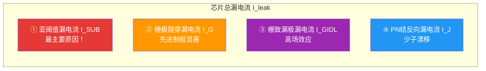
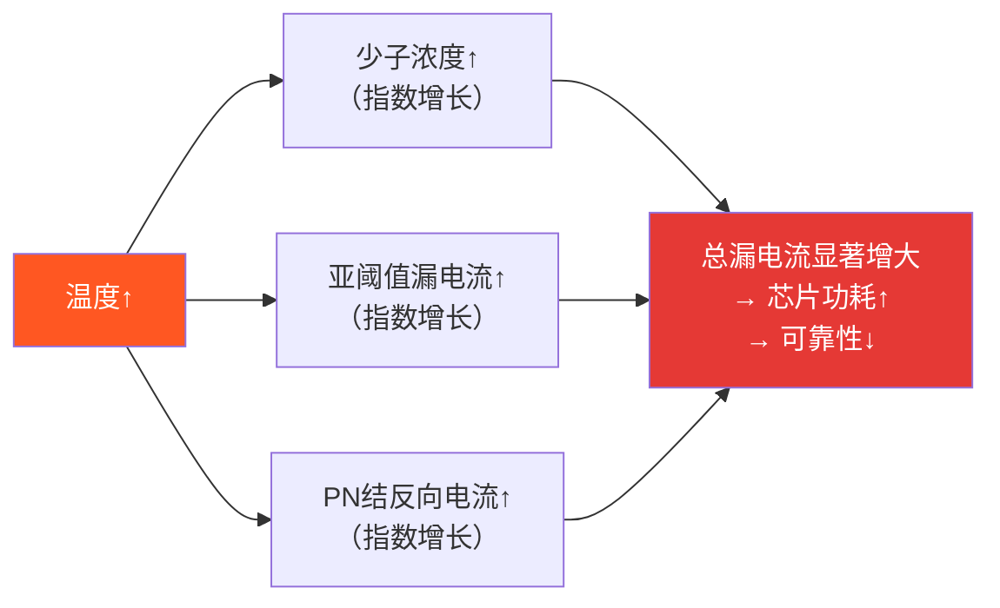
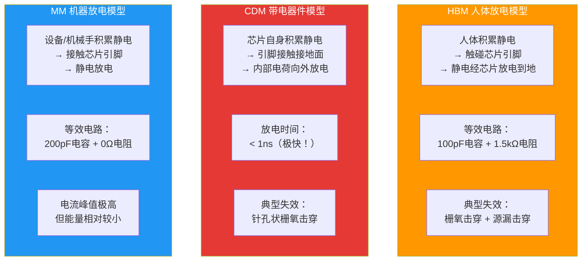
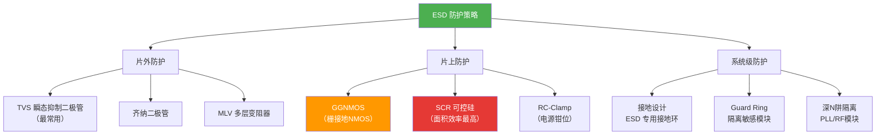

---
tags:
  - ate
  - semiconductor
  - leakage
  - esd
  - reliability
  - chapter2
created: 2026-06-14
---

# 2.3 Leakage 与 ESD 机制

> 🔗 文中的 **彩色高亮词** 均可点击跳转到文末 [[#术语解释|术语解释]] 查看详细说明。
> 📌 **前置要求**：建议先阅读 [[01.PN结与载流子|2.1 PN结与载流子]] 和 [[02.MOSFET与CMOS原理|2.2 MOSFET/CMOS原理]]。

## 为什么测试工程师要学 Leakage 和 ESD？

在 ATE 测试中，有两个"高频出现"的测试项目：

1. **IDDQ / Leakage 测试**——测的是芯片"漏了多少电"
2. **ESD 测试**——测的是芯片"能不能扛住静电"

这两个测试直接关系到芯片的**可靠性**和**寿命**。如果你不理解 Leakage 的物理来源，你就无法判断 IDDQ 测试结果是"正常"还是"异常"；如果你不理解 ESD 的损伤机制，你就无法理解为什么一颗芯片在 ESD 测试后会"坏掉"。

> 💡 **一句话总结**：Leakage 是芯片"不该流的电"，ESD 是芯片"不该承受的电"。

---

## 第一部分：Leakage（漏电流）

### 什么是 Leakage？

理想的 MOSFET 在截止状态下应该**完全没有电流**。但现实中，即使栅极电压低于阈值电压（VG < VT），仍然会有微小的电流流过——这就是**漏电流（Leakage）**。

> 图：载流子的泄漏路径——即使在"关断"状态下，仍有多种机制导致电流泄漏。[来源：CSDN](https://blog.csdn.net/m0_54689021/article/details/133236126)

### 四种漏电流来源

MOSFET 中存在**四种主要的漏电流机制**，它们的物理来源各不相同：

#### ① 亚阈值漏电流（Subthreshold Leakage, I_SUB）

**这是最主要原因，占总漏电流的 60%~80%。**

当 VG 略低于 VT 时，MOSFET 并没有完全"关死"——沟道中仍有少量载流子在扩散，形成微小的漏电流。

| 特性 | 说明 |
|------|------|
| **物理机制** | 沟道处于弱反型状态，少子扩散电流 |
| **与电压关系** | I_SUB ∝ e^(VG/VT)，指数级敏感 |
| **与温度关系** | **温度每升高 10°C，漏电流约增大 2 倍** |
| **与工艺关系** | VT 越低，漏电流越大（先进制程 VT 在降低） |

> 📌 **这就是为什么先进制程（7nm/5nm/3nm）的静态功耗越来越大**——阈值电压 VT 降低，亚阈值漏电流指数级增长。

#### ② 栅极隧穿漏电流（Gate Tunneling Leakage, I_G）

当栅极氧化层（SiO₂）厚度薄到只有几个原子层时，电子可以直接"隧穿"过绝缘层，形成从栅极到衬底的漏电流。

| 特性 | 说明 |
|------|------|
| **物理机制** | 量子隧穿效应（Fowler-Nordheim 隧穿） |
| **与厚度关系** | 氧化层越薄，隧穿概率指数增长 |
| **工艺节点** | 从 90nm 开始显著，65nm 以下成为主要问题 |
| **解决方案** | 采用 High-K 介质（如 HfO₂）替代 SiO₂ |

#### ③ 栅致漏极漏电流（Gate-Induced Drain Leakage, I_GIDL）

在栅极和漏极重叠区域，高电场会导致能带间隧穿（BTBT），产生电子-空穴对，形成从漏极到衬底的漏电流。

| 特性 | 说明 |
|------|------|
| **物理机制** | 栅漏重叠区的高场效应导致能带间隧穿 |
| **与电压关系** | I_GIDL ∝ VDG（栅漏电压差） |
| **NMOS vs PMOS** | NMOS 的 GIDL 比 PMOS 大约 **100 倍** |

#### ④ PN结反向漏电流（Junction Leakage, I_J）

MOSFET 的源/漏区与衬底之间存在 PN 结。即使在反向偏置下，仍会有由少子漂移和耗尽区产生-复合引起的微小反向电流。

| 特性 | 说明 |
|------|------|
| **物理机制** | PN 结反向偏置时的少子漂移 + 耗尽区产生-复合电流 |
| **与温度关系** | 随温度升高而增大 |
| **与面积关系** | 结面积越大，漏电流越大 |

### 漏电流的温度特性

> ⚠️ **温度是 Leakage 的"放大器"**——这是 ATE 测试中必须做高温测试的根本原因。

### 为什么 Leakage 对测试很重要？

| 测试场景 | Leakage 的影响 |
|---------|---------------|
| **IDDQ 测试** | 测量芯片静态漏电流，异常漏电 = 制造缺陷 |
| **高温测试** | 温度升高导致漏电流指数增大，测试必须覆盖高温 corner |
| **低功耗测试** | 移动设备芯片对漏电流极其敏感，规格可能要求 < 1μA |
| **老化测试** | 长期工作后氧化层退化，漏电流可能逐渐增大 |

> 🔑 **核心认知**：IDDQ 测试的本质就是在测 Leakage。如果你测到的 IDDQ 值远超预期，很可能意味着芯片内部有制造缺陷（如栅氧缺陷导致额外漏电通路）。

---

## 第二部分：ESD（静电放电）

### 什么是 ESD？

**ESD（Electrostatic Discharge，静电放电）** 是电荷在不同电位物体之间的瞬间转移。在干燥环境下，人体摩擦可产生数千伏的静电电压——当你触碰芯片引脚时，这些电荷会在**纳秒级**时间内释放，峰值电流可达**数十安培**。

> 💡 **形象理解**：ESD 就像是给芯片引脚来了一记"闪电拳"——电压极高（kV级）、时间极短（ns级）、能量集中在一个针尖大的区域。

### ESD 的三种模型

业界根据静电产生的不同场景，定义了三种主要的 ESD 测试模型：

### 三种模型对比

| 特性 | HBM（人体） | CDM（带电器件） | MM（机器） |
|------|------------|----------------|-----------|
| **来源** | 人体摩擦起电 | 芯片自身积累电荷 | 设备/机械手 |
| **放电方向** | 由外向内 | **由内向外** | 由外向内 |
| **放电时间** | ~150 ns | **< 1 ns** | ~1-10 ns |
| **峰值电流** | 中等（A级） | **极高（数十A）** | 高 |
| **能量** | 大 | 小 | 中等 |
| **失效模式** | 栅氧击穿 + 源漏熔毁 | 针孔状栅氧击穿 | 结击穿 |
| **防护重点** | IO 引脚钳位电路 | 低寄生电容泄放通道 | IO 引脚 |
| **当前地位** | 传统主流 | **已成为主要失效源** | 已被 CDM 取代 |

> 📌 **重要趋势**：随着工艺缩小和自动化生产普及，**CDM 已取代 HBM 成为芯片 ESD 失效的主要原因**。CDM 的"由内向外"放电特性使其防护难度更高。

### ESD 损伤机制

ESD 脉冲的破坏力来自两个方面：

#### 热效应（焦耳热）

| 损伤类型 | 说明 | 严重程度 |
|---------|------|---------|
| **金属熔毁** | 大电流流过细金属连线，局部温度骤升导致铝/铜熔断 | ⚠️ 致命 |
| **硅熔融** | 电流集中区域硅材料熔化，形成永久短路/开路 | ⚠️ 致命 |
| **键合线烧毁** | 键合线承载不了大电流而熔断 | ⚠️ 致命 |

#### 电场效应（介质击穿）

| 损伤类型 | 说明 | 严重程度 |
|---------|------|---------|
| **栅氧击穿** | 强电场击穿 SiO₂ 绝缘层，栅极与沟道短路 | ⚠️ 致命 |
| **隐性损伤** | 栅氧未完全击穿但特性退化，后续工作中逐渐恶化 | ⚠️ 隐患 |

### ESD 失效判定标准

在 ATE ESD 测试中，通常有三种判定方法：

| 判定方法 | 说明 | 判定标准 |
|---------|------|---------|
| **绝对漏电流法** | ESD 后在引脚上加额定电压，测量漏电流 | 漏电流 > 规格值 → FAIL |
| **I-V 曲线漂移法** | 对比 ESD 前后的 I-V 曲线 | 漂移 > 规定百分比 → FAIL |
| **功能测试法** | ESD 后运行芯片功能测试 | 功能异常 → FAIL |

### ESD 防护策略

---

## 第三部分：Leakage 与 ESD 的测试关联

### ATE 测试中的关注点

| 测试项目 | 物理本质 | 测试目的 |
|---------|---------|---------|
| **IDDQ 测试** | 测量所有 MOSFET 的 I_SUB + I_G + I_GIDL + I_J 总和 | 检测制造缺陷（异常漏电） |
| **Leakage 测试** | 测量特定引脚或电源域的漏电流 | 验证低功耗规格 |
| **ESD HBM 测试** | 模拟人体静电对芯片放电 | 验证芯片抗静电能力 |
| **ESD CDM 测试** | 模拟带电芯片对外放电 | 验证芯片自身放电安全性 |
| **高温 IDDQ** | 在高温下测 IDDQ | 验证高温漏电流是否超标 |

### 测试工程师需要知道的

1. **IDDQ 的基线是 Leakage**——正常芯片的 IDDQ 应该在一个合理范围内，太高说明有缺陷，太低可能是测试程序有问题
2. **温度是 Leakage 的放大器**——高温测试结果必须与常温对比，判断是否在规格内
3. **ESD 测试后必须复测功能**——ESD 可能造成隐性损伤，只有通过功能测试才能确认芯片是否真的"没坏"
4. **CDM 是当前主要威胁**——自动化生产线上的芯片更容易带电，CDM 防护是设计和测试的重点

---

## 参考链接

- [你不知道的五种MOS管泄漏电流 - CSDN](https://devpress.csdn.net/v1/article/detail/135934860)
- [芯片设计中leakage power - CSDN](https://devpress.csdn.net/v1/article/detail/143615978)
- [CMOS电路的低功耗设计基础 - CSDN](https://blog.csdn.net/Tranquil_ovo/article/details/132077902)
- [硬核干货：ESD基础知识汇总 - CSDN](https://blog.csdn.net/weixin_41872791/article/details/137375076)
- [【ESD专题】ESD基础及IEC61000-4-2标准 - CSDN](https://blog.csdn.net/weixin_51792779/article/details/115737345)
- [芯片ESD防护 - CSDN](https://blog.csdn.net/weixin_42693135/article/details/135981564)
- [ESD硬件设计：从"被动防护"到"主动免疫" - CSDN](https://blog.csdn.net/m0_50833886/article/details/149404234)

---

## 术语解释

> 本章专业名词统一解释。**点击正文中的蓝色词**即可跳转到对应的解释位置。

### Leakage 相关

#### Leakage
**全称**：—　｜　**中文**：漏电流

MOSFET 在截止状态下仍然流过的微小电流。是芯片静态功耗的主要来源，也是 IDDQ 测试的物理基础。

#### Subthreshold Leakage
**全称**：—　｜　**中文**：亚阈值漏电流

VG < VT 时，沟道处于弱反型状态的源漏电流。是漏电流中**最主要**的分量，对温度极其敏感。

#### Gate Tunneling Leakage
**全称**：—　｜　**中文**：栅极隧穿漏电流

电子通过量子隧穿效应穿过极薄的栅氧化层，从栅极流向衬底。先进制程中显著增大。

#### GIDL
**全称**：Gate-Induced Drain Leakage　｜　**中文**：栅致漏极漏电流

栅漏重叠区高电场引起的能带间隧穿电流。NMOS 的 GIDL 比 PMOS 大约 100 倍。

#### Junction Leakage
**全称**：—　｜　**中文**：PN结反向漏电流

源/漏区与衬底之间 PN 结反向偏置时的漏电流。由少子漂移和耗尽区产生-复合引起。

### ESD 相关

#### ESD
**全称**：Electrostatic Discharge　｜　**中文**：静电放电

电荷在不同电位物体之间的瞬间转移。时间短（ns级）、电压高（kV级）、电流大（A级）。

#### HBM
**全称**：Human Body Model　｜　**中文**：人体放电模型

模拟人体积累的静电对芯片放电。等效电路：100pF 电容 + 1.5kΩ 电阻。

#### CDM
**全称**：Charged Device Model　｜　**中文**：带电器件模型

模拟芯片自身积累静电后向外放电。放电时间 < 1ns，峰值电流极高，**已成为当前主要 ESD 失效源**。

#### MM
**全称**：Machine Model　｜　**中文**：机器放电模型

模拟设备/机械手积累的静电对芯片放电。已被 CDM 取代。

#### TVS
**全称**：Transient Voltage Suppressor　｜　**中文**：瞬态电压抑制器

一种常用的片外 ESD 防护器件。当电压超过阈值时快速导通，将 ESD 能量泄放到地。

#### GGNMOS
**全称**：Gate-Grounded NMOS　｜　**中文**：栅接地NMOS

一种片上 ESD 防护结构。栅极接地，当 ESD 脉冲到来时利用寄生 NPN 晶体管导通泄放电流。

#### SCR
**全称**：Silicon Controlled Rectifier　｜　**中文**：可控硅

一种面积效率最高的片上 ESD 防护结构。利用寄生 PNPN 结构的闩锁效应泄放 ESD 电流。

#### Latch-up
**全称**：—　｜　**中文**：闩锁效应

CMOS 中寄生 PNPN 结构被触发后的持续导通状态。可能导致芯片永久失效。ESD 是触发 Latch-up 的常见原因。

> 💡 **提示**：这些术语会随着学习进度不断出现，建议建立自己的 [[术语表]] 随时记录。
