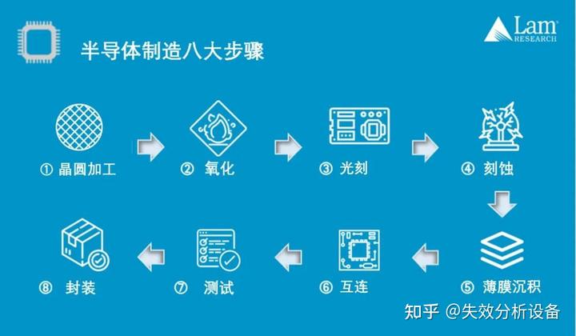
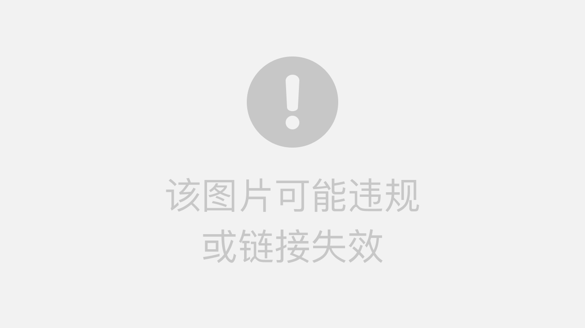
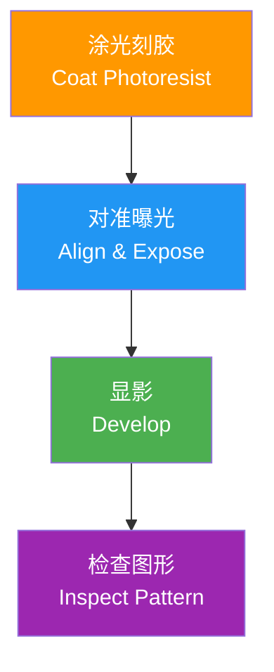
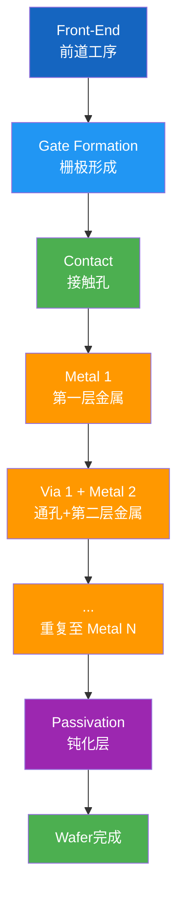
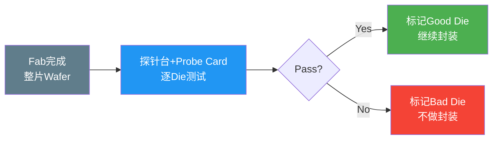
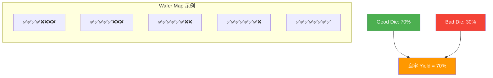
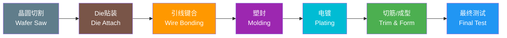
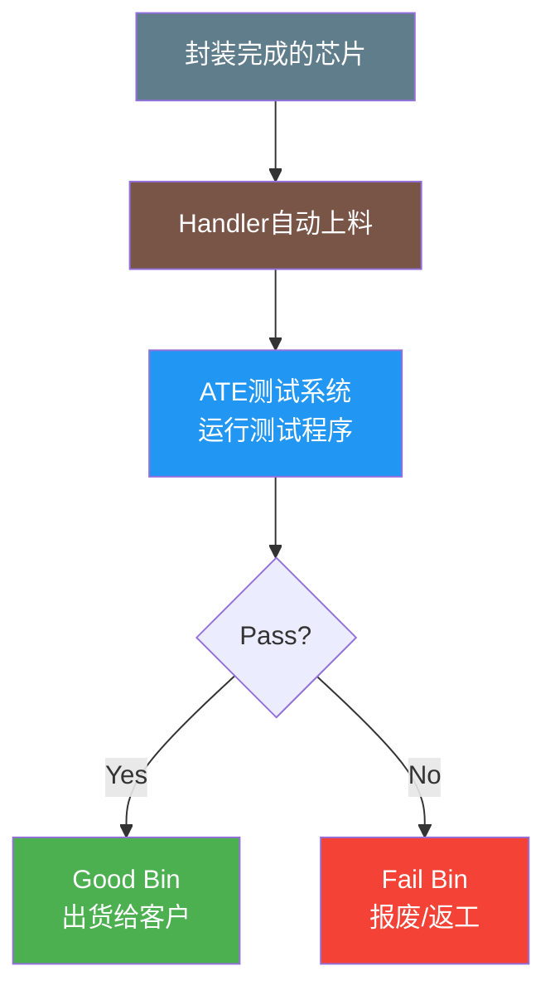
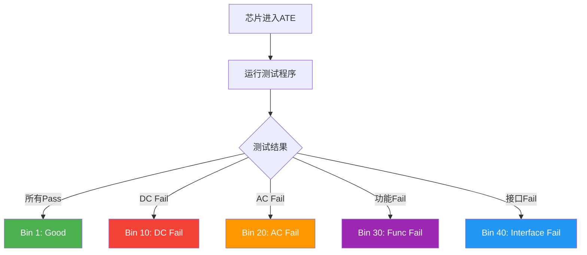
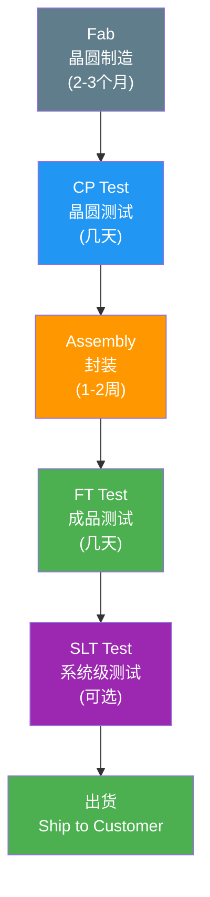

---
tags:
  - ate
  - semiconductor
  - ic-manufacturing
  - fab
  - packaging
  - chapter2
created: 2026-06-14
---

# 2.4 IC 制造流程（Fab → 封装 → 测试）

> 🔗 文中的 **彩色高亮词** 均可点击跳转到文末 [[#术语解释|术语解释]] 查看详细说明。
> 📌 **前置要求**：建议先阅读 [[01.PN结与载流子|2.1 PN结与载流子]] 和 [[02.MOSFET与CMOS原理|2.2 MOSFET/CMOS原理]]。

## 为什么测试工程师要学 IC 制造流程？

作为 ATE 测试工程师，你拿到的是一颗**已经制造完成的芯片**。但如果你不理解它的制造过程，你就无法：

- **理解缺陷来源**——为什么某个测试项会失败？是 Fab 里的光刻问题？还是封装时的引线键合问题？
- **定位失效根因**——CP 测试发现某颗 die 不良，它是 Fab defect 还是 packaging issue？
- **与 Fab/封装厂沟通**——需要知道对方在说什么，才能有效协作
- **优化测试策略**——哪些测试项可以在 CP 阶段筛掉，避免浪费封装成本？

> 💡 **一句话总结**：IC 制造流程 = Fab（晶圆制造）→ Assembly（封装）→ Test（测试）。测试工程师站在流程的**终点**，但需要理解**全过程**。

---

## 第一部分：Fab（晶圆制造）

### 1.1 整体流程概览

IC 制造的起点是**硅砂（SiO₂）**，终点是一片片布满芯片的**晶圆（Wafer）**。整个 Fab 流程可以概括为**8 大核心工序**：

> 图：IC 制造八大核心工序概览——从硅提纯到晶圆完成。[来源：CSDN](https://blog.csdn.net/Jailman/article/details/132715279)

> 💡 **与测试的关联**：每个制造工序都可能引入缺陷。例如：光刻偏移→短路；刻蚀不净→开路；CMP 不平→层间漏电。这些缺陷最终都会在 CP/FT 测试中暴露。

### 1.2 硅提纯与拉晶

制造 IC 的第一步是获得**超高纯度的单晶硅**。

| 步骤 | 说明 | 关键指标 |
|------|------|----------|
| **冶金级硅提纯** | 将石英砂（SiO₂）还原为冶金级硅（98-99%纯度），再通过西门子法或流化床法提纯 | 纯度需达到 99.9999999%（9N）以上 |
| **单晶拉制（CZ 法）** | 将高纯硅熔化（1414°C），用籽晶缓慢旋转提拉，生长出单晶硅锭（Ingot） | 直径 150/200/300mm，长度 1-2m |
| **晶圆切割** | 用金刚石线锯将硅锭切成薄片（0.5-1mm），再研磨、抛光 | 表面粗糙度 < 0.2nm |

![[assets/02.半导体基础/04.IC制造流程/Pasted image 20260614094220.png]]

> 图：单晶硅锭（左）和切割后的晶圆（右）。一片 300mm 晶圆可以制造数百到数千颗芯片。[来源：CSDN](https://blog.csdn.net/Jailman/article/details/132715279)

**📌 测试关联**：晶圆的质量直接影响后续制造。如果硅锭内部有**位错（Dislocation）**或**杂质（Contamination）**，即使 Fab 工艺完美，芯片也会失效。这类缺陷在 CP 测试中通常表现为**系统性失效**——失效 die 呈现规律性分布（如某一行/列全部失效）。

### 1.3 氧化（Oxidation）

氧化是在晶圆表面生长一层**二氧化硅（SiO₂）**薄膜的过程。SiO₂ 是 IC 制造中最关键的材料之一：

- **栅极氧化层**：作为 MOSFET 的栅极绝缘层（厚度仅 1-10nm，在先进制程中用 High-k 材料替代）
- **隔离层**：隔离不同器件/金属层
- **掩膜层**：在后续刻蚀/掺杂步骤中作为保护层

> 图：热氧化工艺——晶圆在高温炉管中与氧气/水蒸气反应，表面生长 SiO₂。[来源：CSDN](https://blog.csdn.net/Jailman/article/details/132715279)

**📌 测试关联**：栅极氧化层质量直接影响 MOSFET 的阈值电压 VT 和漏电流。如果氧化层有针孔（Pinhole）或厚度不均，会导致 **Leakage 异常**——这正是 [[03.Leakage与ESD机制|2.3 Leakage与ESD机制]] 中讨论的问题。

### 1.4 光刻（Lithography）

光刻是 IC 制造的**核心工序**，被称为"半导体工业的皇冠"。它决定了芯片上每个器件的**最小尺寸**（即"XX nm 工艺"的含义）。

光刻的基本原理类似于**胶片摄影**：

| 步骤 | 说明 |
|------|------|
| **涂光刻胶** | 在晶圆表面涂覆一层对紫外光敏感的高分子材料（Photoresist） |
| **对准曝光** | 用掩膜板（Mask/Reticle）对准晶圆，紫外光透过掩膜板上的图形照射到光刻胶上 |
| **显影** | 被曝光（正胶）或未被曝光（负胶）的光刻胶被溶解去除，留下所需的图形 |
| **检查** | 用光学显微镜或 SEM 检查图形是否正确 |

**📌 测试关联**：光刻偏移（Overlay Error）或分辨率不足会导致：
- **短路**：相邻线路之间的光刻胶没有完全分开 → 刻蚀后金属连在一起
- **开路**：本应连通的线路被光刻胶覆盖 → 刻蚀后断开
- **参数漂移**：MOSFET 的沟道长度（L）偏差 → VT/Idsat 偏移

> 📌 这就是为什么 "XX nm 工艺" 如此重要——光刻精度决定了芯片的性能和良率。EUV（极紫外光刻）技术将波长从 193nm 缩短到 13.5nm，使得 7nm 以下制程成为可能。

### 1.5 刻蚀（Etching）

刻蚀是将光刻图形**转移到晶圆材料**上的过程——去掉没有被光刻胶保护的部分。

| 类型 | 说明 | 特点 |
|------|------|------|
| **湿法刻蚀** | 用化学溶液（如 HF、HCl）溶解材料 | 各向同性，成本低，但精度差 |
| **干法刻蚀** | 用等离子体（Plasma）轰击材料 | 各向异性，精度高，主流方法 |

**📌 测试关联**：刻蚀不完全（残留）→ 短路；刻蚀过度（Undercut）→ 开路。这两种缺陷在 CP 测试中表现为 **Open/Short 测试失败**。

### 1.6 掺杂（Doping / Ion Implantation）

掺杂是通过离子注入（Ion Implantation）将特定元素（如硼 B、磷 P、砷 As）注入晶圆，形成 **N 型/P 型区域**——这正是 [[01.PN结与载流子|2.1 PN结与载流子]] 中讲到的概念。

| 掺杂类型 | 注入元素 | 形成区域 |
|----------|----------|----------|
| **N 型掺杂** | 磷（P）、砷（As） | N 型半导体 |
| **P 型掺杂** | 硼（B） | P 型半导体 |

注入后需要进行**退火（Anneal）**，在 900-1100°C 高温下修复离子注入造成的晶格损伤，并激活掺杂原子。

**📌 测试关联**：掺杂浓度和深度直接决定 MOSFET 的 VT（阈值电压）。如果掺杂不均匀，同一颗芯片上不同位置的 MOSFET VT 不一致 → **参数测试失败**。

### 1.7 沉积（Deposition）

沉积是在晶圆表面**生长薄膜**的工艺，包括：

| 薄膜类型 | 用途 | 常用材料 |
|----------|------|----------|
| **绝缘层** | 层间隔离、栅极介质 | SiO₂、Si₃N₄、High-k（HfO₂） |
| **金属层** | 互连导线 | Cu（铜）、Al（铝）、W（钨） |
| **阻挡层** | 防止金属扩散 | TaN、TiN |

先进制程通常需要 **10+ 层金属互连**，每层之间都有绝缘层隔开。

**📌 测试关联**：金属层之间的**层间介质（ILD）**如果存在缺陷（如针孔），会导致层间漏电。这种缺陷在 IDDQ 测试中表现为漏电流异常偏大。

### 1.8 化学机械抛光（CMP）

CMP（Chemical Mechanical Polishing）是用化学溶液 + 机械研磨的方式将晶圆表面**磨平**，确保后续光刻的对焦精度。

**📌 测试关联**：CMP 不均匀会导致**厚度差异**，进而影响电容、电阻等参数。在先进制程中，CMP 是影响良率的关键工序之一。

### 1.9 多次循环

现代 IC 通常有 **10-15 层金属互连**，每增加一层金属都需要重复"光刻→刻蚀→沉积→CMP"的循环。一颗先进制程芯片的 Fab 流程可能包含 **500+ 道工序**，耗时 **2-3 个月**。

> 💡 **测试关联**：层数越多，制造缺陷的概率越高。这就是为什么先进制程芯片的 **CP Yield（良率）** 通常比成熟制程低得多——更多工序 = 更多出错机会。

---

## 第二部分：CP 测试（Wafer Sort / Probe Test）

### 2.1 什么是 CP 测试？

CP（Circuit Probing）测试是在**晶圆还未切割成单颗芯片**之前，用探针卡（Probe Card）接触每个 die 的焊盘（Pad），进行电性测试。

### 2.2 CP 测试的目的

| 目的 | 说明 |
|------|------|
| **筛掉不良 die** | 避免将坏 die 送去封装，节省封装成本 |
| **收集良率数据** | 生成 **Wafer Map**，分析失效模式与空间分布 |
| **反馈 Fab 工艺** | 通过失效分析定位 Fab 的工艺问题 |

> 📌 **CP 测试的核心价值**：封装一颗芯片的成本可能是 CP 测试成本的 **10-100 倍**。如果一颗 die 已经在 Fab 中失效，不经过 CP 测试就直接封装，就是在浪费封装资源。

### 2.3 CP 测试的内容

CP 测试通常是**快速、粗略**的筛选，主要测：

| 测试类型 | 示例 |
|----------|------|
| **Continuity** | 确认每个 Pad 是否连通（Open/Short） |
| **DC Parametric** | IDDQ（静态漏电流）、VT（阈值电压）、Idsat（饱和电流） |
| **Basic Functional** | 简单的逻辑功能验证（如扫描链测试） |
| **Leakage** | 输入/输出引脚的漏电流 |

### 2.4 Wafer Map 与良率分析

CP 测试后会生成 **Wafer Map**——一张显示每个 die 测试结果的地图：

**良率分布模式**：

| 模式 | 含义 | 可能原因 |
|------|------|----------|
| **随机失效** | 失效 die 散落分布 | 颗粒污染、随机缺陷 |
| **系统性失效** | 失效 die 集中在某个区域 | Fab 工艺问题（如 CMP 不均匀） |
| **边缘失效** | 失效 die 集中在晶圆边缘 | 边缘工艺控制问题 |
| **行/列失效** | 某一行或列全部失效 | 探针卡接触问题或划片槽问题 |

> 📌 **测试工程师的日常工作**：分析 Wafer Map 是测试工程师的核心技能之一。通过 Wafer Map 的分布模式，可以判断问题是 Fab 造成的还是测试本身造成的。

---

## 第三部分：Assembly（封装）

### 3.1 封装的作用

封装是将 Fab 制造的 die **保护起来**，并提供与外部电路连接的**引脚/焊球**。封装的主要功能：

| 功能 | 说明 |
|------|------|
| **机械保护** | 防止物理损伤、湿气、灰尘 |
| **电气连接** | 将 die 的 Pad 连接到外部引脚 |
| **散热** | 将 die 产生的热量传导出去 |
| **电气性能** | 提供稳定的电源/信号路径 |

### 3.2 封装流程

#### 步骤 1：晶圆切割（Wafer Saw / Dicing）

将 CP 测试后的晶圆沿着划片槽（Scribe Line）切割成单颗 die。

**📌 测试关联**：切割过程中可能产生**微裂纹（Micro-crack）**或**芯片崩边（Chipping）**，导致 die 内部电路损坏。这类缺陷在 FT 测试中可能表现为间歇性失效。

#### 步骤 2：Die 贴装（Die Attach）

将切割好的 die 用导电胶或焊料粘贴到封装基板（Substrate）或引线框架（Leadframe）上。

**📌 测试关联**：如果 Die Attach 不牢固（空洞 Void），会导致散热不良 → 芯片在高温测试时失效。

#### 步骤 3：引线键合（Wire Bonding）

用金线（Au）、铜线（Cu）或铝线（Al）将 die 上的 Pad 连接到封装的引脚。

![Wire Bonding示意图]![[assets/02.半导体基础/04.IC制造流程/Pasted image 20260614094407.png]]

> 图：引线键合——用细金属线将 die 的焊盘连接到封装引脚。[来源：CSDN](https://blog.csdn.net/Jailman/article/details/132715279)

**📌 测试关联**：Wire Bonding 质量问题是 FT 测试中的常见失效模式：
- **虚焊（Non-Stick）**→ 开路
- **塌丝（Sagging）**→ 短路
- **断丝（Wire Break）**→ 开路

#### 步骤 4：塑封（Molding）

用环氧树脂（Epoxy Molding Compound, EMC）将 die 和引线包裹起来，提供机械保护和防潮。

**📌 测试关联**：塑封过程中可能产生**分层（Delamination）**或**空洞（Void）**，影响散热和可靠性。X-Ray 检测是发现这类缺陷的常用方法。

#### 步骤 5：电镀与切筋成型

电镀在引脚表面镀上一层锡（Sn），便于后续焊接。切筋（Trim）将引线框架上多余的材料去除，成型（Form）将引脚弯折成所需的形状（如 gull-wing、J-lead）。

### 3.3 先进封装技术

随着摩尔定律放缓，先进封装成为提升芯片性能的重要途径：

| 封装类型 | 说明 | 典型应用 |
|----------|------|----------|
| **FC（Flip Chip）** | die 翻转朝下，用锡球直接焊接到基板 | 高端 CPU/GPU |
| **WLP（Wafer Level Package）** | 在晶圆上直接完成封装 | 小型移动芯片 |
| **2.5D/3D 封装** | 多颗 die 通过硅桥（Silicon Interposer）或 TSV 互连 | 高性能计算、AI 芯片 |
| **Chiplet** | 将大芯片拆分成多个小 die，通过封装互连 | AMD EPYC、Intel Meteor Lake |

**📌 测试关联**：先进封装引入了新的测试挑战：
- **TSV（Through Silicon Via）** 可能导致 die 间短路
- **Interposer** 的焊接质量需要专门的检测
- **多 die 封装**需要在测试中区分是哪颗 die 失效

---

## 第四部分：FT（Final Test）

### 4.1 什么是 FT 测试？

FT（Final Test）是对**封装完成后的芯片**进行全面测试，是芯片出厂前的**最后一道质量关卡**。

### 4.2 FT 测试 vs CP 测试

| 对比项 | CP 测试 | FT 测试 |
|--------|---------|---------|
| **测试对象** | 晶圆上的 die（裸片） | 封装后的芯片（成品） |
| **测试环境** | 探针台（Prober） | 分选机（Handler） |
| **测试内容** | 快速筛选（DC + 基础功能） | 全面测试（DC + AC + 功能 + 可靠性） |
| **测试速度** | 快（每颗 die 几秒） | 慢（每颗芯片几十秒到几分钟） |
| **测试成本** | 低 | 高（是 CP 的 5-10 倍） |
| **目的** | 筛掉不良 die，节省封装成本 | 确保成品质量，保证出货良率 |

> 💡 **为什么 FT 要测这么久？** 因为 FT 是芯片出厂前的**最终检验**。CP 测试只能做粗略筛选，很多测试项（如高速功能、全速扫描、边界扫描、温度特性）只能在封装后才能做。

### 4.3 FT 测试的主要测试项

| 测试类别 | 测试项 | 说明 |
|----------|--------|------|
| **DC 测试** | Continuity（开短路） | 确认每个引脚的 ESD 二极管是否正常 |
| | IDDQ（静态电流） | 测量芯片在待机状态下的漏电流 |
| | VIH/VIL（输入阈值） | 测量输入引脚的高低电平阈值 |
| | VOH/VOL（输出驱动） | 测量输出引脚的驱动能力 |
| **AC 测试** | Setup/Hold Time | 时序参数验证 |
| | Clock Frequency | 最高工作频率 |
| | Propagation Delay | 信号传输延迟 |
| **功能测试** | Scan Pattern | 通过扫描链验证内部逻辑功能 |
| | Memory BIST | 内置自测试验证存储器 |
| | Functional Pattern | 全功能验证 |
| | Interface Test | SPI/I2C/UART/USB 等接口测试 |
| **可靠性测试** | Burn-in（老化） | 高温高电压加速老化 |
| | HTOL（高温工作寿命） | 在 125°C/150°C 下长时间工作测试 |

### 4.4 Bin 分类

FT 测试后，每颗芯片会被分配到一个 **Bin（分选桶）**：

> 📌 **Bin 的意义**：Bin 分类不仅告诉我们"这颗芯片是好是坏"，还告诉我们"它是怎么坏的"。通过分析不同 Bin 的分布，可以定位制造缺陷的根因。这是 [[18.数据分析与良率工程/01.良率分析Yield|良率分析]] 的核心内容。

---

## 第五部分：SLT（System Level Test）

### 5.1 什么是 SLT？

SLT（System Level Test）是将芯片放入一个**接近真实使用场景的系统环境**中进行测试。它不是在 ATE 上测，而是在一块**测试板（Test Board）**上运行。

| 对比项 | ATE FT 测试 | SLT 测试 |
|--------|-------------|----------|
| **测试设备** | ATE（昂贵） | 通用设备 + 测试板（便宜） |
| **测试环境** | 受控的测试条件 | 接近真实使用场景 |
| **测试内容** | 逐引脚测试 | 系统级功能验证 |
| **测试速度** | 快 | 慢 |
| **成本** | ATE 时间成本高 | 设备成本低，可并行 |

### 5.2 SLT 的典型测试内容

- **Boot Test**：验证芯片能否正常启动操作系统
- **Speed Binning**：在不同频率下运行，确定芯片的最高工作频率（如 Intel CPU 的 i5/i7 分级）
- **功耗测试**：在真实负载下测量功耗
- **接口功能验证**：USB/PCIe/SATA 等高速接口的实际传输测试

> 💡 **测试关联**：SLT 测试越来越重要，因为很多芯片缺陷（尤其是高速接口缺陷）无法在 ATE 上完全暴露，只有在接近真实使用场景下才能发现。很多芯片公司采用 **ATE FT + SLT** 的组合测试策略。

---

## 第六部分：封装与测试的关系

### 6.1 从 Fab 到出货的完整流程

### 6.2 CP 与 FT 的联动

CP 和 FT 不是独立的——它们是**相互配合**的两级测试体系：

| 联动方式 | 说明 |
|----------|------|
| **CP 筛选 → FT 验证** | CP 筛掉明显的坏 die，FT 做最终确认 |
| **CP 数据 → FT 参考** | CP 测试中的参数数据可以用于 FT 的 **Guard Band** 优化 |
| **FT 失效 → CP 回溯** | FT 发现系统性失效时，回溯 CP 数据找原因 |
| **良率闭环** | CP 和 FT 的良率数据共同反馈给 Fab 和封装厂 |

### 6.3 测试工程师的角色

在整个制造流程中，测试工程师承担的关键职责：

| 职责 | 说明 |
|------|------|
| **测试程序开发** | 编写 ATE 测试程序（Test Program） |
| **测试硬件设计** | 设计 Probe Card（CP）和 Load Board（FT） |
| **良率分析** | 分析 CP/FT 的良率数据，定位失效根因 |
| **测试优化** | 优化测试时间、Guard Band、测试覆盖率 |
| **与 Fab/封装沟通** | 将测试数据反馈给上游，推动工艺改进 |
| **可靠性验证** | 设计和执行可靠性测试方案 |

> 📌 **测试工程师的核心价值**：测试不是简单的"Pass/Fail 判定"——它是芯片制造质量的**守门人**，是连接 Fab（制造）和客户（使用）之间的**桥梁**。

---

## 术语解释

#### Wafer（晶圆）
半导体制造的基础材料。一片 Wafer 是一个直径 150/200/300mm 的圆形薄硅片，上面通过光刻、刻蚀等工艺制造了成百上千颗芯片（Die）。Wafer 的直径越大，单片能制造的芯片越多，成本越低。

#### Die（芯片裸片）
Wafer 上被划片切割前的每一颗独立芯片。一片 300mm Wafer 上可能有数百到数千颗 Die。Die 的大小取决于芯片设计复杂度，从几 mm² 到几百 mm² 不等。

#### Fab（晶圆制造厂）
Fabrication Facility 的缩写，即晶圆制造工厂。Fab 内部有极其洁净的环境（Class 1/10/100），包含光刻机、刻蚀机、离子注入机等数百台设备。建一座先进制程 Fab 需要 **100-200 亿美元**投资。

#### Probe Card（探针卡）
CP 测试中使用的测试接口硬件。探针卡上排列着与 die Pad 对应的微型探针（Tip），通过探针台（Prober）精确对准 die 上的 Pad，实现电气连接。Probe Card 是定制的，不同芯片需要不同的 Probe Card。

#### Handler（分选机/机械手）
FT 测试中使用的自动化设备，负责将封装好的芯片**自动上料到测试插座（Socket）**，测试完成后根据结果将芯片分拣到不同的 Bin 桶。Handler 的速度直接影响测试吞吐量。

#### Load Board（负载板）
FT 测试中连接 ATE 和芯片的测试板。Load Board 上有测试插座（Socket），芯片被插入 Socket 后与 ATE 的 Pin Electronics 连接。Load Board 也是定制的。

#### 基板（Substrate）
封装中支撑 die 并提供电气互连的多层 PCB。基板上有布线、过孔（Via）、焊球（Bump）等结构，将 die 的 Pad 信号引出到封装底部的 BGA 焊球。

#### TSV（Through Silicon Via，硅通孔）
3D 封装中的关键技术。TSV 是穿过硅片的垂直导电通孔，用于在多层 die 之间建立电气连接。TSV 的制造精度要求极高，是 3D 封装的核心工艺之一。

#### CMP（Chemical Mechanical Polishing，化学机械抛光）
一种结合化学腐蚀和机械研磨的平坦化工艺。CMP 用于在每层金属沉积后将晶圆表面磨平，确保后续光刻的对焦精度。CMP 的均匀性直接影响芯片的良率。

#### EUV（Extreme Ultraviolet Lithography，极紫外光刻）
使用波长 13.5nm 的极紫外光进行光刻的技术。EUV 是 7nm 以下先进制程的必备技术，由 ASML 公司独家供应光刻机，单台售价约 **2 亿美元**。

#### 位错（Dislocation）
晶体内部的线缺陷，即原子排列发生错位。位错会导致载流子迁移率下降、漏电流增加，严重时导致芯片失效。位错通常由拉晶过程中的热应力或后续高温工艺引起。

#### 分层（Delamination）
封装中不同材料层之间发生剥离的现象。分层通常由热膨胀系数（CTE）不匹配引起，在温度循环中产生应力导致层间开裂。分层会影响散热和可靠性，是封装中的常见失效模式。

#### 前道工序（Front-End Process）
在 Fab 中完成的晶圆制造工序，包括氧化、光刻、刻蚀、掺杂、沉积、CMP 等。前道工序决定了芯片的器件结构和性能参数。

#### 后道工序（Back-End Process）
封装和测试工序，包括晶圆切割、Die Attach、Wire Bonding、Molding、电镀、切筋成型、FT 测试等。后道工序决定了芯片的最终形态和质量。

#### Guard Band（测试裕度）
在测试中设定的"安全余量"。例如，如果芯片规格要求最高工作频率 ≥ 100MHz，测试时可能会用 105MHz 来测试——多出的 5MHz 就是 Guard Band，用于确保通过测试的芯片在实际使用中留有余量。

---

> 📚 **本章小结**：IC 制造流程 = **Fab**（晶圆制造，2-3 个月）→ **CP 测试**（晶圆级筛选）→ **Assembly**（封装，1-2 周）→ **FT 测试**（成品全面测试）→ **SLT 测试**（系统级验证，可选）→ **出货**。测试工程师站在流程的终点，但必须理解全流程才能有效定位失效根因。

> 🔗 **下一步**：[[05.芯片分类|2.5 芯片分类]] ——了解不同类型的芯片（MCU / SoC / Memory / PMIC / RF / FPGA）及其测试特点。
