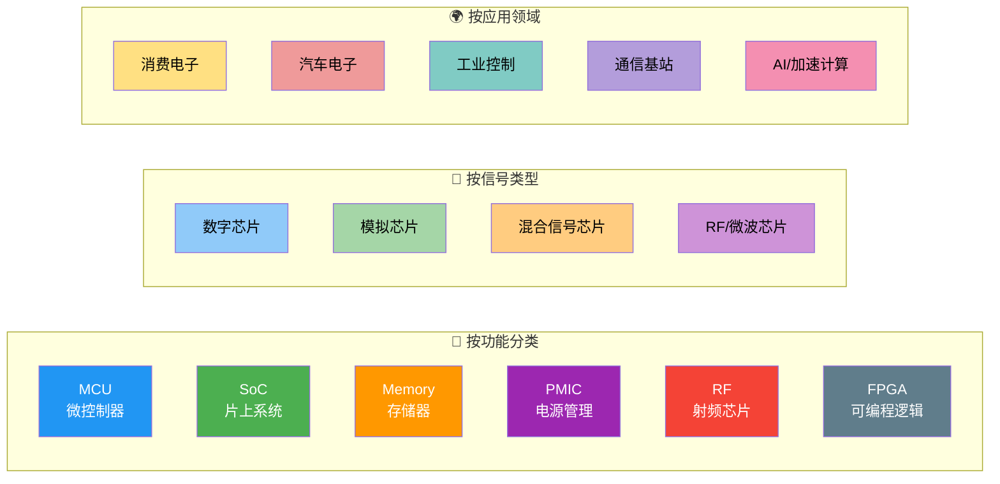
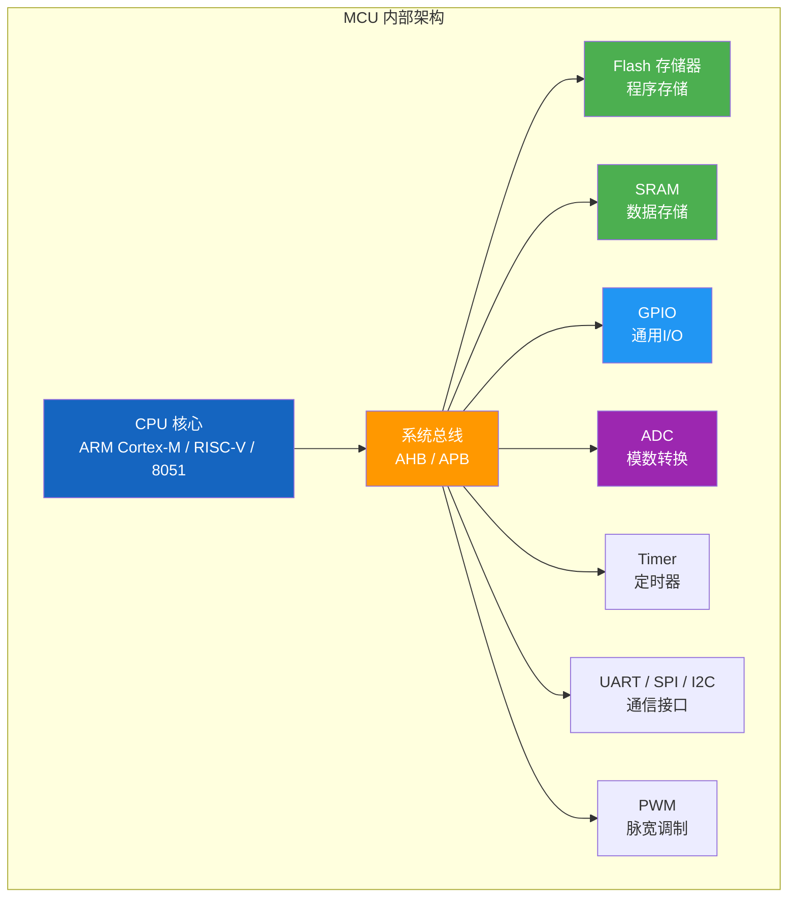
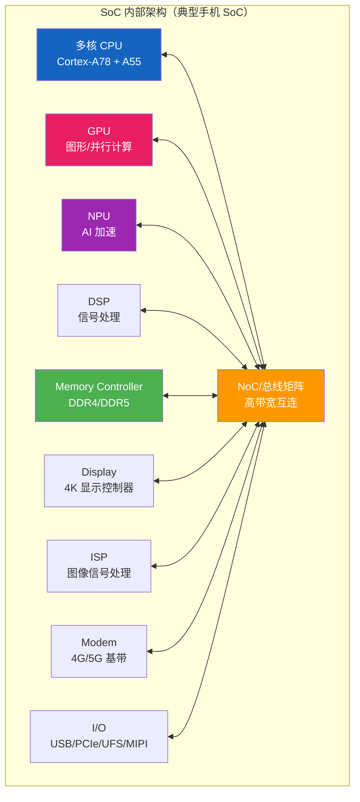
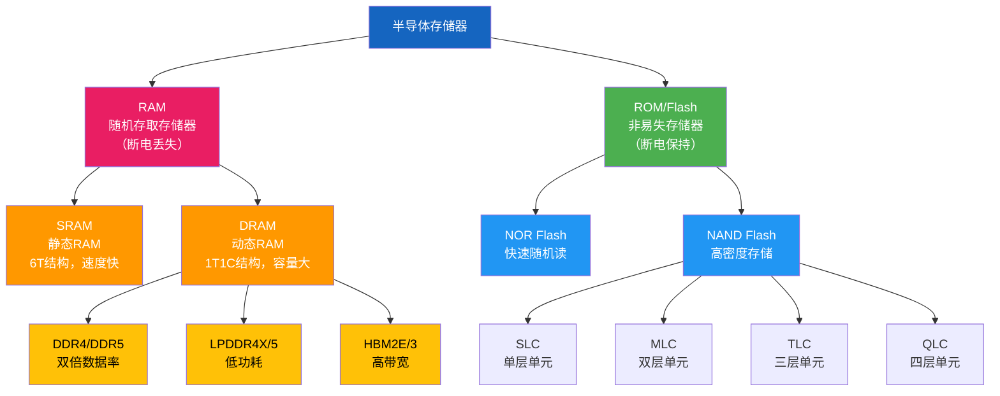
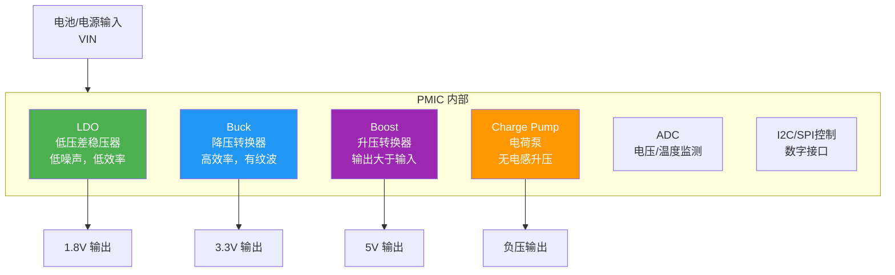
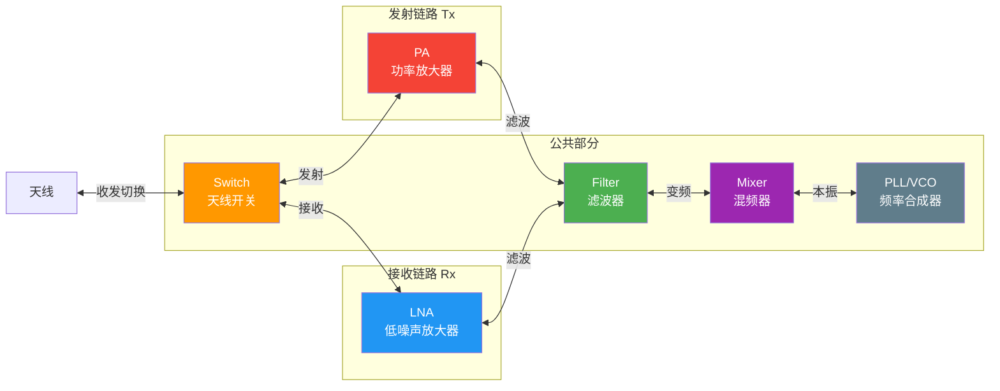
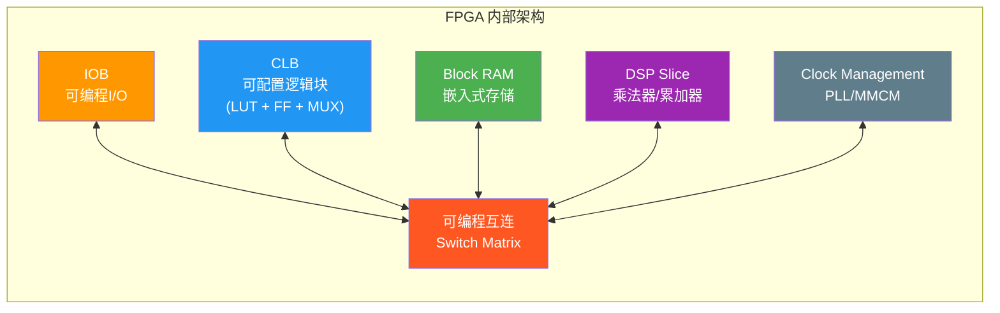

---
tags:
  - ate
  - semiconductor
  - chip-classification
  - mcu
  - soc
  - memory
  - pmic
  - rf
  - fpga
  - chapter2
created: 2026-06-14
---

# 2.5 芯片分类（MCU / SoC / Memory / PMIC / RF / FPGA）

> 🔗 文中的 **彩色高亮词** 均可点击跳转到文末 [[#术语解释|术语解释]] 查看详细说明。
> 📌 **前置要求**：建议先阅读 [[01.PN结与载流子|2.1 PN结与载流子]]、[[02.MOSFET与CMOS原理|2.2 MOSFET/CMOS原理]] 和 [[04.IC制造流程|2.4 IC制造流程]]。

## 为什么测试工程师要学芯片分类？

作为 ATE 测试工程师，你面对的不是泛泛的"芯片"——不同种类的芯片，测试方法、测试设备、测试策略都截然不同：

| 如果你在测... | 你的关注点是... | 典型 ATE 配置 |
|:---|:---|:---|
| **MCU** | GPIO、ADC、Flash烧写、外设功能 | 数字通道 + 低速模拟 |
| **SoC** | 高速接口、多核功能、功耗场景 | 高速数字 + RF + 混合信号 |
| **Memory** | 存储单元读写、Timing、BIST | 专用 Memory ATE |
| **PMIC** | 电压精度、效率、瞬态响应 | 精密模拟 + 大电流源 |
| **RF** | S参数、噪声系数、功率 | RF 板卡 + 屏蔽环境 |
| **FPGA** | 配置加载、I/O验证、时序 | 大量数字通道 |

> 💡 **一句话总结**：芯片分类决定了你的测试方案。用测 MCU 的方法去测 RF 芯片，就像用体温计量电压——工具不对，结果全错。

---

## 第一部分：芯片分类总览

在深入每一种芯片之前，先建立一个全局认知：

> 📌 一颗芯片可能同时属于多个分类。例如，一颗带 RF 收发器的 MCU（如 TI CC2530），既是 MCU 又是 RF 芯片——测试时需要同时覆盖数字和射频部分。

---

## 第二部分：MCU（微控制器）

### 2.1 什么是 MCU？

MCU（Microcontroller Unit，微控制器）是将 **CPU、存储器（Flash/RAM）、外设接口** 集成在单一芯片上的"**迷你计算机**"。它被设计用于**嵌入式控制**场景，特点是：**低功耗、低成本、实时性强**。

### 2.2 MCU 内部架构

> 图：MCU 典型内部架构——CPU 核心、存储器（Flash/SRAM）、总线系统及各类外设模块。[参考来源：英飞凌开发者社区](https://community.infineon.com/t5/%E5%8D%9A%E5%AE%A2/%E5%8D%95%E7%89%87%E6%9C%BA%E7%9A%84%E7%BB%84%E6%88%90-%E5%86%85%E9%83%A8%E7%BB%93%E6%9E%84%E6%8E%A2%E7%A7%98/ba-p/1087808)

### 2.3 MCU 的关键特征

| 特征 | 典型值 | 说明 |
|:---|:---|:---|
| **CPU 核心** | ARM Cortex-M0/M3/M4/M7, RISC-V, 8051 | 单核为主，主频通常在几十 MHz 到几百 MHz |
| **Flash** | 16KB ~ 2MB | 存储程序代码 |
| **SRAM** | 2KB ~ 1MB | 运行数据 |
| **工作电压** | 1.8V / 3.3V / 5V | 宽电压支持 |
| **功耗** | μA ~ mA 级（休眠模式 nA 级） | 极低功耗是核心卖点 |
| **封装** | QFN / LQFP / BGA | 引脚数从 8 到 200+ |
| **代表型号** | STM32（意法半导体）、GD32（兆易创新）、ESP32（乐鑫） | — |

### 2.4 MCU 的 ATE 测试要点

| 测试项 | 内容 | 方法 |
|:---|:---|:---|
| **Open/Short** | 每个引脚的 ESD 二极管导通 | 强制电流 ±100μA，测电压 |
| **Leakage** | 输入引脚漏电流 | 施加 VDDmax/VSS，测电流 |
| **Flash 测试** | 烧写 + 回读 + 校验 | ATE 通过 JTAG/SWD 烧写程序 |
| **GPIO 功能** | 输入/输出/上下拉 | 设定方向寄存器，驱动高/低，读取 |
| **ADC 测试** | 精度、线性度、INL/DNL | ATE 模拟源提供精确电压，读 ADC 值 |
| **功耗测试** | 运行/休眠/待机电流 | PMU 精密电流测量 |
| **时钟精度** | 内部 RC 振荡器频率 | 频率计或定时器捕获 |

> 📌 **MCU 测试的核心难点**：MCU 需要**烧写固件后测试**，这意味着测试程序不仅要控制 ATE，还要与芯片内部固件配合。通常策略是：先烧写一段专用 **Test Firmware**，然后 ATE 与 Firmware 协同完成各外设的自测试。

### 2.5 MCU 的典型应用

| 领域 | 应用 | 代表芯片 |
|:---|:---|:---|
| 消费电子 | 家电控制、遥控器、玩具 | STM8、PIC16 |
| 物联网 | 传感器节点、智能灯 | ESP32、nRF52 |
| 汽车电子 | 车窗控制、LED 驱动 | S32K、RH850 |
| 工业控制 | PLC、电机驱动 | STM32F4、TMS320 |

---

## 第三部分：SoC（片上系统）

### 3.1 什么是 SoC？

SoC（System on Chip，片上系统）是将**完整的电子系统**集成到单一芯片上。相比 MCU，SoC 集成度更高、性能更强，通常包含：

- **多核 CPU**（如 ARM Cortex-A 系列）
- **GPU**（图形处理器）
- **NPU/DSP**（AI/信号处理）
- **高速接口**（USB 3.0、PCIe、DDR 控制器）
- **多媒体编解码器**
- **Modem**（4G/5G/WiFi 基带）

> 💡 **MCU vs SoC 的核心区别**：MCU 是"单片机"——CPU + 基础外设，跑裸机或 RTOS；SoC 是"单芯片系统"——多核 + 复杂外设，通常跑 Linux/Android。

### 3.2 SoC 内部架构

> 图：SoC 芯片架构示意图——集成了 CPU、GPU、存储器控制器、通信接口等模块。各功能单元通过片上总线/NoC 互连。

### 3.3 SoC 的关键特征

| 特征 | 典型值 | 说明 |
|:---|:---|:---|
| **CPU** | 4-8 核，ARM Cortex-A 系列 | 主频 1-3 GHz |
| **制程** | 3nm / 5nm / 7nm | 先进制程，晶体管数十亿级 |
| **内存接口** | LPDDR4X / LPDDR5 | 带宽 50+ GB/s |
| **GPU** | Adreno / Mali / 自研 | 支持 OpenGL/Vulkan |
| **功耗** | 数百 mW ~ 数 W | 热管理至关重要 |
| **封装** | FC-BGA / PoP | 引脚数 500~2000+ |
| **代表型号** | 高通骁龙、苹果 A/M 系列、联发科天玑、海思麒麟 | — |

### 3.4 SoC 的 ATE 测试要点

> 📌 SoC 测试是 ATE 领域**最具挑战性**的方向之一——管脚多、速度快、功能复杂、功耗大。

| 测试项 | 内容 | 方法 |
|:---|:---|:---|
| **DDR 接口测试** | LPDDR PHY 训练、读写眼图 | ATE 高速数字通道 + DDR 协议卡 |
| **高速 SerDes** | PCIe/USB/UFS 信号完整性 | 高速示波器 + BERT/JTOL 测试 |
| **多核功能** | 各核心启动/通信/功耗 | 烧写 Linux + 运行多核测试脚本 |
| **GPU 测试** | 图形渲染/计算正确性 | 专用 GPU 测试 Pattern |
| **功耗场景** | 满载/待机/各模块独立功耗 | PMU 精密测量 + 多场景切换 |
| **DFT/Scan** | 全芯片扫描链测试 | ATPG 向量 + 压缩扫描 |

> 💡 **SoC 的测试策略**：由于 SoC 过于复杂，不可能在 ATE 上穷举所有功能。通常策略是 **ATE 做结构测试（DFT/Scan/Memory BIST）+ SLT 做功能覆盖**。业界趋势是越来越多测试从 ATE 转移到 SLT。

### 3.5 SoC 的典型应用

| 领域 | 应用 | 代表芯片 |
|:---|:---|:---|
| 智能手机 | 应用处理器 | 骁龙 8 Gen、苹果 A17 |
| 汽车 | 智能座舱/自动驾驶 | 高通 8295、英伟达 Orin |
| AI 加速 | 边缘推理/训练 | 英伟达 Jetson、算能 BM1684 |
| IoT 网关 | 边缘计算 | 瑞芯微 RK3588 |

---

## 第四部分：Memory（存储器芯片）

### 4.1 存储器分类总览

存储器芯片是半导体产业中**出货量最大**的一类芯片。按功能可分为：

### 4.2 三大存储技术对比

| 特性 | SRAM | DRAM | NAND Flash |
|:---|:---|:---|:---|
| **存储单元** | 6T 触发器 | 1T + 1C | Floating Gate / CT |
| **速度** | 1~10ns | 10~50ns | μs~ms 级 |
| **容量** | KB~MB 级 | GB 级 | GB~TB 级 |
| **功耗** | 中等 | 高（需刷新） | 低（写入时较高） |
| **刷新** | 不需要 | 需要（ms 级周期） | 不需要 |
| **非易失** | ❌ | ❌ | ✅ |
| **每 bit 成本** | 最高 | 中等 | 最低 |
| **典型用途** | CPU 缓存、MCU 内 RAM | 电脑内存、显存 | SSD、U 盘、手机存储 |

### 4.3 Memory 芯片的 ATE 测试要点

Memory 测试是 ATE 领域最成熟的测试类型之一，有其**专用的测试算法和专用设备**：

| 测试项 | 内容 | 方法 |
|:---|:---|:---|
| **DC 参数** | 工作电流、待机电流、漏电流 | 精密 PMU |
| **AC 参数** | 读写时序（tRCD/tRP/tCL）、Setup/Hold | 高速 Timing 测量 |
| **功能测试** | 全地址读写、March 算法 | 专用 Memory Pattern 生成器 |
| **保留测试** | 数据保持时间 | 写入 → 等待 → 回读 |
| **干扰测试** | 相邻单元串扰 | 访问相邻地址，校验目标地址 |
| **BIST** | 内建自测试（嵌入 SoC 的 Memory） | March C- / March LR 等算法 |

> 📌 **March 算法**是 Memory 测试中最经典的一类测试算法，通过在存储器上执行特定的**行进式读写序列**（如 Write0 → Read0 → Write1 → Read1...）来检测 Stuck-at、Transition、Coupling 等故障。

### 4.4 Memory 测试的专用 ATE

| 厂商 | 平台 | 特点 |
|:---|:---|:---|
| Advantest | T5833 / T5503 | DDR5/LPDDR5/HBM 测试 |
| Teradyne | Magnum 系列 | Flash/DRAM 通用 |
| 国产 | 长川科技 D9000 | 国产替代方案 |

---

## 第五部分：PMIC（电源管理芯片）

### 5.1 什么是 PMIC？

PMIC（Power Management Integrated Circuit，电源管理集成电路）负责为电子系统提供**稳定、高效、可靠**的电源。它是每台电子设备中**不可或缺**的芯片——没有 PMIC，CPU/SoC 根本无法工作。

### 5.2 PMIC 的功能模块

### 5.3 PMIC 的关键测试参数

| 参数           | 含义                 | 测试方法           |
| :----------- | :----------------- | :------------- |
| **输出电压精度**   | VOUT 与目标值的偏差       | 精确电压表 ±1mV     |
| **负载调整率**    | 负载从 0→满载时 VOUT 的变化 | 电子负载切换，测 ΔVOUT |
| **线性调整率**    | 输入电压变化时 VOUT 的变化   | 改变 VIN，测 ΔVOUT |
| **效率（η）**    | POUT / PIN × 100%  | 同时测输入/输出功率     |
| **输出纹波**     | 开关电源的输出电压波动        | 示波器 ACMode 测量  |
| **瞬态响应**     | 负载突变的恢复时间          | 动态负载 + 示波器捕获   |
| **静态电流（IQ）** | 芯片自身消耗的电流          | nA 级电流表        |
| **保护功能**     | 过流/过温/欠压锁定         | 注入故障条件，验证响应    |

> 📌 **PMIC 测试的核心难点**：PMIC 测试需要**大电流测量**（可达数安培到数十安培）+ **精密小信号测量**（μV/nA 级）+ **动态响应**测量——三者对 ATE 的硬件要求完全不同，是典型的精密混合信号测试。

### 5.4 PMIC 的典型应用

| PMIC 类型 | 应用 | 测试重点 |
|:---|:---|:---|
| **手机 PMIC** | 为 SoC/Memory/RF 供电 | 多路输出、效率、IQ |
| **汽车 PMIC** | BMS、LED 驱动、SBC | 宽温范围、可靠性、功能安全 |
| **服务器 PMIC** | 多相 Buck、Hot Swap | 大电流、均流、瞬态 |
| **IoT PMIC** | 电池供电低功耗设备 | 超低 IQ、效率 |

---

## 第六部分：RF（射频芯片）

### 6.1 什么是 RF 芯片？

RF（Radio Frequency，射频）芯片是处理和传输**高频电磁波信号**的芯片，是无线通信的核心。RF 芯片的工作频率从数百 MHz（如 LoRa 433MHz）到数十 GHz（如 5G mmWave 28/39GHz）。

### 6.2 RF 芯片的分类

### 6.3 RF 芯片的关键测试参数

| 参数 | 符号 | 含义 | 典型要求 |
|:---|:---|:---|:---|
| **S 参数** | S11/S21/S12/S22 | 端口反射/传输特性 | 用矢量网络分析仪（VNA）测 |
| **增益** | Gain | 输出功率 / 输入功率 | PA: 20~40dB |
| **噪声系数** | NF | 信噪比恶化程度 | LNA: < 1dB |
| **1dB 压缩点** | P1dB | 线性度上限（增益下降 1dB 时的输出功率） | 越高越好 |
| **三阶截点** | IIP3/OIP3 | 线性度指标 | 越大越线性 |
| **相位噪声** | PN | 频率纯度的频域度量 | 偏移 1MHz: < -150dBc/Hz |
| **EVM** | EVM | 调制精度误差 | 5G: < 3.5% |

### 6.4 RF 芯片 ATE 测试的特殊性

> 📌 RF 测试是 ATE 中的"高端玩家"领域——需要专门的 RF 板卡、屏蔽环境、精密校准。

| 挑战 | 说明 | 应对方案 |
|:---|:---|:---|
| **高频信号完整性** | GHz 级信号在探针/线缆中衰减严重 | 专用 RF Probe Card + 高频同轴线缆 |
| **噪声干扰** | 测试环境噪声会严重干扰 RF 测量 | 屏蔽箱 + 滤波 + 接地设计 |
| **校准复杂** | RF 测量需要复杂的去嵌入校准 | SOLT/TRL 校准标准 |
| **板卡昂贵** | RF ATE 板卡成本是数字板卡的 5-10 倍 | 多 Site 并行测试分摊成本 |
| **RF BIST 趋势** | 越来越多 RF 芯片内建 BIST | 减少对昂贵 RF ATE 的依赖 |

### 6.5 RF 芯片的典型应用

| 领域 | 芯片类型 | 频率范围 |
|:---|:---|:---|
| 手机通信 | 4G/5G FEM（前端模块） | 600MHz ~ 6GHz |
| WiFi/BT | WiFi7 FEM、BT SoC | 2.4GHz / 5GHz / 6GHz |
| 物联网 | LoRa、NB-IoT、Zigbee | Sub-GHz / 2.4GHz |
| 雷达/卫星 | mmWave PA/LNA | 24GHz / 77GHz / E-band |

---

## 第七部分：FPGA（现场可编程门阵列）

### 7.1 什么是 FPGA？

FPGA（Field Programmable Gate Array，现场可编程门阵列）是一种**硬件可重构**的芯片——你可以在出厂后通过编程改变芯片内部的电路连接，实现你想要的任何数字逻辑功能。

> 图：FPGA 逻辑单元结构图——包含 4 输入 LUT、全加器和 D 触发器。这是 FPGA 最基本的可编程单元。[来源：Wikimedia Commons](https://commons.wikimedia.org/wiki/File:FPGA_cell_example.png)

### 7.2 FPGA 的核心特点

| 特点 | 说明 |
|:---|:---|
| **硬件可重构** | 通过加载 Bitstream 配置内部电路，可以"变身"为任何数字电路 |
| **并行计算** | 天然适合并行处理，不同于 CPU 的串行执行 |
| **低延迟** | 硬件直接实现逻辑，无指令周期开销 |
| **快速原型** | 无需 ASIC 流片，即可验证数字设计 |
| **成本** | 单颗芯片成本高于 ASIC（量产时），但无 NRE 费用 |

> 💡 **FPGA vs ASIC**：ASIC（专用集成电路）是"定制芯片"——设计好后不能改，但量产成本极低。FPGA 是"万能芯片"——可以反复改，但单颗成本高。很多人用 FPGA 做原型验证，确认无误后再流片 ASIC。

### 7.3 FPGA 的 ATE 测试要点

FPGA 测试的最大特点是：**芯片在测试前是"空白"的**，需要先加载配置才能测试。

| 测试项 | 内容 | 方法 |
|:---|:---|:---|
| **配置加载** | 验证能否正常下载 Bitstream | 通过 JTAG/SPI 加载配置 |
| **I/O 验证** | 全部 I/O 引脚功能 | 配置成回环模式，ATE 发→收 |
| **CLB 测试** | LUT/FF/MUX 功能 | 配置特定 Pattern，验证真值表 |
| **Block RAM 测试** | 嵌入式存储器读写 | BIST/March 算法 |
| **DSP 测试** | 乘法器精度和频率 | 配置乘法器，输入已知数据，验证输出 |
| **PLL 测试** | 时钟倍频/分频精度 | 配置 PLL，测量输出频率 |
| **功耗测试** | 静态/动态功耗 | 配置不同利用率的设计，测电流 |

> 📌 **FPGA 测试的核心难点**：FPGA 的资源数量巨大（例如 Xilinx VU13P 有 378 万个 LUT），不可能测试所有可能的配置组合。测试策略是做**关键资源覆盖**：每个类型的资源至少被一个配置覆盖到。

### 7.4 FPGA 代表厂商与平台

| 厂商 | 系列 | 制程 | 测试平台 |
|:---|:---|:---|:---|
| Xilinx（AMD） | Virtex / Kintex / Artix / Zynq | 7nm / 16nm | Advantest V93000 / Teradyne UltraFLEX |
| Intel（Altera） | Stratix / Arria / Cyclone / Agilex | 7nm / 10nm | Advantest V93000 |
| Lattice | iCE40 / ECP5 / CrossLink | 28nm / 40nm | Teradyne J750 |
| 国产 | 复旦微 / 紫光同创 / 安路科技 | 28nm+ | 国产 ATE 平台 |

### 7.5 FPGA 的典型应用

| 领域 | 应用 | 说明 |
|:---|:---|:---|
| 通信基站 | 5G 基带处理、波束赋形 | 实时并行处理 |
| 数据中心 | SmartNIC、AI 推理加速 | 低延迟 + 高吞吐 |
| 航天/军工 | 星载处理、雷达信号处理 | 抗辐射 + 高可靠性 |
| 原型验证 | ASIC 流片前验证 | 快速迭代 |

---

## 第八部分：六大芯片类型速查表

| 芯片类型 | 核心功能 | 工作频率 | 引脚数 | 主要测试挑战 | 推荐 ATE 平台 |
|:---|:---|:---|:---|:---|:---|
| **MCU** | 嵌入式控制 | < 500MHz | 8~200+ | Flash 烧写、外设协同 | J750 / Chroma |
| **SoC** | 复杂系统处理 | 1~3GHz | 500~2000+ | 多核/高速接口/功耗 | UltraFLEX / V93000 |
| **Memory** | 数据存储 | DDR 速率 | 100~1000+ | Timing 精度/算法 | Magnum / T5833 |
| **PMIC** | 电源管理 | 开关频率 MHz | 10~100 | 大电流 + 精密测量 | ETS-800 / STS8200 |
| **RF** | 无线通信 | 0.4~60GHz | 10~200 | 高频校准/噪声 | UltraFLEX RF / V93000 RF |
| **FPGA** | 可编程逻辑 | I/O 速率 Gbps | 200~2000+ | 配置加载/资源覆盖 | UltraFLEX / V93000 |

---

## 术语解释

#### MCU（Microcontroller Unit，微控制器）

又称单片机，将 CPU、存储器、外设接口集成在单一芯片上的微型计算机。主要用于嵌入式控制场景，特点是低功耗、低成本、实时性强。代表型号：STM32、ESP32、GD32。

#### SoC（System on Chip，片上系统）

将整个电子系统的功能集成在单一芯片上的高度集成化芯片。通常包含多核 CPU、GPU、NPU、高速接口等，运行复杂操作系统（Linux/Android）。代表型号：高通骁龙、苹果 A 系列。

#### CPU 核心（Core）

芯片中执行指令的处理器核心。MCU 通常搭载单核（ARM Cortex-M），SoC 通常搭载多核（ARM Cortex-A）。核心的架构、频率和数量直接影响芯片的计算能力。

#### Flash 存储器

一种非易失性半导体存储器，断电后数据不会丢失。MCU 内部通常集成 **嵌入式 Flash（eFlash）** 用于存储程序代码。测试时需要烧写、回读并校验数据正确性。

#### SRAM（Static Random Access Memory，静态随机存取存储器）

使用 6 晶体管触发器结构存储数据，速度快（ns 级），不需要刷新，但每 bit 成本高、面积大。通常用作 CPU 的高速缓存（Cache）或 MCU 的片上数据存储器。

#### DRAM（Dynamic Random Access Memory，动态随机存取存储器）

使用 1 晶体管 + 1 电容（1T1C）结构存储数据，容量大、成本低，但需要周期性刷新（Refresh）以保持数据。用于电脑内存、服务器内存。DDR4/DDR5 是 DRAM 的主流接口标准。

#### NAND Flash

一种高密度非易失存储器，通过 Floating Gate 或 Charge Trap 存储电荷来保存数据。按每单元存储位数分为 SLC（1bit/cell）、MLC（2bit）、TLC（3bit）、QLC（4bit）。是 SSD、U 盘、手机存储的核心。

#### LDO（Low Dropout Regulator，低压差线性稳压器）

一种线性稳压器，通过调整串联晶体管的导通电阻来稳定输出电压。特点是输出噪声极低、响应快，但效率 = VOUT/VIN（输入输出压差越大效率越低）。

#### Buck Converter（降压转换器）

一种开关型 DC-DC 转换器，通过 PWM 控制开关管的通断将高电压转换为低电压。效率高（通常 85%~95%），但输出有开关纹波。

#### S 参数（Scattering Parameters，散射参数）

用于描述高频/射频网络的端口特性的参数矩阵。S11 为输入反射系数（回波损耗），S21 为正向传输系数（增益）。测量 S 参数是 RF 测试中最基础的操作。

#### 噪声系数（Noise Figure，NF）

衡量器件/系统对信号信噪比恶化程度的指标，单位 dB。NF = SNR_in(dB) - SNR_out(dB)，理想放大器 NF = 0dB。LNA 的 NF 是其最重要的指标之一。

#### LUT（Look-Up Table，查找表）

FPGA 中实现组合逻辑的基本单元。本质上是一个小型 SRAM，将输入地址映射到预存的输出值。例如，一个 4 输入 LUT 可以表示任意 4 变量的布尔函数。

#### CLB（Configurable Logic Block，可配置逻辑块）

FPGA 中最基本的可编程逻辑资源，由多个 SLICE 组成。每个 SLICE 包含 LUT、触发器（FF）、多路选择器（MUX）和进位链。CLB 的数量决定了 FPGA 的逻辑容量。

#### Bitstream

FPGA 的配置文件，包含了芯片内部所有可编程资源的配置信息（LUT 真值表、互连开关状态、I/O 标准等）。FPGA 上电后必须加载 Bitstream 才能工作。

#### March 算法

一类专门用于测试存储器（SRAM/DRAM/Flash）的测试算法。通过在存储器上执行特定的行进式读写序列（如 March C-：↕W0; ↑R0W1; ↑R1W0; ↕R0W1R1; ↕R0）来检测各种故障类型（Stuck-at、Transition、Coupling 等）。

#### EVM（Error Vector Magnitude，误差向量幅度）

衡量数字调制信号质量的指标，定义为实际信号与理想参考信号之间的误差向量幅度。EVM 越小，调制精度越高。5G NR 要求 EVM < 3.5%（64QAM）。

#### 多 Site 并行测试

在同一台 ATE 上同时测试多颗芯片的技术。例如 4-Site 并行测试可以同时测 4 颗芯片，理论吞吐量提高 4 倍。多 Site 是降低单颗芯片测试成本的最有效手段。

#### NoC（Network on Chip，片上网络）

先进 SoC 中使用的一种互连架构，用类似计算机网络（路由/包交换）的方式连接芯片内部的各个模块。相比传统总线，NoC 具有更高的带宽和更好的可扩展性。

#### BIST（Built-In Self-Test，内建自测试）

在芯片内部集成测试电路，使芯片能够自己测试自己的技术。Memory BIST 可以自动执行 March 算法测试嵌入式存储器，减少对昂贵 ATE 的依赖。

---

## 🔗 延伸阅读与参考资料

### 各芯片类型深度学习链接

| 芯片类型 | 推荐文章 | 来源 |
|:---|:---|:---|
| **MCU** | [MCU 内部架构及程序运行原理讲解](https://blog.csdn.net/2301_77010025/article/details/132915179) | CSDN |
| **MCU** | [单片机MCU的基本结构与工作原理](https://zhuanlan.zhihu.com/p/618264621) | 知乎 |
| **SoC** | [干货 \| 一文搞懂SoC的架构（建议收藏）](https://zhuanlan.zhihu.com/p/18718420182) | 知乎 |
| **SoC** | [SOC芯片架构技术分析（一）](https://zhuanlan.zhihu.com/p/658816690) | 知乎 |
| **Memory** | [存储器的分类整理(SRAM/DRAM/NOR FLASH/NAND FLASH)](https://blog.csdn.net/qq_42973834/article/details/108676693) | CSDN |
| **Memory** | [一文彻底搞懂DRAM、SRAM、NAND Flash](https://zhuanlan.zhihu.com/p/1903762772094870461) | 知乎 |
| **PMIC** | [SOC 电源管理芯片（PMIC）功能及测试](https://www.ijiwei.com/n/1007975) | 集微网 |
| **PMIC** | [LDO基础及其ATE测试](https://juejin.cn/post/7543207515763441714) | 掘金 |
| **RF** | [射频芯片ATE测试从入门到放弃](https://blog.csdn.net/zy731025074/article/details/126143725) | CSDN |
| **RF** | [ATE测试机板卡介绍（十）- 射频板卡](https://zhuanlan.zhihu.com/p/1945080316642465761) | 知乎 |
| **FPGA** | [FPGA的基石：深入解析可配置逻辑块（CLB）架构](https://zhuanlan.zhihu.com/p/30866015650) | 知乎 |
| **FPGA** | [FPGA内部结构](https://zhuanlan.zhihu.com/p/609953683) | 知乎 |
| **综合** | [六大核心芯片：MCU/SOC/DSP/FPGA/NPU/GPU 的区别与应用](https://zeeklog.com/liu-da-he-xin-xin-pian-mcu-soc-dsp-fpga-npu-gpu-de-qu-bie-yu-ying-yong-jie-xi-4/) | ZeekLog |
| **综合** | [芯片ATE测试学习（实时更新）](https://zhuanlan.zhihu.com/p/617589232) | 知乎 |

---

> 📚 **本章小结**：六大核心芯片类型各有特点和测试重点——**MCU** 重在固件烧写与外设协同测试；**SoC** 重在高速接口与多核功耗场景；**Memory** 重在精密 Timing 与 March 算法覆盖；**PMIC** 重在大电流与精密小信号混合测量；**RF** 重在高频信号完整性与噪声控制；**FPGA** 重在配置加载与资源覆盖。理解每种芯片的特点，是设计测试方案的第一步。
>
> 🔗 **下一步**：[[../01.行业与基础认知/01.行业认知|1.1 行业认知]]（回顾 CP/FT/SLT 测试流程在各类芯片中的应用）→ 或者继续 [[../03.数字电路基础|3. 数字电路基础]] 进入下一章学习。
