---
tags:
  - ate
  - digital-circuit
  - combinational-logic
  - sequential-logic
  - flip-flop
  - latch
  - chapter3
created: 2026-06-14
---

# 3.1 组合逻辑与时序逻辑

> 🔗 文中的 **彩色高亮词** 均可点击跳转到文末 [[#术语解释|术语解释]] 查看详细说明。
> 📌 **前置要求**：建议先阅读 [[../02.半导体基础/02.MOSFET与CMOS原理|2.2 MOSFET/CMOS原理]] 理解底层器件，以及 [[../02.半导体基础/05.芯片分类|2.5 芯片分类]] 了解各类芯片的测试特点。

## 为什么测试工程师要学组合逻辑与时序逻辑？

作为 ATE 测试工程师，你每天接触的不只是"电压"和"电流"——你还需要理解芯片内部的**数字逻辑行为**：

| 如果你在做... | 你需要理解... | 为什么？ |
|:---|:---|:---|
| **Pattern 测试** | 组合逻辑的真值表行为 | 测试向量本质上是在遍历输入组合，验证输出是否符合预期 |
| **Scan 测试** | 时序逻辑的触发器链路 | Scan Chain 就是把所有 DFF 串成移位寄存器，逐拍打入/读出数据 |
| **AC 参数测试** | Setup/Hold Time 的含义 | Setup/Hold 是时序逻辑最核心的 AC 参数，直接决定芯片能跑多快 |
| **功能测试 Debug** | 组合逻辑的竞争冒险 | 某些间歇性 Fail 可能来自组合逻辑中的 Glitch，而非芯片缺陷 |
| **时钟相关测试** | Clock Tree、Skew、Jitter | 时钟是时序逻辑的"心跳"，时钟异常会导致整个芯片功能错误 |

> 💡 **一句话总结**：组合逻辑 = 芯片的"计算"，时序逻辑 = 芯片的"记忆 + 节拍"。ATE 测试本质上是**用组合逻辑生成测试激励，通过时序逻辑采样结果验证**。

---

## 第一部分：组合逻辑基础

### 1.1 什么是组合逻辑？

**定义**：组合逻辑电路的**任意时刻输出仅取决于该时刻的输入**，与电路的历史状态无关。

这句话的关键词是"**仅取决于当前输入**"——它意味着组合逻辑：
- ❌ **没有记忆**：不知道"刚才发生了什么"
- ❌ **没有反馈**：输出不会绕回来影响输入
- ✅ **纯函数**：相同输入必定产生相同输出

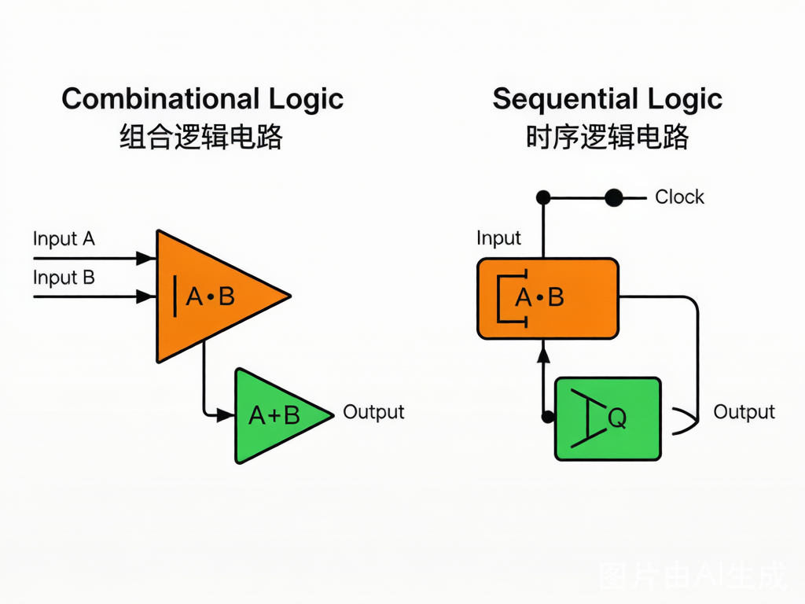

> 图：组合逻辑（左）vs 时序逻辑（右）的本质区别——时序逻辑多了"存储元件"和"反馈回路"。[AI生成示意图]

### 1.2 基本逻辑门

组合逻辑的最基本构建块是**逻辑门（Logic Gate）**。每个逻辑门实现一个布尔函数：

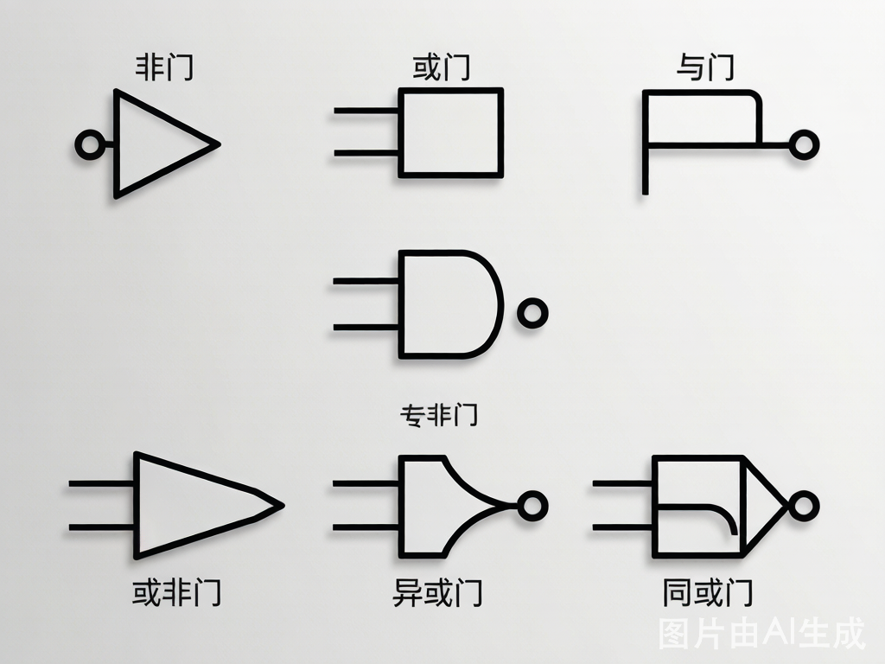

> 图：7 种基本逻辑门的 IEEE/ANSI 标准符号。[AI生成示意图]

| 门类型 | 符号 | 布尔表达式 | 真值表（A,B → Y） | 晶体管数（CMOS） |
|:---|:---|:---|:---|:---:|
| **NOT（非门）** | ![NOT] | Y = Ā | 0→1, 1→0 | 2 (1 PMOS + 1 NMOS) |
| **AND（与门）** | ![AND] | Y = A·B | 00→0, 01→0, 10→0, 11→1 | 6 (NAND + NOT) |
| **OR（或门）** | ![OR] | Y = A+B | 00→0, 01→1, 10→1, 11→1 | 6 (NOR + NOT) |
| **NAND（与非门）** | ![NAND] | Y = (A·B)' | 00→1, 01→1, 10→1, 11→0 | 4 (2 PMOS + 2 NMOS) |
| **NOR（或非门）** | ![NOR] | Y = (A+B)' | 00→1, 01→0, 10→0, 11→0 | 4 (2 PMOS + 2 NMOS) |
| **XOR（异或门）** | ![XOR] | Y = A⊕B | 00→0, 01→1, 10→1, 11→0 | 8~12 |
| **XNOR（同或门）** | ![XNOR] | Y = (A⊕B)' | 00→1, 01→0, 10→0, 11→1 | 10~14 |

> 📌 **为什么 NAND/NOR 是"通用门"？** 因为仅用 NAND（或仅用 NOR）就能实现所有其他逻辑门。在 CMOS 工艺中，NAND 和 NOR 是**面积最小、速度最快**的基本门，所以数字 IC 设计几乎全部用 NAND/NOR 搭建。

**CMOS 门电路简图**：

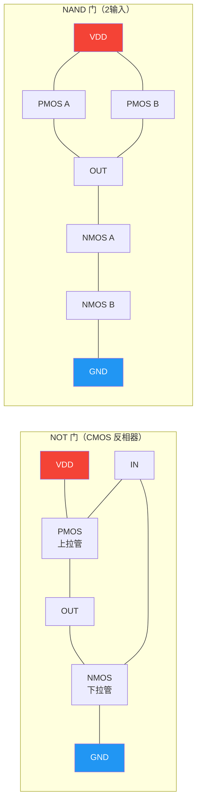

> 图：CMOS 反相器和 NAND 门电路结构。PMOS 并联（NAND 上拉）= 任意一路导通即上拉；NMOS 串联（NAND 下拉）= 必须两路同时导通才下拉。[回看 [[../02.半导体基础/02.MOSFET与CMOS原理|2.2 MOSFET/CMOS原理]]]

### 1.3 组合逻辑的特点总结

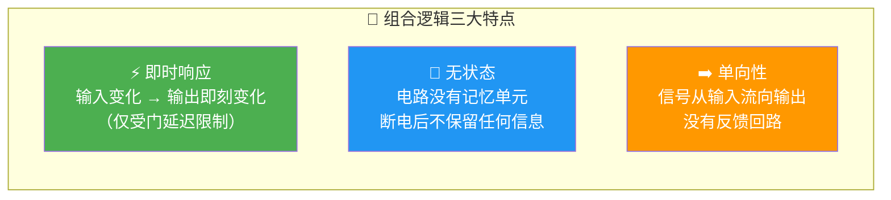

### 1.4 常见组合逻辑电路

| 电路名称 | 功能 | 输入→输出 | ATE 测试关注点 |
|:---|:---|:---|:---|
| **编码器（Encoder）** | 将 2ⁿ 路输入编码为 n 位二进制 | 4→2, 8→3 | 优先级逻辑验证 |
| **译码器（Decoder）** | 将 n 位二进制译码为 2ⁿ 路输出 | 2→4, 3→8 | 使能端、所有组合遍历 |
| **多路选择器（MUX）** | 从多路输入中选一路输出 | 2ⁿ:1 | Select 信号切换、延迟 |
| **加法器（Adder）** | 二进制加法运算 | A+B → Sum, Carry | 进位链延迟、溢出 |
| **比较器（Comparator）** | 比较两个数的大小 | A,B → A>B, A=B, A<B | 全组合验证 |

**译码器（2-4 Decoder）工作原理**：

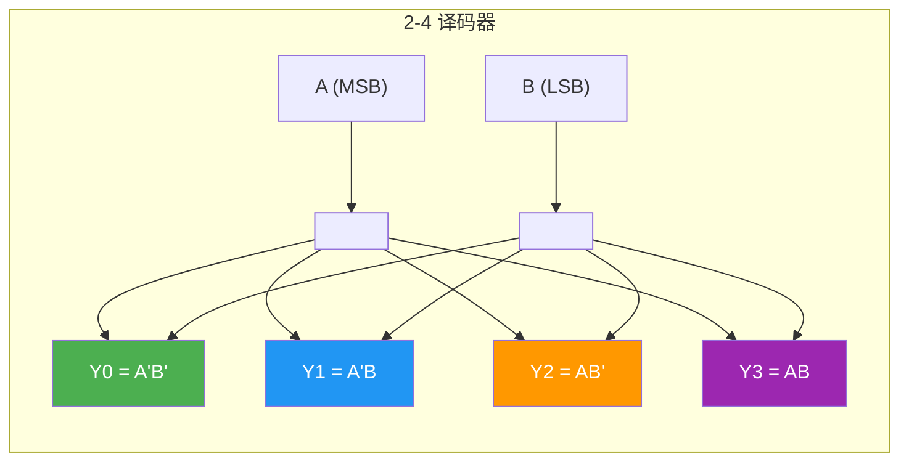

> 📌 **ATE 测试视角**：测试译码器时，你需要遍历 A,B 的所有 4 种组合（00/01/10/11），验证每次只有一根输出为高电平。如果同时有两根输出为高，说明芯片内部有短路缺陷。

### 1.5 组合逻辑的竞争与冒险（Hazards）

这是组合逻辑中最容易出问题、也最容易被忽视的地方：

- **竞争（Race）**：两个信号到达同一个门的时间不同（路径延迟差异）
- **冒险（Hazard）**：由于竞争导致输出出现**短暂的错误脉冲（Glitch）**

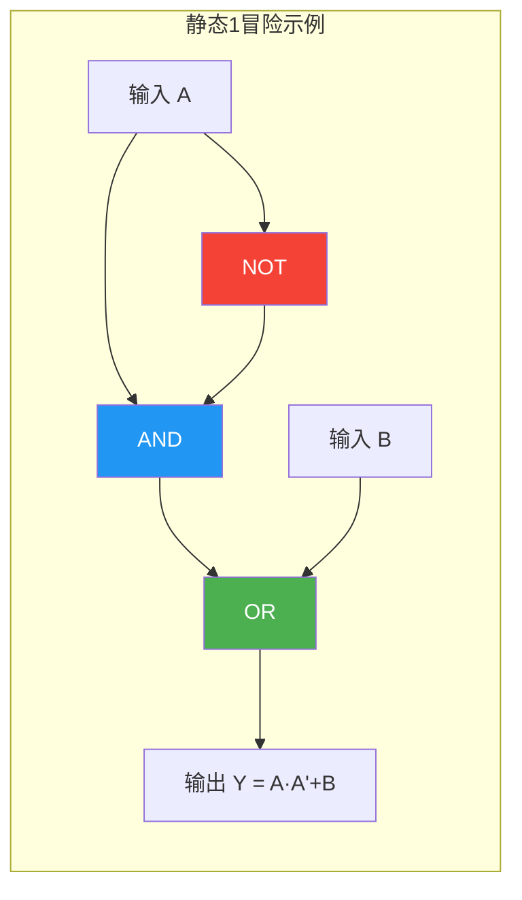

> **场景**：A=1, B=0 → Y=0。当 A 从 1→0 时，理论输出应保持 Y=0。但由于反相器有延迟，AND 门会在极短时间内看到 A=0 和 A'=1（旧值），产生一个**尖峰脉冲（Glitch）**。

| 冒险类型 | 现象 | 发生条件 | 是否可消除 |
|:---|:---|:---|:---|
| **静态-1 冒险** | 输出应为 1，但出现短暂 0 | 信号路径延迟不同 | ✅ 加冗余项 |
| **静态-0 冒险** | 输出应为 0，但出现短暂 1 | 信号路径延迟不同 | ✅ 加冗余项 |
| **动态冒险** | 输出应变化一次，但震荡多次 | 多条路径延迟不同 | ✅ 用同步电路 |

> 🎯 **ATE 测试关联**：冒险产生的 Glitch 宽度通常在 ps~ns 级。如果你的测试 Strobe 位置恰好落在 Glitch 上，就会读到错误的结果。这就是为什么**Strobe 位置选择**在 Pattern 测试中至关重要——你需要等信号稳定后再采样。

---

## 第二部分：时序逻辑基础

### 2.1 什么是时序逻辑？

**定义**：时序逻辑电路的输出不仅取决于当前输入，还取决于**电路当前的状态**（即"历史"）。

对比记忆：

| 维度 | 组合逻辑 | 时序逻辑 |
|:---|:---|:---|
| **输出依赖** | 仅当前输入 | 当前输入 + 当前状态 |
| **记忆能力** | 无 | 有（通过存储元件） |
| **时钟** | 不需要 | 通常需要 |
| **Verilog 描述** | `assign` / `always @(*)` | `always @(posedge clk)` |
| **电路结构** | 纯门电路 | 门电路 + 存储元件 |
| **测试方法** | 真值表遍历 | 状态机遍历 + 时序约束 |

### 2.2 锁存器（Latch）vs 触发器（Flip-Flop）

这是数字电路中最基础、最重要的两个存储元件：

| 特性 | Latch（锁存器） | Flip-Flop（触发器） |
|:---|:---|:---|
| **触发方式** | **电平触发**（Level-sensitive） | **边沿触发**（Edge-triggered） |
| **透明期** | 时钟有效电平期间，输出跟随输入 | 仅在时钟边沿瞬间采样输入 |
| **空翻问题** | ❌ 存在（有效电平内输入多次变化则输出多次翻转） | ✅ 不存在 |
| **面积** | 较小 | 较大（≈2倍） |
| **功耗** | 较低 | 较高 |
| **抗噪能力** | 弱 | 强 |
| **典型用途** | 门控时钟、数据暂存 | 寄存器、计数器、状态机 |
| **在 ASIC 中** | 尽量避免（DFT 不友好） | 标准单元库主力 |

**SR Latch（基本锁存器）**：

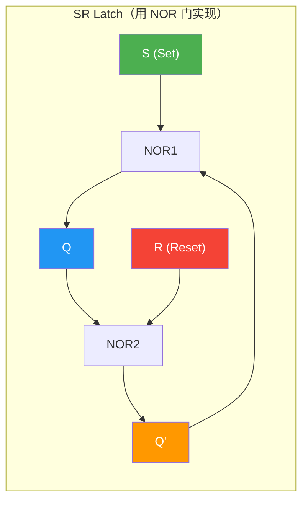

| S | R | Q | Q' | 状态 |
|:---:|:---:|:---:|:---:|:---|
| 0 | 0 | 保持 | 保持 | **保持**（记忆） |
| 0 | 1 | 0 | 1 | **Reset** |
| 1 | 0 | 1 | 0 | **Set** |
| 1 | 1 | 0 | 0 | 🚫 **禁止**（Q=Q'=0，违反互补性） |

> ⚠️ SR Latch 的 S=R=1 是**非法状态**——复位后状态不确定。这也是为什么实际电路中很少直接使用 SR Latch。

**D Flip-Flop（边沿触发 D 触发器）**——这是 ATE 测试中最常打交道的器件：

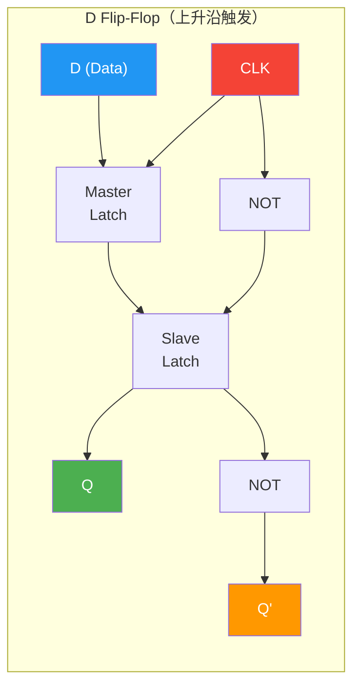

**D 触发器真值表**（上升沿触发）：

| CLK | D | Q(next) | 说明 |
|:---:|:---:|:---:|:---|
| ↑ | 0 | 0 | 采样到 0 |
| ↑ | 1 | 1 | 采样到 1 |
| 0 / 1 / ↓ | X | Q（保持） | 非上升沿不变化 |

> 💡 **主从结构**：边沿 DFF 内部由两个 Latch（Master + Slave）级联。CLK=0 时 Master 透明（跟踪 D 变化）；CLK 上升沿到来时 Master 锁存 → Slave 透明，输出更新。正是"先关 Master，再开 Slave"的顺序阻止了空翻。

### 2.3 DFF 的时序参数

每一个 DFF 都有几个**关键的时序参数**，这些参数直接决定了芯片能跑的最高频率：

```
        ┌────── setup ──────┐┌─ hold ─┐
        │    时间窗口        ││ 时间窗口│
        │←─────────────→││←──→│
DATA ───┴────────────────────┘└───────────────
                            ┌───┐
CLK  ───────────────────────┘   └─────────────
                            ↑
                        采样边沿
        │←─── clk-to-q ────→│
                       Q ────┘
```

| 参数 | 符号 | 含义 | 典型值（28nm） |
|:---|:---|:---|:---:|
| **建立时间** | **t_setup** | 数据在时钟边沿**之前**必须稳定的最短时间 | 50~150 ps |
| **保持时间** | **t_hold** | 数据在时钟边沿**之后**必须保持的最短时间 | 0~50 ps |
| **时钟到输出延迟** | **t_ck→q** | 时钟边沿到输出 Q 有效的时间 | 100~300 ps |
| **最小脉冲宽度** | **t_pw** | 时钟高/低电平的最短持续时间 | 80~200 ps |

> 🎯 **ATE 测试核心**：Setup Time 和 Hold Time 是 [[AC参数测试]] 中最重要的两个指标。如果你测一颗芯片的 t_setup 超标，意味着数据没有提前足够时间到达——芯片可能在高温/低压下出现间歇性功能错误。Setup/Hold 的详细测试方法将在后续章节展开。

### 2.4 常见时序逻辑电路

| 电路名称 | 功能 | 本质 | ATE 测试关注点 |
|:---|:---|:---|:---|
| **寄存器（Register）** | 存储一组数据（n 位） | n 个 DFF + 共同时钟 | 并行加载、输出延迟 |
| **移位寄存器（Shift Register）** | 数据逐位移动 | DFF 级联（Q→下一级 D） | **Scan Chain 的本质！** |
| **计数器（Counter）** | 每个时钟周期计数值 +1 | DFF + 组合反馈 | 进位延迟、最大频率 |
| **分频器（Divider）** | 将时钟频率除以 N | 计数器 + 译码 | 占空比、抖动 |

**4位环形移位寄存器**（注意这其实就是 Scan Chain 的原理）：

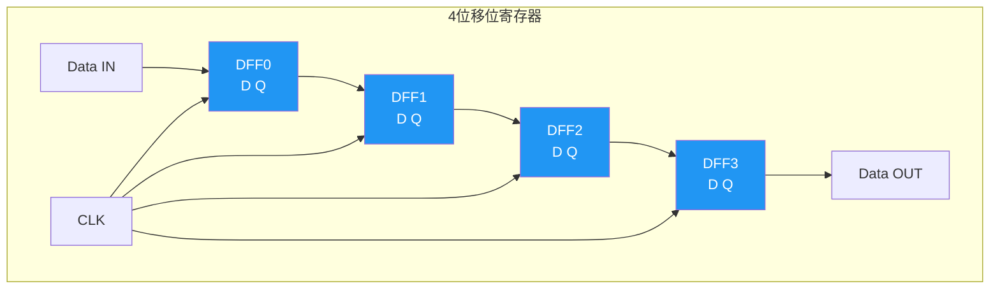

> 💡 **Scan Chain 就是移位寄存器！** 测试模式下，芯片内所有 DFF 串成一条超长移位寄存器。ATE 通过 Scan In 把测试向量打入，时钟拍一拍地移位，最后从 Scan Out 读出结果。这是 DFT 的核心思想，将在后续 [[../第二部分/DFT|DFT 章节]] 详述。

---

## 第三部分：组合逻辑 + 时序逻辑 = 数字系统

### 3.1 一个完整的同步数字系统

所有现代数字芯片（MCU、SoC、FPGA）都是组合逻辑和时序逻辑的结合：

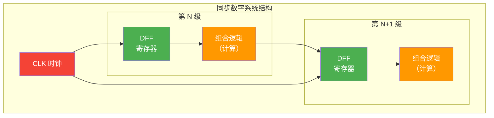

> **关键约束**：两级 DFF 之间的组合逻辑延迟必须 < 时钟周期 - t_setup - t_ck→q。这就是**建立时间约束（Setup Constraint）**，决定了芯片的最大工作频率 Fmax。

### 3.2 与 ATE Pattern 测试的关联

当你写测试 Pattern 时，本质上是在操作这个"组合逻辑 + 时序逻辑"系统：

| Pattern 操作 | 对应逻辑 | 说明 |
|:---|:---|:---|
| 设置输入引脚电平 | 驱动组合逻辑输入 | 每个向量周期设置不同的输入组合 |
| 等待信号传播 | 组合逻辑计算 | 等待门延迟 + 线延迟 |
| 发送时钟脉冲 | 触发 DFF 采样 | 在合适的 Strobe 时刻捕获输出 |
| 读取输出引脚 | 检查时序逻辑输出 | 与 Expected 值比较 |

```
时序图示例（一个 Pattern 周期）：
         ┌──────┐
CLK  ────┘      └────────────────
         ┌──────────────────────┐
INPUT ──┘  新输入               └────────
                    ┌──────────┐
OUTPUT ─────────────┘  输出有效  └────────
                    ↑      ↑
                 t_setup   Strobe 采样点
```

> 🎯 **Pattern Timing 的核心问题**：Strobe 放在哪里？放太早 → 信号还没稳定（组合逻辑还在算）；放太晚 → 浪费测试时间。Timing 优化是 ATE 工程师的核心技能之一。

---

## 第四部分：速查总结

### 4.1 一图看懂组合逻辑 vs 时序逻辑

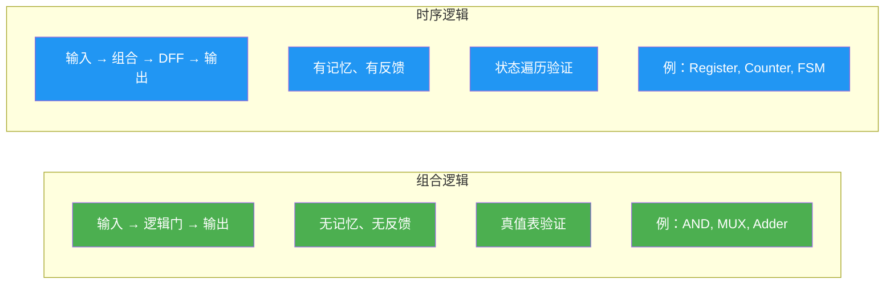

### 4.2 ATE 工程师必记要点

| 序号 | 要点 | 为什么重要 |
|:---:|:---|:---|
| 1 | **组合逻辑 = 输入→即时输出** | Pattern 的 Expected 值基于真值表计算 |
| 2 | **时序逻辑 = 输入 + 状态→输出** | Scan Chain、状态机测试必须理解当前状态 |
| 3 | **DFF 是时序逻辑的原子单元** | 所有数字芯片的状态存储都靠 DFF |
| 4 | **t_setup + t_hold 定义"采样窗口"** | AC 参数测试的核心对象 |
| 5 | **竞争冒险产生 Glitch** | 需要选择合适的 Strobe 位置避开 |
| 6 | **Fmax = 1 / (t_ck→q + t_logic + t_setup)** | 决定芯片能不能跑标称频率 |

---

## 📖 术语解释

### 基本逻辑门

#### AND Gate（与门）
输出为 1 当且仅当所有输入均为 1。布尔表达式：Y = A·B。CMOS 中通常由 NAND+NOT 实现。常用于"条件满足"判断、使能控制等场景。

#### OR Gate（或门）
任意输入为 1 则输出为 1。布尔表达式：Y = A+B。常用于中断合并、多条件触发等。

#### NOT Gate（非门 / 反相器）
输出为输入的补码。布尔表达式：Y = Ā。CMOS 中最简单的门（1 PMOS + 1 NMOS），是所有逻辑门的基础。

#### NAND Gate（与非门）
与门后接非门。Y = (A·B)'。**CMOS 中面积最小、速度最快的门**，是 ASIC 标准单元库的主力。任何布尔函数都可以仅用 NAND 实现（通用门）。

#### NOR Gate（或非门）
或门后接非门。Y = (A+B)'。与 NAND 同为通用门。

#### XOR Gate（异或门）
输入不同时输出 1，相同时输出 0。Y = A⊕B = A'B + AB'。加法器、奇偶校验的核心单元。

#### XNOR Gate（同或门）
输入相同时输出 1，不同时输出 0。Y = (A⊕B)'。等价于"等于"比较，常用于比较器。

### 时序元件

#### Latch（锁存器）
电平触发的存储元件。在使能信号有效期间，输出跟随输入变化（透明）。存在**空翻**问题，在标准 ASIC 设计中应尽量避免使用。

#### Flip-Flop（触发器）
边沿触发的存储元件。仅在时钟边沿瞬间采样输入并更新输出。具有强抗干扰能力，是数字 IC 设计的标准时序元件。

#### D Flip-Flop（D 触发器）
最常用的触发器类型，有一个数据输入端 D 和一个时钟端 CLK。在时钟边沿，Q 更新为 D 的值。内部通常由两个 Latch（主从结构）构成。

#### Setup Time（建立时间）
数据信号必须在时钟有效边沿**之前**保持稳定的最短时间。不满足 → Setup Violation → DFF 可能进入亚稳态。

#### Hold Time（保持时间）
数据信号必须在时钟有效边沿**之后**保持稳定的最短时间。不满足 → Hold Violation → DFF 可能采样到错误数据。

#### Clock-to-Q Delay（时钟到输出延迟）
从时钟有效边沿到 DFF 输出 Q 稳定的时间。t_ck→q 越大，留给组合逻辑的时间越少。

#### Metastability（亚稳态）
当 DFF 的 Setup/Hold 时间不满足时，输出可能进入**不确定的中间电平**并持续振荡一段时间才稳定到 0 或 1。亚稳态是同步数字系统的头号杀手，会导致不可预测的功能错误。

### 组合逻辑相关

#### Glitch（尖峰脉冲 / 毛刺）
由于组合逻辑路径延迟差异导致的短暂错误输出脉冲。宽度通常在 ps~ns 级别。在同步电路中，只要 Strobe 位置正确，Glitch 会被 DFF 滤除——但这正是"正确的 Strobe 位置"如此重要的原因。

#### Propagation Delay（传播延迟）
信号从输入经过逻辑门到达输出所需的时间。t_pd = t_rise + (t_rise 与 t_fall 取大值)。门的扇出（Fan-out）越大，延迟越大。

#### Hazard（冒险）
组合逻辑中因路径延迟差异导致的瞬时错误输出。分静态冒险（输出应不变但瞬变）和动态冒险（输出应变化一次但震荡多次）。

#### Critical Path（关键路径）
同步数字系统中，两级 DFF 之间组合逻辑延迟最长的路径。关键路径的延迟决定了芯片的最大工作频率（Fmax）。

#### Fan-out（扇出）
一个逻辑门输出能驱动的同类门输入数量。扇出越大 → 负载电容越大 → 延迟越大。在测试时，ATE 驱动能力需要匹配芯片引脚的负载。

---

## 🔗 延伸阅读与参考资料

| 序号 | 标题 | 来源 | 链接 |
|:---:|:---|:---|:---|
| 1 | 嵌入式基础知识-组合逻辑与时序逻辑电路 | 腾讯云 | [链接](https://cloud.tencent.com/developer/article/2390480) |
| 2 | 组合逻辑电路和时序逻辑电路区别 | CSDN | [链接](https://blog.csdn.net/xxxisail/article/details/90597531) |
| 3 | 时序逻辑和组合逻辑的区别和使用 | 知乎 | [链接](https://zhuanlan.zhihu.com/p/110543798) |
| 4 | 【数字电路基础】深入理解setup time和hold time | CSDN | [链接](https://blog.csdn.net/qq_45413245/article/details/127838766) |
| 5 | 数电和Verilog-组合逻辑和时序逻辑电路 | 知乎 | [链接](https://zhuanlan.zhihu.com/p/519998275) |
| 6 | Combinational and Sequential Circuits | GeeksforGeeks | [链接](https://www.geeksforgeeks.org/digital-logic/combinational-and-sequential-circuits/) |
| 7 | Setup and Hold Time Basics | EDN | [链接](https://www.edn.com/understanding-the-basics-of-setup-and-hold-time/) |
| 8 | Logic Symbols for Basic Logic Gates | ElectronicsHub | [链接](https://www.electronicshub.org/logic-symbols/) |

---

> ⏭️ **下一节预告**：[[02.状态机设计|3.2 状态机设计]] — 从 Moore/Mealy 状态机到 ATE 状态遍历测试策略。✅ 已完成。
