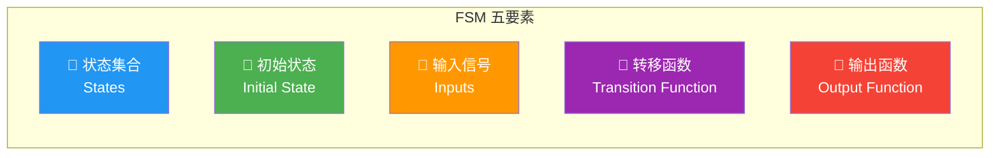
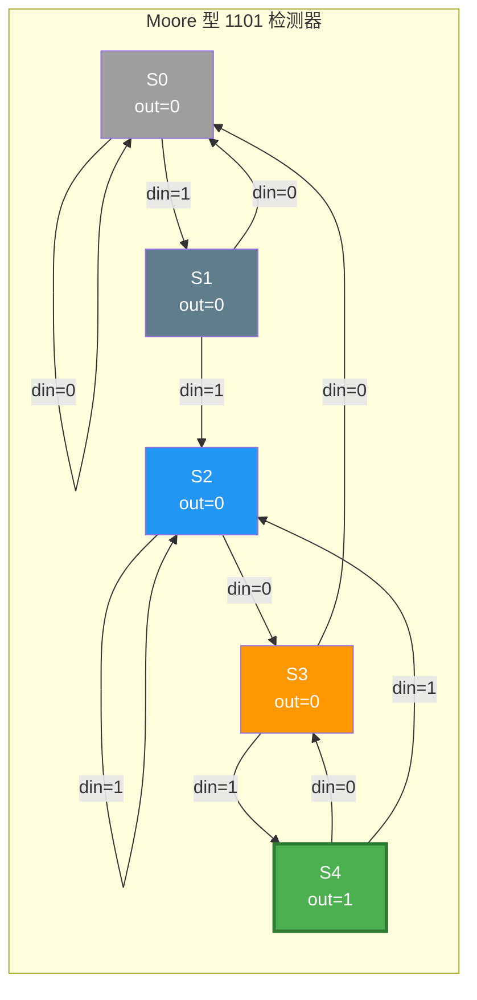
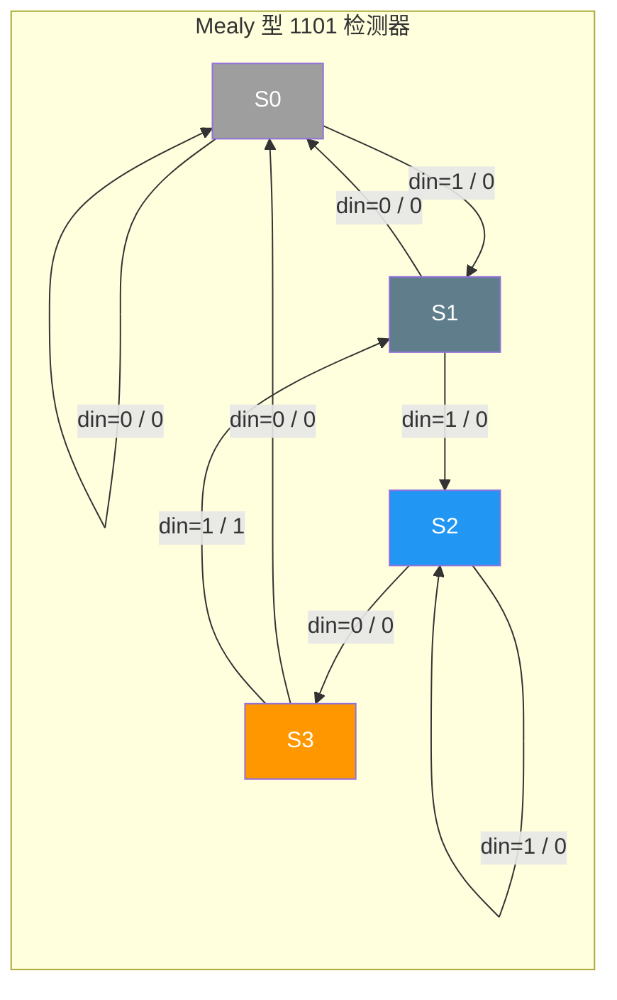
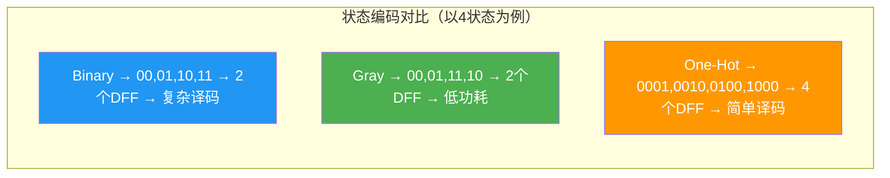
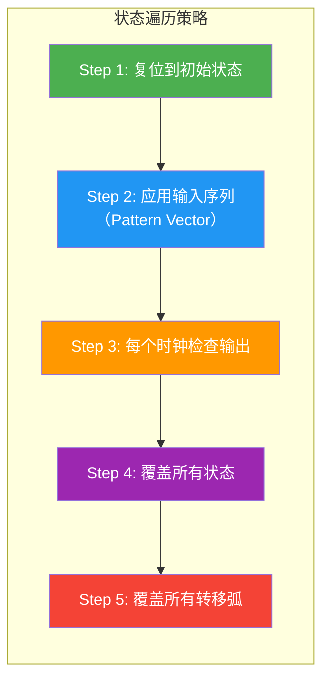

---
tags:
  - ate
  - digital-circuit
  - fsm
  - state-machine
  - moore
  - mealy
  - chapter3
created: 2026-06-14
---

# 3.2 状态机设计（FSM：Finite State Machine）

> 🔗 文中的 **彩色高亮词** 均可点击跳转到文末 [[#术语解释|术语解释]] 查看详细说明。
> 📌 **前置要求**：建议先阅读 [[01.组合逻辑与时序逻辑|3.1 组合逻辑与时序逻辑]]，理解 DFF、组合逻辑、Setup/Hold 后再看本章。

## 为什么测试工程师要学状态机？

状态机是数字芯片的"**行为骨架**"——几乎所有的数字控制器、协议引擎、序列检测器，本质上都是一个有限状态机：

| 如果你在做... | 状态机扮演的角色 | ATE 测试的挑战 |
|:---|:---|:---|
| **功能测试** | 芯片内部控制器 = FSM | 需要遍历所有状态 + 所有转移路径 |
| **Scan 测试** | Scan FSM（Shift → Capture → Update） | 需要验证 TAP 控制器的状态转移是否正确 |
| **协议测试** | SPI/I2C/UART 从机 = FSM | 需要覆盖协议的所有状态和异常转移 |
| **BIST 测试** | MBIST/LBIST 控制器 = FSM | 需要确认 BIST 状态机能否正确启动和结束 |
| **Debug** | 芯片"卡死" = 状态机死锁 | 需要从外部引脚反推当前状态 |

> 💡 **一句话总结**：ATE 功能测试的本质 = **用输入序列驱动芯片状态机遍历所有状态，并在每个状态验证输出是否符合预期**。不理解状态机，就不可能写出完整的测试 Pattern。

---

## 第一部分：有限状态机基础

### 1.1 什么是有限状态机？

**定义**：有限状态机（FSM）是一个数学模型，它由 **有限个状态**、**状态之间的转移规则** 以及 **输出** 组成，在任何时刻只能处于**一个确定的状态**。

**FSM 的五大要素**：



| 要素 | 说明 | 示例（自动售货机） |
|:---|:---|:---|
| **状态集合** | FSM 可能处于的所有状态 | `{空闲, 等投币, 出饮料, 找零}` |
| **初始状态** | 上电/复位后的第一个状态 | `空闲` |
| **输入信号** | 驱动状态转移的外部信号 | 投币、选择饮料、取消 |
| **转移函数** | 给定当前状态 + 输入 → 下一个状态 | `空闲 + 投币 → 等投币` |
| **输出函数** | 给定当前状态（+ 输入）→ 输出 | `出饮料状态 → 打开出货门` |

### 1.2 Moore 型 vs Mealy 型状态机

这是 FSM 最重要的分类，决定了输出行为：


> 图：Moore 机（左）vs Mealy 机（右）的架构差异——输出逻辑的输入不同。[AI 生成示意图]

| 维度 | **Moore 型** | **Mealy 型** |
|:---|:---|:---|
| **输出取决于** | **仅取决于当前状态** | **当前状态 + 当前输入** |
| **输出变化时机** | 时钟边沿（状态变化后） | 输入变化时**立即响应** |
| **时序类型** | 同步（Synchronous） | 可能异步（Asynchronous） |
| **状态数量** | 需 **更多** 状态 | 需 **更少** 状态 |
| **对毛刺敏感度** | 不敏感（输出经寄存器） | 敏感（输出来自组合逻辑） |
| **输出延迟** | 比 Mealy 晚 1 个时钟周期 | 输入变化后组合逻辑延迟 |
| **设计复杂度** | 较简单 | 较复杂（需注意异步路径） |
| **FPGA/ASIC 推荐** | ✅ 推荐（三段式 Moore） | ⚠️ 谨慎使用 |

> 📌 **FPGA 设计首选 Moore + 三段式**，充分利用 FPGA 丰富的 DFF 资源，且输出无毛刺。但在 ASIC 中，如果不介意组合输出，Mealy 可以省状态。

### 1.3 状态图（State Diagram）的画法

状态图是 FSM 的标准可视化方式：

| 图形元素 | 含义 |
|:---|:---|
| **圆圈** | 一个状态 |
| **箭头** | 状态转移（标注：输入 / 输出） |
| **带箭头的入线** | 复位后进入的初始状态 |
| **双圆圈** | 接受/终止状态 |

**Moore 状态图格式**：箭头标注只有「输入」，输出写在圆圈内部
**Mealy 状态图格式**：箭头标注为「输入 / 输出」

---

## 第二部分：经典实例——1101 序列检测器

这是数字 IC 面试和教学中**最经典的状态机实例**。设计一个电路：输入串行比特流 `din`，当检测到连续序列 `1101` 时，输出 `dout = 1`（重叠检测）。

### 2.1 Moore 型实现

**状态含义**（用状态本身记忆"已匹配的序列前缀"）：

| 状态 | 含义 | 输出 |
|:---:|:---|:---:|
| **S0** | 初始 / 未匹配 | 0 |
| **S1** | 已匹配 `1` | 0 |
| **S2** | 已匹配 `11` | 0 |
| **S3** | 已匹配 `110` | 0 |
| **S4** | 已匹配 `1101` ✅ | **1** |

**Moore 状态图**（5 个状态）：



> 🔑 **关键理解**：S4 → S2（当 din=1）：因为序列 `1101` 最后一位的 `1` 可以作为下一段 `11` 的前缀，实现**重叠检测**。同理 S4 → S3（当 din=0）：最后的 `10` 可作为 `110` 的前缀 `10`。这种"前缀复用"是序列检测器设计的关键技巧。

### 2.2 Mealy 型实现

Mealy 型只需 **4 个状态**（少一个），因为输出标在箭头上：

**Mealy 状态图**（4 个状态）：



> 📌 对比 Moore（5 状态）和 Mealy（4 状态）的差异：Mealy 省了一个状态 S4，因为检测到 `1101` 时，直接在转移箭头上输出 1（M3→M1 / din=1 / out=1），不需要额外的"确认状态"。

### 2.3 Verilog 代码（三段式 Moore）

三段式是工业界最推荐的 FSM 编码风格：

```verilog
// ============================================
// 1101 序列检测器 — 三段式 Moore 型（重叠检测）
// ============================================
module seq_detector_1101 (
    input  wire clk,
    input  wire rst_n,      // 异步复位，低有效
    input  wire din,         // 串行输入
    output reg  dout         // 检测输出
);

    // ---------- 状态编码（One-Hot）----------
    localparam S0 = 5'b00001,
               S1 = 5'b00010,
               S2 = 5'b00100,
               S3 = 5'b01000,
               S4 = 5'b10000;

    reg [4:0] state, next_state;

    // ===== 第一段：时序逻辑 — 状态寄存器 =====
    always @(posedge clk or negedge rst_n) begin
        if (!rst_n)
            state <= S0;
        else
            state <= next_state;
    end

    // ===== 第二段：组合逻辑 — 次态计算 =====
    always @(*) begin
        case (state)
            S0: next_state = din ? S1 : S0;
            S1: next_state = din ? S2 : S0;
            S2: next_state = din ? S2 : S3;
            S3: next_state = din ? S4 : S0;
            S4: next_state = din ? S2 : S3;
            default: next_state = S0;
        endcase
    end

    // ===== 第三段：时序逻辑 — 输出（Moore）=====
    always @(posedge clk or negedge rst_n) begin
        if (!rst_n)
            dout <= 1'b0;
        else
            dout <= (state == S4);
    end

endmodule
```

> 📌 **三段式优势**：第一段管状态寄存，第二段管转移逻辑，第三段管输出——各司其职，时序收敛容易，综合工具优化空间大。输出多一级寄存器，完全消除组合毛刺。

### 2.4 波形验证

```
         ___     ___     ___     ___     ___     ___     ___
CLK   __|   |___|   |___|   |___|   |___|   |___|   |___|   |__
          ___     ___     ___     ___     ___     ___
din   __|   |___|   |___|   |___|   |___|   |___|   |______
         1       1       0       1       1       0       1
                          ───────────────────
                               1101 检测！
state: S0 → S1 → S2 → S3 → S4 → S2 → S3 → S4
                                                 ___
dout  _________________________________________|   |______
                                             输出=1（延迟1拍）
```

> 🎯 **关键观察**：Moore 型的输出在检测到序列后**延迟一个时钟周期**才拉高（因为状态更新后才更新输出）。Mealy 型则会在同一周期立即输出——但可能有毛刺。

---

## 第三部分：状态编码策略

### 3.1 常用编码方式

同一个 FSM，不同编码方式会影响面积、速度、功耗：

| 编码方式 | 示例（4状态） | 触发器数 | 组合逻辑 | 适用场景 |
|:---|:---|:---:|:---|:---|
| **Binary** | 00, 01, 10, 11 | log₂N | 复杂 | 面积优先的 ASIC |
| **Gray** | 00, 01, 11, 10 | log₂N | 较复杂 | 低功耗（相邻状态只变1位） |
| **One-Hot** | 0001, 0010, 0100, 1000 | **N** | 简单 | FPGA（DFF 资源丰富） |
| **Almost One-Hot** | 000, 001, 010, 100 | N−1 | 简单 | 省一个 DFF |



> 📌 **ATE 视角**：One-Hot 编码虽然多用 DFF，但对测试友好——每个状态对应一根独热的 DFF 输出，**Scan Chain 中可以精确定位当前状态**，Debug 时比 Binary 编码直观得多。

### 3.2 安全状态机设计

状态机设计中必须考虑的**异常情况**：

| 问题 | 表现 | 解决方案 |
|:---|:---|:---|
| **未定义状态** | 状态寄存器出现非法编码（如 Binary 101 → 5 个状态只用 3 个） | `default` 分支 → 跳回 S0 |
| **死锁** | 进入某个状态后永远无法跳出 | 每个状态对所有输入组合都要有定义 |
| **复位不完整** | 复位释放后状态不确定 | 使用异步复位 + 复位后进入确定状态 |
| **时钟域问题** | 输入信号来自不同时钟域 | 双寄存器同步 + 格雷码跨时钟域 |

```verilog
// 安全处理：default 分支 + 非法状态恢复
always @(*) begin
    case (state)
        S0: next_state = ...;
        S1: next_state = ...;
        // ... 所有合法状态
        default: next_state = S0;  // 🛡️ 非法状态 → 回初始态
    endcase
end
```

> 🎯 **ATE 测试关联**：芯片在辐射/EMI/电压跌落等极端条件下，状态机可能跳入非法状态。ATE 需要设计 **Fault Injection 测试**——故意打入非法编码，验证芯片能否自行恢复到安全状态。

---

## 第四部分：ATE 测试视角——状态遍历策略

### 4.1 功能测试 = 状态遍历

ATE 功能测试的核心是**用输入序列遍历所有状态 + 所有转移弧**：



### 4.2 状态覆盖率（State Coverage）

| 覆盖类型 | 定义 | 公式 | 目标 |
|:---|:---|:---|:---:|
| **状态覆盖** | 访问过的状态 / 总状态数 | #visited / #total | 100% |
| **转移覆盖** | 经过的转移弧 / 总转移弧 | #taken / #total | ≥ 95% |
| **路径覆盖** | 经过的状态路径 / 所有可能路径 | —— | 不可穷举（指数级） |

> 💡 **实际工程中**：对 FSM 测试，**状态覆盖 100% + 转移覆盖 ≥ 95%** 是常见目标。路径覆盖（所有可能的状态序列）不可穷举——10 个状态的 FSM，走 20 步就有 >10¹² 种路径。

### 4.3 W-Method（状态机测试经典算法）

W-Method 是测试有限状态机的经典方法：

```
W-Method 状态机测试流程：
┌─────────────────────────────────────────────┐
│ 1. 计算状态机的 P-set（到达每个状态的路径）     │
│ 2. 计算 W-set（区分每对状态的特征序列）         │
│ 3. 生成测试序列 = P-set · W-set               │
│ 4. 对每个测试序列：施加输入 → 比较输出          │
└─────────────────────────────────────────────┘
```

| 概念 | 说明 | 1101 检测器示例 |
|:---|:---|:---|
| **P-set** | 从初始态到达每个状态的最短输入序列 | `S0: ε, S1: 1, S2: 11, S3: 110, S4: 1101` |
| **W-set** | 能区分每对状态的特征序列 | 例如：输入 `01` 时，S1→S0(out=0)，S4→S3→S0(out=1→0) |
| **测试序列** | 用 P 到达目标态 + 用 W 验证状态正确 | `复位 → 1101 → 01（验证确实是S4，输出应为1→0）` |

> 🎯 **ATE 实践**：W-Method 为小状态机（<20 个状态）提供理论上完备的测试。对大型 FSM，业界通常用 **Scan Chain 直接观察状态**——绕过状态遍历，直接检查 DFF 的值。

### 4.4 测试 Pattern 编写提示


| 步骤 | 操作 | 工具/文件 |
|:---|:---|:---|
| 1. 获取状态图 | 从设计文档或 RTL 仿真提取 | Verdi / VCS |
| 2. 生成测试向量 | 覆盖所有状态 + 转移 | Python / Perl 脚本 |
| 3. 转换为 ATE 格式 | Pattern → ATE 时序文件 | ATE 厂商工具 |
| 4. 上机验证 | 实际芯片上跑 Pattern | ATE 测试程序 |

---

## 第五部分：速查总结

### 5.1 Moore vs Mealy 一图决断


### 5.2 ATE 工程师必记要点

| 序号 | 要点 | 为什么重要 |
|:---:|:---|:---|
| 1 | **FSM = 状态 + 转移 + 输出** | 所有数字控制器的数学抽象 |
| 2 | **Moore 输出 = f(状态)** | DFT/Scan 友好，推荐用于测试 |
| 3 | **Mealy 输出 = f(状态, 输入)** | 省状态但输出可能有毛刺 |
| 4 | **三段式 = 状态寄存 + 次态逻辑 + 输出逻辑** | 工业标准写法，清晰无毛刺 |
| 5 | **状态覆盖 ≠ 完备测试** | 还要覆盖所有转移弧 + 非法状态 |
| 6 | **Scan 可绕过状态遍历** | 直接读 DFF 值 → 精确定位当前状态 |
| 7 | **W-Method** | 小 FSM 的完备测试方法 |
| 8 | **default → S0** | 防止状态机卡死在非法状态 |

---

## 📖 术语解释

### FSM 核心概念

#### FSM（Finite State Machine，有限状态机）
由有限个状态、状态转移规则和输出函数组成的数学模型。数字芯片中的控制器（如 SPI 主机、中断控制器）几乎都是 FSM。

#### Moore 型状态机
输出**仅取决于当前状态**的状态机。输出变化在时钟边沿发生，无组合毛刺。FPGA/ASIC 设计首选。

#### Mealy 型状态机
输出**取决于当前状态和当前输入**的状态机。输入变化时输出立即响应（组合逻辑直接驱动），可能产生毛刺。

#### 状态图（State Diagram）
FSM 的可视化表示：圆圈 = 状态，箭头 = 转移（标注输入/输出）。Moore 型将输出写在圆圈内，Mealy 型将输出写在箭头上。

#### 状态转移表（State Transition Table）
用表格表示所有状态转移：行 = 当前状态，列 = 输入组合，单元格 = 下一状态 + 输出。

### 编码与设计

#### One-Hot 编码
每个状态用一根独热位表示（如 0001, 0010, 0100, 1000）。N 个状态需要 N 个 DFF。优点是译码逻辑极简，缺点是 DFF 消耗大。FPGA 中常用。

#### Binary 编码
状态按二进制编码（如 00, 01, 10, 11）。N 个状态只需 ceil(log₂N) 个 DFF。优点是面积小，缺点是译码逻辑复杂。ASIC 中常用。

#### Gray 编码
相邻状态只改变 1 位的编码（如 00, 01, 11, 10）。跨时钟域或低功耗设计中常用，减少同时翻转的位数。

#### 三段式状态机
工业界推荐的 FSM 编码风格：用 3 个 always 块分别描述状态寄存器（时序）、次态逻辑（组合）、输出逻辑（时序）。输出多一级寄存器，消除组合毛刺。

#### 非法状态恢复
当状态寄存器因噪声/辐射等原因进入未定义编码时，通过 `default` 分支自动跳回安全状态（通常是初始状态）的机制。是可靠性设计的必须项。

### 测试相关

#### 状态覆盖率（State Coverage）
测试中访问过的状态数 / FSM 总状态数。功能测试的**最低目标 = 100% 状态覆盖**。

#### 转移覆盖率（Transition Coverage）
测试中经过的转移弧数 / FSM 总转移弧数。比状态覆盖更严格——覆盖所有转移意味着所有输入组合在每种状态下都被测试到。

#### W-Method
一种有限状态机完备测试方法：先找到到达每个状态的路径（P-set），再用区分序列（W-set）验证状态正确性。适用于小型 FSM（状态数 < 20）。

#### 死锁（Deadlock / Livelock）
- **死锁**：状态机进入某个状态后，对所有输入都无法跳出（永久卡死）
- **活锁**：状态机在几个状态间无限循环，无法进入正常功能状态

#### 重叠检测（Overlapping Detection）
序列检测中，上一个匹配序列的尾部和下一个序列的头部可以共享。例如 `1101` 重叠检测中，`1101101` 会检测到两次 `1101`（位置 1-4 和 4-7）。

---

## 🔗 延伸阅读与参考资料

| 序号 | 标题 | 来源 | 链接 |
|:---:|:---|:---|:---|
| 1 | Verilog中一文搞懂有限状态机（FSM） | CSDN | [链接](https://blog.csdn.net/weixin_42664351/article/details/106377812) |
| 2 | 浅谈Moore型和Mealy型以及序列检测状态图 | CSDN | [链接](https://blog.csdn.net/Anzg256/article/details/130119673) |
| 3 | Moore状态机和Mealy状态机的区别（以序列检测器为例） | 知乎 | [链接](https://zhuanlan.zhihu.com/p/458315584) |
| 4 | Verilog状态机，以检测1101序列为例 | 知乎 | [链接](https://zhuanlan.zhihu.com/p/414219256) |
| 5 | Moore型状态机和Mealy型状态机 | 博客园 | [链接](https://www.cnblogs.com/571328401-/p/13193815.html) |
| 6 | Verilog FSM – Finite State Machine Design | EcriionX | [链接](https://ecrionix.org/verilog/finite-state-machines/) |
| 7 | FSMs in Verilog: State Encoding | AnalogCircuitDesign | [链接](https://analogcircuitdesign.com/verilog-fsm/) |
| 8 | 【FPGA个人笔记】有限状态机 | SegmentFault | [链接](https://segmentfault.com/a/1190000046720979) |

---

> ⏭️ **下一节预告**：[[03.Setup-Hold-Skew-Jitter|3.3 Setup / Hold / Skew / Jitter]] — 深入理解时序约束，从 DFF 内部结构到 ATE AC 参数测试实战。✅ 已完成。
