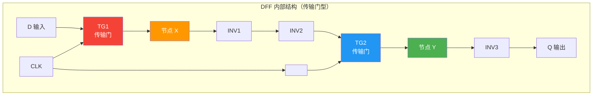
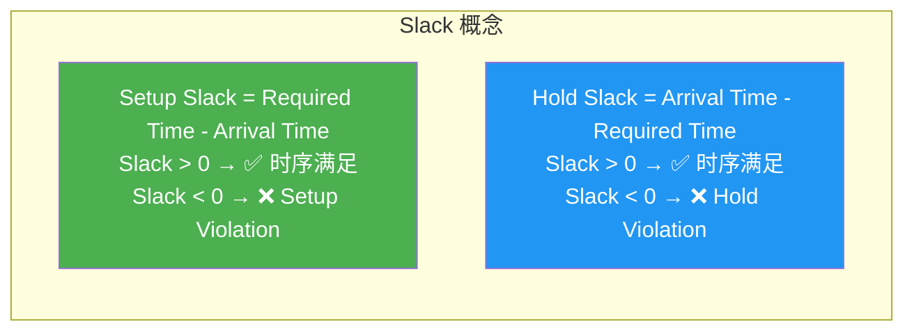
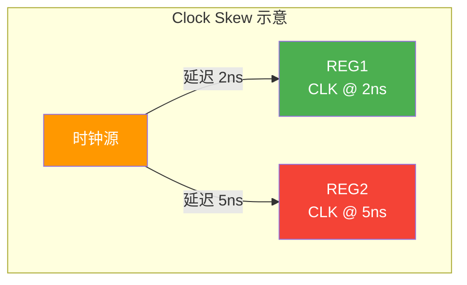
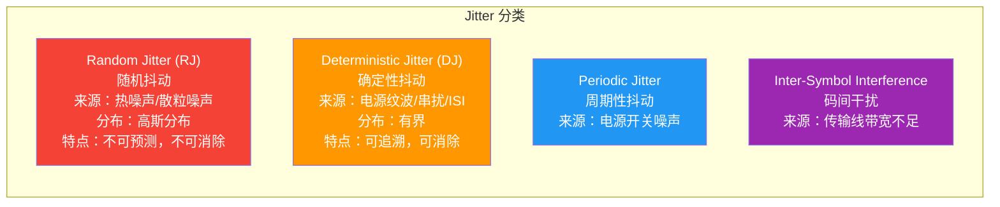
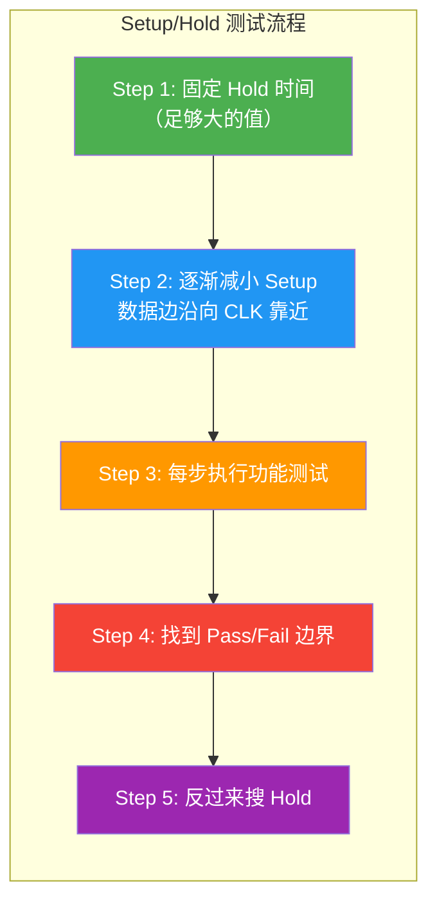
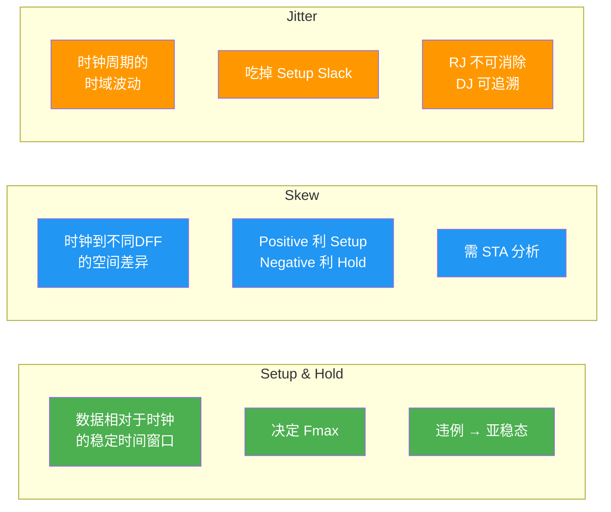

---
tags:
  - ate
  - digital-circuit
  - setup-time
  - hold-time
  - skew
  - jitter
  - metastability
  - ac-testing
  - chapter3
created: 2026-06-14
---

# 3.3 Setup / Hold / Skew / Jitter

> 🔗 文中的 **彩色高亮词** 均可点击跳转到文末 [[#术语解释|术语解释]] 查看详细说明。
> 📌 **前置要求**：建议先阅读 [[01.组合逻辑与时序逻辑|3.1 组合逻辑与时序逻辑]] 和 [[02.状态机设计|3.2 状态机设计]]，理解 DFF 和时序基础。

## 为什么测试工程师要学这些？

Setup / Hold / Skew / Jitter 是 ATE **AC 参数测试**的四大核心对象。它们直接决定了：

| 如果你不知道... | 后果是... |
|:---|:---|
| **Setup/Hold 的定义** | 不知道芯片能跑多快，Pattern 的 Strobe 放哪儿 |
| **Setup/Hold 违例的后果** | 芯片间歇性 Fail 却找不到原因（亚稳态！） |
| **Clock Skew** | Scan Chain 移位出错，却以为是芯片缺陷 |
| **Clock Jitter** | 高速接口测试不稳定，误判为芯片性能不达标 |

> 💡 **一句话总结**：Setup/Hold 定义"数据采样的安全窗口"，Skew 定义"时钟到达的空间差异"，Jitter 定义"时钟周期的时域波动"。三者共同决定芯片的 **Fmax** 和测试 Pattern 的 **Timing 设置**。

---

## 第一部分：Setup Time 与 Hold Time 深入理解

### 1.1 基本定义（重温）


> 图：Setup Time、Hold Time、Clock-to-Q Delay 的时序关系。[AI 生成示意图]

| 参数 | 符号 | 正式定义 | 通俗理解 |
|:---|:---|:---|:---|
| **建立时间** | **t_setup** | 时钟有效边沿**之前**，数据必须保持稳定的最短时间 | "数据要**提前到**，不能踩着点来" |
| **保持时间** | **t_hold** | 时钟有效边沿**之后**，数据必须保持稳定的最短时间 | "数据要**多待一会儿**，不能立刻走" |
| **时钟到输出** | **t_ck→q** | 时钟边沿到输出 Q 有效的时间 | "触发器自己也有反应时间" |

> 📌 这三个参数的典型值（28nm 工艺）：t_setup = 50~150ps，t_hold = 0~50ps，t_ck→q = 100~300ps。

### 1.2 为什么需要 Setup/Hold？——DFF 传输门模型

这是面试中的**高频问题**。答案藏在 DFF 的内部结构里：



> 图：最简单的 DFF 传输门模型。TG1 和 TG2 是互补导通的两个开关。CLK=0 时 TG1 通 TG2 断（Master 透明）；CLK=1 时 TG1 断 TG2 通（Slave 透明）。

**Setup Time 的物理来源**：

```
D 输入端 → TG1 导通 → 对节点 X 的寄生电容充电 → 电压达到翻转阈值
                               ↑
                    这需要时间！这就是 t_setup
```

数据信号 D 经过传输门 TG1 后，需要对**节点 X 的寄生电容**充电/放电，电压必须越过 INV1 的翻转阈值才能被正确锁存。如果在 CLK 上升沿到来之前 D 还没把 X 充到足够的电压 → TG1 断开时 X 的电平不确定 → **亚稳态**。

**Hold Time 的物理来源**：

```
CLK 上升沿 → TG1 开始关断（但这需要时间！）
如果 D 此时立刻变化 → 变化会"漏"过还没完全关断的 TG1 → X 被污染
```

TG1 从"导通"到"完全关断"不是瞬时的。在关断过程中，如果 D 发生变化，电荷会通过半开的 TG1 泄漏到节点 X，使得原本锁存好的值被破坏。

> 🎯 **核心理解**：Setup = 节点 X 的充电时间，Hold = TG1 的关断时间。这就是为什么 t_setup 通常比 t_hold 大——对电容充电（fC~pF）比关断一个 MOS 管慢。

### 1.3 亚稳态（Metastability）

当 Setup/Hold 违例时，DFF 输出可能进入**亚稳态**——这是数字电路中最可怕的隐形杀手。

| 正常状态 | 亚稳态 |
|:---|:---|
| Q = 0 或 1（稳定） | Q 在 0 和 1 之间的中间电平**振荡** |
| 下一个时钟沿可被正确采样 | 振荡可能持续数个周期才稳定 |
| 确定性行为 | **非确定性**——可能稳定到 0，也可能到 1 |

```
正常的 DFF 输出：
CLK _--_--_--_--
Q   ___------____

亚稳态的 DFF 输出：
CLK _--_--_--_--
Q   ___~~~------    ← "~~~" 就是振荡区，后续电路读到的是 0 还是 1 完全随机！
```

> ⚠️ **MTBF（Mean Time Between Failures，平均故障间隔）**：亚稳态导致的错误概率虽然极低（单个 DFF 可以是 10^-9 次/秒），但一颗 SoC 有**百万级 DFF**，运行数小时就可能出现一次。这解释了为什么芯片会"偶尔死机"——很可能就是亚稳态。

### 1.4 Slack（时序裕量）

Slack 是衡量时序是否满足的最直接指标：



**Setup Slack 公式**（单周期同步电路）：

```
Setup Slack = Tclk + Tskew - Tsu - Tco - Tcomb

其中：
  Tclk   = 时钟周期
  Tskew  = 捕获时钟延迟 - 发射时钟延迟
  Tsu    = 捕获寄存器的 Setup Time
  Tco    = 发射寄存器的 Clock-to-Q
  Tcomb  = 两级寄存器间的组合逻辑延迟
```

**Hold Slack 公式**：

```
Hold Slack = Tco + Tcomb - Th - Tskew
```

> 📌 **关键推论**：Setup Slack 和 Tclk（时钟频率）相关 → 降频可以修复 Setup Violation；但 Hold Slack 和 Tclk 无关 → **降频不能修复 Hold Violation！** Hold Violation 一旦出现，必须改设计（加 buffer）。

---

## 第二部分：Clock Skew（时钟偏移）

### 2.1 什么是 Skew？



**定义**：由于时钟树走线长度、负载、Buffer 不同，同一时钟源到达不同 DFF 的时间不同。这个时间差就是 Skew。

```
Tskew = T_clk(捕获寄存器) - T_clk(发射寄存器)
```

| Skew 类型 | 含义 | 对 Setup 的影响 | 对 Hold 的影响 |
|:---|:---|:---|:---|
| **Positive Skew** | 捕获端时钟比发射端**晚到** | ✅ **有利**（增加可用时间） | ❌ **不利**（新数据太快到达） |
| **Negative Skew** | 捕获端时钟比发射端**早到** | ❌ **不利**（减少可用时间） | ✅ **有利**（新数据晚到） |
| **Zero Skew** | 两者同时到达 | 无影响 | 无影响 |

> 🎯 **ATE 测试关联**：测试机的每个数字通道也有**通道间偏斜（Channel-to-Channel Skew）**。如果 Clock 通道和 Data 通道的 Skew 达到数百 ps，你就可能"冤枉"芯片——测出的 Setup/Hold 超标其实是测试机的错。这就是为什么要做 **De-Skew 校准**。

### 2.2 Skew 来源

| 来源 | 说明 | 量级 |
|:---|:---|:---|
| **Clock Tree 深度不同** | 到不同 DFF 的 Buffer 级数不同 | 几十~几百 ps |
| **走线长度差异** | PCB/芯片内部 Clock 走线长度不等 | ps 级（片内）~ ns 级（PCB） |
| **负载电容差异** | 不同 DFF 的时钟端电容不同 | 几~几十 ps |
| **PVT 变异** | 工艺/电压/温度局部差异 | 几十 ps |

---

## 第三部分：Clock Jitter（时钟抖动）

### 3.1 什么是 Jitter？

**定义**：时钟周期的短期波动——每个周期的长度不是严格相等的，存在随机或确定性的偏差。

```
理想时钟：|<-T->|<-T->|<-T->|<-T->|  周期恒定
实际时钟：|<-T1->|<-T2->|<-T3->|<-T4->|  周期在 T±ΔT 间波动
                                        ↑
                                   这就是 Jitter
```

### 3.2 Jitter 的分类



### 3.3 Jitter 对时序的影响

Jitter 直接影响 Setup/Hold 的有效窗口：

```
无 Jitter 时：
Setup Slack = Tclk - Tsu - Tco - Tcomb   ← Tclk 是常数

有 Jitter 时：
Setup Slack = (Tclk - Tjitter_pp) - Tsu - Tco - Tcomb   ← 最坏情况周期缩短
```

> 💡 **峰峰值抖动（Tjitter_pp）** 才是影响时序的关键。如果 Jitter = ±50ps，那么最坏情况下时钟周期会**缩短 100ps**（峰-峰值）。

| Jitter 指标 | 含义 | 影响 |
|:---|:---|:---|
| **Period Jitter** | 单个周期对理想周期的偏差 | 影响 Setup Slack |
| **Cycle-to-Cycle Jitter** | 相邻两个周期之间的差值 | 影响 PLL 锁定 |
| **TIE (Time Interval Error)** | 实际边沿对理想边沿的累计偏差 | 影响长序列的时序 |

### 3.4 Skew vs Jitter 对比

| 维度 | Skew | Jitter |
|:---|:---|:---|
| **本质** | **空间差异**（不同位置） | **时间波动**（同一位置不同时刻） |
| **是否可预测** | 相对固定（可 STA 分析） | 随机（RJ）或周期性（DJ） |
| **单位** | ps（绝对时间差） | ps (RMS) 或 ps (peak-to-peak) |
| **典型来源** | 时钟树不平衡 | 晶振噪声、PLL、电源噪声 |
| **对测试的影响** | 通道间 Timing 偏差 | 时钟稳定性不足导致误采样 |

---

## 第四部分：ATE AC 参数测试实战

### 4.1 Setup/Hold 测试方法

这是 ATE 测试中最核心的 AC 测试之一。核心思路：**移动数据边沿，搜索芯片仍能正确工作的最差位置**。



**ATE 具体操作**：

```
测试 Setup Time：
┌──────────────────────────────────────────┐
│ CLK  ────────┐         ┌──────────────── │
│              └─────────┘                  │
│ DATA ──────────────┐     ┌────────────── │
│                    └─────┘    ↑           │
│                  ← t_setup → 边沿搜索方向  │
│                                          │
│ 将 DATA 边沿从左向右移动（减小 t_setup）   │
│ 每移一步跑一次 Pattern，直到 Fail          │
│ 最后一个 Pass 的位置 = 最小 t_setup        │
└──────────────────────────────────────────┘
```

### 4.2 Shmoo Plot（什穆图）

Shmoo Plot 是 ATE 工程师最常用的二维参数扫描可视化工具：

```
            Shmoo Plot: VDD vs Fmax
            ┌─────────────────────────┐
VDD (高)    │ ✅ ✅ ✅ ✅ ✅ ✅ ✅ ✅ ✅ │
            │ ✅ ✅ ✅ ✅ ✅ ✅ ✅ ✅ ✅ │
            │ ✅ ✅ ✅ ✅ ✅ ✅ ❌ ❌ ❌ │
            │ ✅ ✅ ✅ ❌ ❌ ❌ ❌ ❌ ❌ │  ← 这是 Pass/Fail 边界
VDD (低)    │ ❌ ❌ ❌ ❌ ❌ ❌ ❌ ❌ ❌ │
            └─────────────────────────┘
            低频 ←──── 频率 ────→ 高频

            ✅ = Pass    ❌ = Fail
```

| Shmoo 轴 | 常见参数 | 目的 |
|:---|:---|:---|
| X 轴 | 频率、Setup Time、Hold Time | 找 Timing 边界 |
| Y 轴 | VDD、温度、VIL/VIH | 找电压/环境边界 |

> 🎯 **Shmoo Plot 的价值**：一眼看出芯片的"安全工作区域"。Pass/Fail 的边界线越平直 → 芯片一致性越好；边界线越参差 → 可能存在 Yield 问题。

### 4.3 Skew/Jitter 的 ATE 测量

| 参数 | 测试方法 | ATE 工具 |
|:---|:---|:---|
| **通道间 Skew** | 用 TDR 测量各通道的传输延迟，计算差异 | Time Measurement Unit (TMU) |
| **Clock Jitter** | 采集时钟周期数据，统计 RMS/PP | 高速 Digitizer 或专用 Jitter 模块 |
| **Data Jitter** | 用眼图（Eye Diagram）测量数据抖动 | 高速采样模块 |

### 4.4 Guard Band（保护带）

```
规格书的 Setup Time Min = 100ps

你的测试 Limit 设为多少？
  → 如果设 100ps：测出来的刚好 pass 的芯片，在用户板子上可能 fail（PCB 的额外 Skew！）
  → 如果设 120ps：多加了 20% Guard Band，确保量产后的可靠性

Guard Band = Test Limit - Spec Limit
```

> 💡 Guard Band 是量产测试的必须项——测试环境（ATE + Load Board）和用户环境（PCB）的时序条件不同，必须留余量。

### 4.5 De-Skew 校准

ATE 每个数字通道的电长度不同，在测试前必须先校准：

```
De-Skew 流程：
1. 用 TDR 脉冲测量每个通道的绝对延迟
2. 以某个通道（通常是最长的）为参考
3. 其他通道加补偿延迟，使所有通道的延迟对齐
4. 校准后：所有通道的 Skew < ±50ps（视 ATE 平台）
```

> 🎯 **不校准的后果**：假设 Clock 通道比 Data 通道多延迟 200ps → 测出的 t_setup 会**比真实值大 200ps** → 你可能把好芯片判为 Fail（过杀，Overkill）。

---

## 第五部分：速查总结

### 5.1 四大参数一览



### 5.2 ATE 工程师必记要点

| 序号 | 要点 | 为什么重要 |
|:---:|:---|:---|
| 1 | **t_setup：数据在 CLK 前必须稳定** | Pattern 的 Data 边沿必须早于 CLK 边沿足够长时间 |
| 2 | **t_hold：数据在 CLK 后必须保持** | 数据不能紧跟 CLK 就变 |
| 3 | **Setup Violation → 亚稳态** | 芯片"随机"Fail 的根源 |
| 4 | **降频修 Setup，加 Buffer 修 Hold** | Hold Violation 降频无效！ |
| 5 | **Positive Skew 利 Setup 害 Hold** | 反过来 Negative Skew 利 Hold 害 Setup |
| 6 | **Jitter 用峰峰值评估** | RMS 值对最坏情况没有参考意义 |
| 7 | **Shmoo Plot = 二维边界扫描** | 找到 Pass/Fail 边界，设定 Guard Band |
| 8 | **De-Skew 校准是测试的前提** | 不校准 → ATE 自己引入测量误差 |
| 9 | **Guard Band ≈ 10~20% 规格值** | 补偿测试环境和用户环境的差异 |

---

## 📖 术语解释

### Setup / Hold 相关

#### Setup Time（建立时间）
在时钟有效边沿到来**之前**，数据信号必须保持稳定的最短时间。物理来源：数据经过传输门后对内部节点电容充电所需时间。典型值 50~150ps（28nm）。

#### Hold Time（保持时间）
在时钟有效边沿到来**之后**，数据信号必须继续保持稳定的最短时间。物理来源：传输门从导通到完全关断所需的时间。典型值 0~50ps（28nm）。

#### Clock-to-Q Delay（t_ck→q）
从时钟有效边沿到 DFF 输出 Q 稳定的传播延迟。典型值 100~300ps（28nm）。

#### Metastability（亚稳态）
当 Setup/Hold 时间不满足时，DFF 输出进入不确定的中间电平振荡状态，可能持续数个周期。亚稳态的稳定结果（0 或 1）不可预测。

#### Slack（时序裕量）
信号实际到达时间与要求时间的差值。Setup Slack = Required Time - Arrival Time；Hold Slack = Arrival Time - Required Time。Slack > 0 表示时序满足。

#### MTBF（Mean Time Between Failures）
亚稳态导致错误的平均间隔时间。单 DFF 的 MTBF 可以很大（数百年），但百万级 DFF 的芯片 MTBF 可能只有数小时。

### Skew 相关

#### Clock Skew（时钟偏移）
同一时钟源到达不同 DFF 的时间差。Tskew = T_clk(捕获) - T_clk(发射)。来源包括时钟树深度不同、走线长度差异、负载电容差异。

#### Positive Skew
捕获端时钟晚于发射端到达。有利于 Setup（增加可用时间），不利于 Hold（新数据来得太早）。

#### Negative Skew
捕获端时钟早于发射端到达。不利于 Setup（减少可用时间），有利于 Hold（新数据来得晚）。

#### De-Skew（去偏斜校准）
在 ATE 测试前，测量并补偿各测试通道的传输延迟差异，使所有通道的 Timing 对齐。

### Jitter 相关

#### Clock Jitter（时钟抖动）
时钟周期的短期随机或确定性波动。分 Random Jitter（RJ，不可预测）和 Deterministic Jitter（DJ，可追溯）。

#### Period Jitter
单个时钟周期相对于理想周期的偏差。直接影响 Setup Slack。

#### Cycle-to-Cycle Jitter
相邻两个时钟周期之间的差值。PLL 稳定性评价的关键指标。

#### TIE（Time Interval Error）
实际时钟边沿相对于理想边沿的累计时间误差。评估长序列时钟稳定性。

### 测试相关

#### Shmoo Plot（什穆图）
ATE 测试中的二维参数扫描图，X/Y 轴为两个变量（如频率和电压），每个坐标点用 Pass/Fail 标记。用于确定芯片的"安全工作区域"。

#### Guard Band（保护带）
测试 Limit 与规格 Limit 之间的安全余量。补偿测试环境（ATE + Load Board + Socket）与用户环境（PCB）的差异。

#### Edge Search（边沿搜索）
ATE 测试 Setup/Hold 的标准方法：逐步移动信号边沿，找到 Pass→Fail 的转折点。

---

## 🔗 延伸阅读与参考资料

| 序号 | 标题 | 来源 | 链接 |
|:---:|:---|:---|:---|
| 1 | 半导体测试基础 - AC 参数测试 | Power's Wiki | [链接](https://wiki-power.com/%E5%8D%8A%E5%AF%BC%E4%BD%93%E6%B5%8B%E8%AF%95%E5%9F%BA%E7%A1%80-AC%E5%8F%82%E6%95%B0%E6%B5%8B%E8%AF%95/) |
| 2 | ATE测试机基础（十六）- AC参数测试：建立时间&保持时间 | 知乎 | [链接](https://zhuanlan.zhihu.com/p/1934358660865303913) |
| 3 | 时序分析基础（Slack、Setup、Hold、Jitter、Skew） | CSDN | [链接](https://blog.csdn.net/hzmscut/article/details/139804860) |
| 4 | 面试必问的建立保持时间，用传输门D触发器模型一次讲透 | CSDN | [链接](https://blog.csdn.net/weixin_26869081/article/details/160433344) |
| 5 | STA -- Setup time & Hold time 详细解读 | 博客园 | [链接](https://www.cnblogs.com/lyc-seu/p/12376517.html) |
| 6 | 门开门合皆有度——从寄存器结构解读 Setup 与 Hold 的秘密 | 知乎 | [链接](https://zhuanlan.zhihu.com/p/1934587152433395627) |
| 7 | 高速信号完整性之 jitter与skew | 知乎 | [链接](https://zhuanlan.zhihu.com/p/678242305) |
| 8 | 建立保持时间及违例解决方法 | 知乎 | [链接](https://zhuanlan.zhihu.com/p/465850515) |

---

> ⏭️ **下一节预告**：[[04.存储器结构|3.4 存储器结构（SRAM / DRAM / Flash）]] — 从 6T SRAM 单元到 March 算法，ATE Memory 测试的核心基础。
