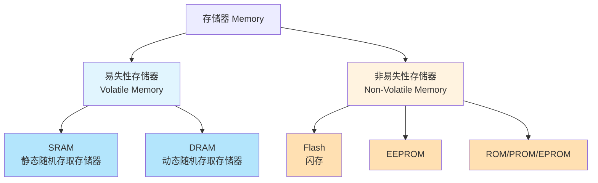
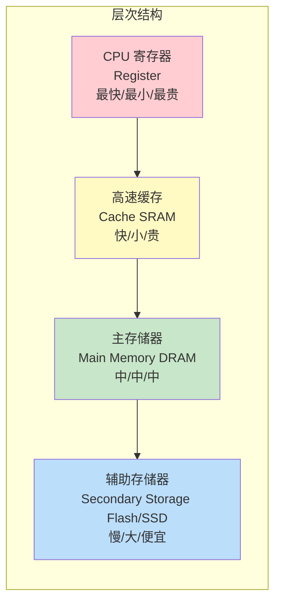
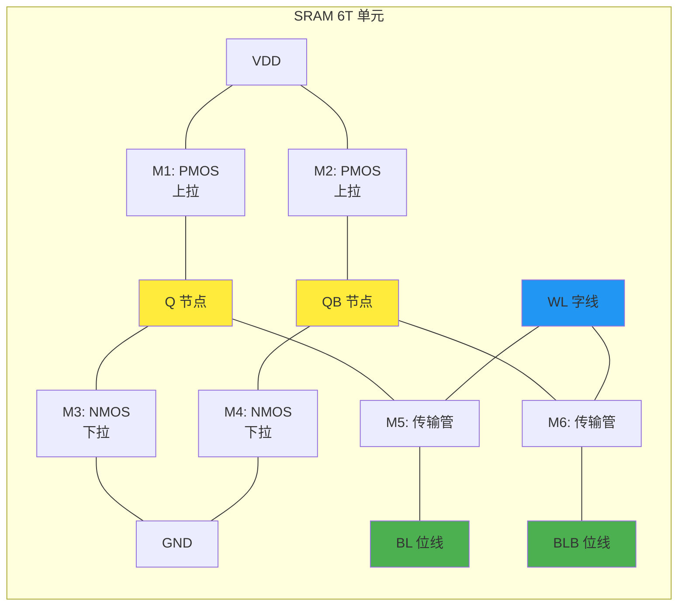
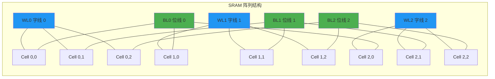
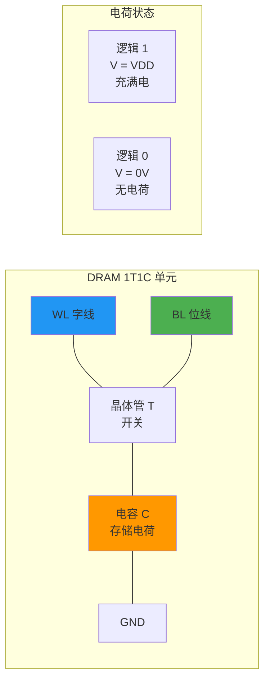
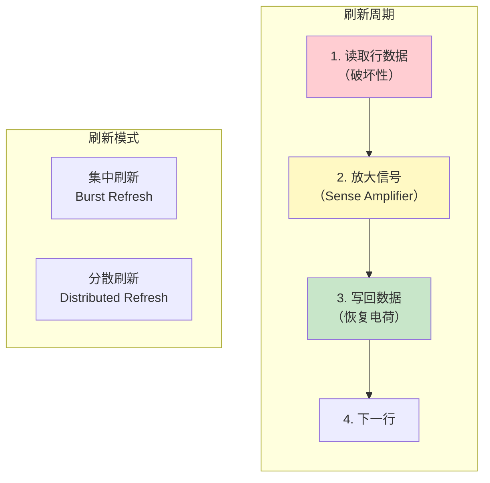
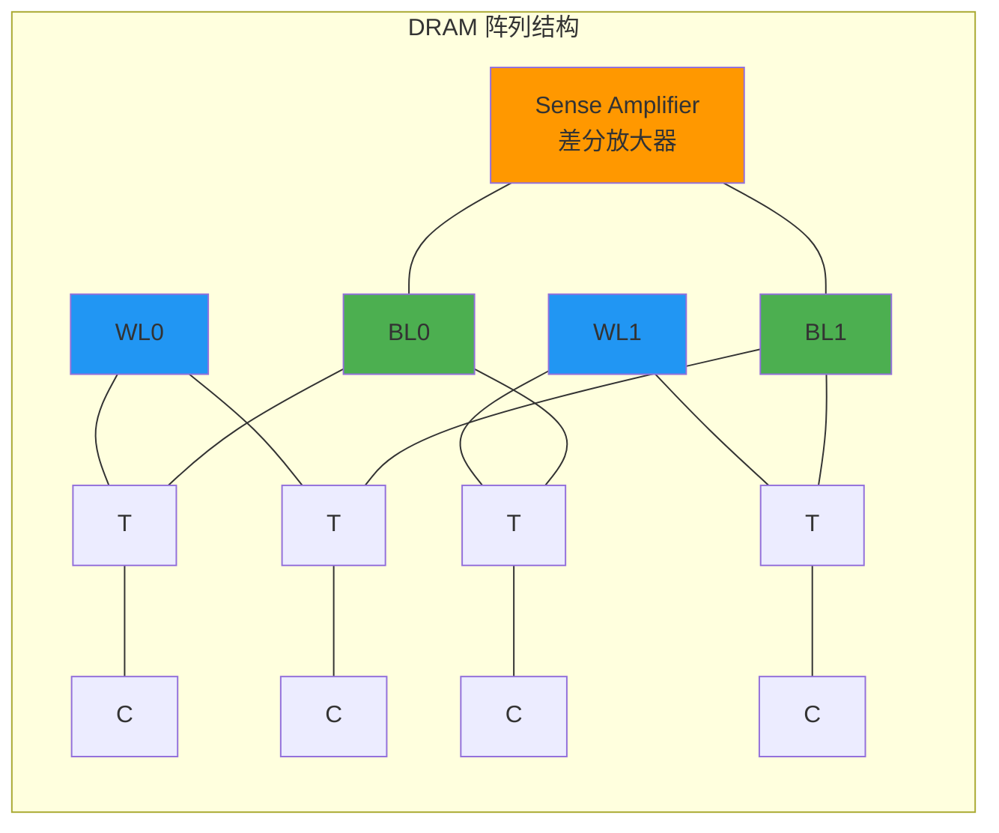
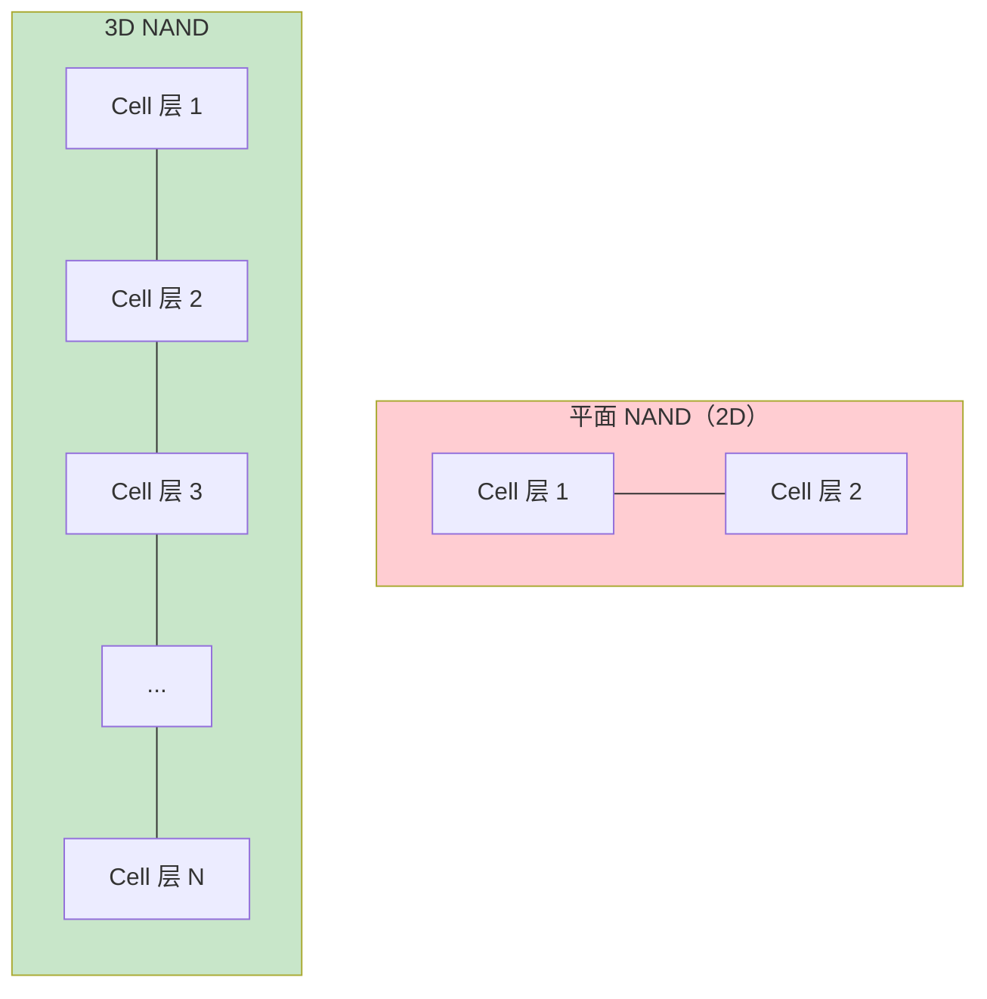

---
tags:
  - ate
  - digital-circuit
  - memory
  - SRAM
  - DRAM
  - Flash
  - chapter3
created: 2026-06-18
---

# 3.4 存储器结构（SRAM / DRAM / Flash）

> 🔗 文中的 **彩色高亮词** 均可点击跳转到文末 [[#术语解释|术语解释]] 查看详细说明。
> 📌 **前置要求**：建议先阅读 [[../02.半导体基础/02.MOSFET与CMOS原理|2.2 MOSFET/CMOS原理]] 理解底层器件，以及 [[../02.半导体基础/05.芯片分类|2.5 芯片分类]] 了解各类芯片的测试特点。

## 为什么测试工程师要学存储器结构？

作为 ATE 测试工程师，你每天接触的不只是"电压"和"电流"——你还需要理解芯片内部的**存储器行为**：

| 如果你在做... | 你需要理解... | 为什么？ |
|:---|:---|:---|
| **Memory 测试** | SRAM/DRAM/Flash 的读写机制 | 测试向量本质上是在遍历存储单元，验证数据存取是否正确 |
| **MBIST 测试** | Memory BIST 的算法（March C+ 等） | MBIST 是存储器测试的核心方法，直接决定良率 |
| **AC 参数测试** | 访问时序（tRC, tRCD, tRP 等） | 时序参数是存储器 AC 测试的核心指标 |
| **功能测试 Debug** | 存储单元的物理失效机制 | 某些间歇性 Fail 可能来自存储单元的漏电或击穿 |
| **良率分析** | 存储器的失效模式与分布 | 存储器失效是芯片失效的主要来源之一 |

> 💡 **一句话总结**：存储器 = 芯片的"记忆"。ATE 测试本质上是**用特定算法遍历存储单元，验证数据存取的正确性和时序特性**。

---

## 第一部分：存储器分类与层次结构

### 1.1 存储器的分类

存储器按照**断电后数据是否丢失**分为两大类：

**核心区别**：
- **易失性存储器（VM）**：断电后数据**立即丢失**，但读写速度快，用于**主存/缓存**
- **非易失性存储器（NVM）**：断电后数据**长期保存**，但读写速度慢，用于**程序/数据存储**

### 1.2 存储器层次结构

现代计算系统采用**层次化存储器结构**，在速度、容量、成本之间取得平衡：

**设计原则**：
- **越靠近 CPU**：速度越快、容量越小、单位成本越高
- **越远离 CPU**：速度越慢、容量越大、单位成本越低

> 📌 **为什么需要层次结构？** 因为不存在一种存储器能同时满足"快、大、便宜"三个要求。层次结构利用**局部性原理**（时间局部性 + 空间局部性），让 CPU 大部分时间访问高速缓存，从而获得接近最快存储器的性能。

---

## 第二部分：SRAM（静态随机存取存储器）

### 2.1 SRAM 的基本结构

**SRAM（Static Random Access Memory）** 是**静态**随机存取存储器，"静态"意味着**只要通电，数据就会一直保持**，不需要刷新。

**核心结构**：每个 SRAM 存储单元由 **6 个晶体管（6T）** 组成，存储 **1 bit** 数据。

> 图：SRAM 6T 存储单元电路原理图。M1-M4 组成两个交叉耦合的反相器（锁存器），M5-M6 是传输门，由字线 WL 控制。[图片来源：半导体物理教程]

**6T SRAM 单元结构详解**：

| 晶体管 | 类型 | 功能 | 关键参数 |
|:---|:---|:---|:---|
| **M1, M2** | PMOS（上拉管） | 维持高电平 | W/L 宽长比 ≥ 2:1 |
| **M3, M4** | NMOS（下拉管） | 维持低电平 | 电流驱动能力 > 10μA |
| **M5, M6** | NMOS（传输管） | 控制数据读写 | 导通电阻 < 5kΩ |

**关键节点**：
- **Q, QB**：互补存储节点（稳态电压：0V 或 VDD）
- **BL, BLB**：差分位线（Bit Line），预充电至 VDD
- **WL**：字线（Word Line），激活时 > 0.7VDD

### 2.2 SRAM 的工作原理

#### 2.2.1 双稳态存储机制

SRAM 的核心是**两个交叉耦合的反相器**，形成一个**双稳态电路**：

**双稳态特性**：
- 电路有两个稳定状态：Q=1/QB=0 或 Q=0/QB=1
- 一旦进入某个状态，会**自动保持**，无需外部干预
- 只有施加足够强的外部信号才能翻转状态

#### 2.2.2 读操作流程

> 图：SRAM 读操作时序与电路状态。[图片来源：SRAM 基础结构教程]

**读操作步骤**：
1. **预充电**：BL 和 BLB 预充电至 VDD
2. **激活字线**：WL 置高电平，M5/M6 导通
3. **差分 sensing**：由于 Q 和 QB 电压不同，BL 和 BLB 产生微小压差（ΔV ≥ 50mV）
4. **放大输出**：差分放大器检测压差，输出数据

**读操作关键参数**：

| 参数 | 典型值 | 物理意义 |
|:---|:---|:---|
| 位线压差 ΔV | ≥ 50mV | 信号检测阈值 |
| 读周期 t_RC | 8-15ns | 高速缓存核心参数 |
| 存取时间 t_AA | ≤ 10ns | 地址有效到数据输出延迟 |

#### 2.2.3 写操作流程

> 图：SRAM 写操作时序与电路状态。[图片来源：SRAM 基础结构教程]

**写操作步骤**：
1. **准备数据**：BL 和 BLB 写入相反的数据（如 BL=0, BLB=1）
2. **激活字线**：WL 置高电平，M5/M6 导通
3. **翻转节点**：BL/BLB 的强驱动能力翻转 Q/QB 节点
4. **保持数据**：WL 关闭后，数据被锁存

**写操作核心挑战**：
- **位线驱动强度**：需满足 I_BL > β×(VDD-Vth)²
- **最小写脉宽**：t_WP ≥ 40ns（0.18μm 工艺）

### 2.3 SRAM 阵列结构

多个 SRAM 单元以 **XY 阵列** 方式排列：

**阵列特点**：
- 每行共享一条字线（WL）
- 每列共享一对位线（BL/BLB）
- 通过行/列译码器选择特定单元

### 2.4 SRAM 的特点与应用

| 特性 | 说明 |
|:---|:---|
| **优点** | 速度快（< 10ns）、无需刷新、静态功耗低 |
| **缺点** | 集成度低（6T/bit）、成本高、容量小 |
| **典型应用** | CPU 缓存（L1/L2/L3 Cache）、片上缓存 |
| **工艺节点** | 通常与逻辑工艺兼容（如 5nm/3nm） |

> 💡 **为什么 CPU 缓存用 SRAM？** 因为缓存需要**极快的访问速度**来匹配 CPU 的高频率，SRAM 的读写延迟远低于 DRAM，虽然容量小但足够缓存热点数据。

---

## 第三部分：DRAM（动态随机存取存储器）

### 3.1 DRAM 的基本结构

**DRAM（Dynamic Random Access Memory）** 是**动态**随机存取存储器，"动态"意味着**数据会随时间衰减**，需要定期刷新。

**核心结构**：每个 DRAM 存储单元由 **1 个晶体管 + 1 个电容（1T1C）** 组成，存储 **1 bit** 数据。

> 图：DRAM 1T1C 存储单元电路原理图。晶体管 T 作为开关，电容 C 存储电荷。[图片来源：半导体物理教程]

**1T1C 单元结构详解**：

| 组件 | 功能 | 关键参数 |
|:---|:---|:---|
| **晶体管（NMOS）** | 作为开关控制访问 | 栅极接字线 WL |
| **电容** | 存储电荷表示数据 | 容量约 10-30fF |
| **字线（WL）** | 控制晶体管导通 | 激活时 > Vth |
| **位线（BL）** | 传输数据 | 预充电至 VDD/2 |

**数据表示**：
- **逻辑 "1"**：电容充电至 VDD（如 1.2V）
- **逻辑 "0"**：电容放电至 0V

### 3.2 DRAM 的工作原理

#### 3.2.1 电荷存储与泄漏

DRAM 的核心是**电容存储电荷**：

**电荷泄漏问题**：
- 电容会通过晶体管的**漏电流**逐渐放电
- 典型泄漏时间：**64ms**
- 漏电流需 < 10⁻¹⁵A/单元

#### 3.2.2 读操作（破坏性读取）

> 图：DRAM 读操作时序。读操作是**破坏性的**，需要刷新。[图片来源：DRAM 基础结构教程]

**读操作步骤**：
1. **预充电**：BL 预充电至 VDD/2（参考电压）
2. **激活字线**：WL 置高电平，晶体管导通
3. **电荷共享**：电容 C 与位线电容 CBL 并联，BL 电压变化 ΔV
   - 若存储 "1"：BL 电压微升（ΔV > 0）
   - 若存储 "0"：BL 电压微降（ΔV < 0）
4. **差分放大**：Sense Amplifier 检测 ΔV（100-200mV），放大至全摆幅
5. **数据回写**：放大后的电压反向写入电容，修复破坏性读取

**关键时序参数**：

| 参数 | 典型值 | 物理意义 |
|:---|:---|:---|
| tRCD | 14-18ns | 行选通到列选通延迟 |
| tRAS | 32-40ns | 行访问时间 |
| tRP | 12-15ns | 预充电时间 |

#### 3.2.3 写操作

**写操作步骤**：
1. **激活字线**：WL 置高电平，晶体管导通
2. **驱动位线**：BL 写入目标电压（VDD 或 0V）
3. **充电/放电**：电容充电至 VDD（写 "1"）或放电至 0V（写 "0"）
4. **关闭字线**：WL 置低电平，数据被锁存

#### 3.2.4 刷新操作

DRAM 需要**定期刷新**以维持数据：

**刷新方式**：
- **集中刷新**：在短时间内刷新所有行，期间无法访问
- **分散刷新**：每个读写周期后插入一个刷新周期
- **现代 DRAM**：采用自适应刷新，根据温度调整刷新频率

### 3.3 DRAM 阵列结构

DRAM 阵列采用**折叠式位线结构**（Folded Bitline）：

**阵列特点**：
- 每行共享一条字线（WL）
- 相邻位线配对，接入差分 Sense Amplifier
- 共模噪声抑制能力强

### 3.4 DRAM 的演进

| 类型 | 特点 | 典型应用 |
|:---|:---|:---|
| **SDRAM** | 同步 DRAM，与系统时钟同步 | PC 内存（PC100/PC133） |
| **DDR SDRAM** | 双倍数据速率，上下沿采样 | DDR/DDR2/DDR3/DDR4/DDR5 |
| **LPDDR** | 低功耗 DRAM | 移动设备（手机/平板） |
| **GDDR** | 图形 DRAM，高带宽 | 显卡（GPU 显存） |
| **HBM** | 高带宽存储器，3D 堆叠 | AI 加速器、高性能计算 |

> 💡 **为什么主存用 DRAM？** 因为 DRAM 的**集成度高、成本低**，适合做大容量主存。虽然速度比 SRAM 慢，但通过**同步接口**和**突发传输**可以弥补带宽不足。

---

## 第四部分：Flash（闪存）

### 4.1 Flash 的基本结构

**Flash（闪存）** 是一种**非易失性**存储器，断电后数据**长期保存**。

**核心结构**：每个 Flash 存储单元由 **1 个浮栅晶体管** 组成，存储 **1 bit 或多 bit** 数据。

> 图：Flash 浮栅晶体管截面图。浮栅被绝缘层完全包裹，电子一旦进入就不会自然流失。[图片来源：Flash 底层原理教程]

**浮栅晶体管结构详解**：

| 组件 | 功能 | 关键特性 |
|:---|:---|:---|
| **控制栅（Control Gate）** | 外部施加电压的入口 | 连接字线 WL |
| **浮栅（Floating Gate）** | 存储电子的"孤岛" | 完全电气隔离 |
| **绝缘层（IPD）** | 隔绝电子 | 高 K 介质（如 HfO₂） |
| **隧穿氧化层** | 电子进出浮栅的通道 | 厚度约 8-10nm |
| **源极/漏极** | 电流通路 | N+ 掺杂区 |

### 4.2 Flash 的工作原理

#### 4.2.1 写入（Program）

> 图：Flash 写入操作（热电子注入）。[图片来源：Flash 底层原理教程]

**写入机制**：
- **热电子注入（Hot Electron Injection）**：
  - 控制栅施加高电压（如 10V）
  - 电子获得足够能量，穿过隧穿氧化层进入浮栅
  - 浮栅积累电子，阈值电压 Vth 升高

**写入特点**：
- 是"单向操作"（只能加电子）
- 无法直接减少电子
- **不能覆盖写**，必须先擦除再写

#### 4.2.2 擦除（Erase）

**擦除机制**：
- **Fowler-Nordheim 隧穿**：
  - 衬底施加高电压（如 20V）
  - 形成反向电场
  - 电子通过量子隧穿从浮栅抽出

**擦除特点**：
- 按**块（Block）** 擦除，不能按字节擦除
- 每次擦写都会损伤氧化层
- **有限擦写寿命**（P/E Cycle）：SLC 约 10 万次，TLC 约 1000 次

#### 4.2.3 读取（Read）

> 图：Flash 读取操作（检测阈值电压）。[图片来源：Flash 底层原理教程]

**读取机制**：
- 控制栅施加读取电压（如 5V）
- 检测晶体管是否导通：
  - **导通**：浮栅无电荷 → Vth 低 → 数据 "1"
  - **不导通**：浮栅有电荷 → Vth 高 → 数据 "0"

**读取特点**：
- **非破坏性读取**：读操作不改变数据
- 本质是检测**阈值电压的不同状态**

### 4.3 NOR Flash vs NAND Flash

Flash 按照**存储单元连接方式**分为 NOR 和 NAND 两种架构：

> 图：NOR Flash（左）vs NAND Flash（右）结构对比。NOR 支持随机访问，NAND 适合大容量存储。[图片来源：NAND Flash 存储单元简介]

**NOR Flash 特点**：

| 特性 | 说明 |
|:---|:---|
| **结构** | 存储单元**并联**，每个单元独立连接位线 |
| **读取** | 支持**随机访问**，可直接执行代码（XIP） |
| **写入** | 按字节写入，速度慢 |
| **擦除** | 按扇区擦除 |
| **应用** | BIOS、Bootloader、嵌入式代码存储 |

**NAND Flash 特点**：

| 特性 | 说明 |
|:---|:---|
| **结构** | 存储单元**串联**，多个单元共享位线 |
| **读取** | 按**页（Page）** 读取，不支持随机访问 |
| **写入** | 按页写入，速度快 |
| **擦除** | 按**块（Block）** 擦除 |
| **应用** | SSD、U 盘、手机存储（eMMC/UFS） |

**NOR vs NAND 对比表**：

| 对比项 | NOR Flash | NAND Flash |
|:---|:---|:---|
| **读取速度** | 快（ns 级） | 慢（μs 级） |
| **写入速度** | 慢 | 快 |
| **擦除速度** | 慢 | 快 |
| **集成度** | 低 | 高 |
| **成本** | 高 | 低 |
| **随机访问** | 支持 | 不支持 |
| **代码执行** | 支持（XIP） | 不支持 |
| **典型容量** | MB 级 | GB-TB 级 |

### 4.4 Flash 的存储密度演进

按照**每个存储单元存储的比特数**，Flash 分为：

| 类型 | 每单元比特数 | 电压状态数 | 特点 |
|:---|:---|:---|:---|
| **SLC** | 1 bit | 2 | 速度快、寿命长、成本高 |
| **MLC** | 2 bit | 4 | 速度中、寿命中、成本中 |
| **TLC** | 3 bit | 8 | 速度慢、寿命短、成本低 |
| **QLC** | 4 bit | 16 | 速度最慢、寿命最短、成本最低 |

> 图：SLC/MLC/TLC/QLC 存储密度对比。[图片来源：NAND 闪存核心教程]

**设计权衡**：
- **密度越高**：单位成本越低，但速度越慢、寿命越短
- **应用场景**：SLC 用于工业/企业级，TLC/QLC 用于消费级

### 4.5 3D NAND 技术

为了突破平面 NAND 的密度极限，发展出 **3D NAND** 技术：

**3D NAND 优势**：
- **垂直堆叠**：从 24 层发展到 200+ 层
- **密度更高**：相同面积下容量提升数倍
- **寿命更长**：单元面积增大，氧化层损伤减小
- **成本更低**：单位容量成本显著下降

---

## 第五部分：SRAM / DRAM / Flash 对比总结

### 5.1 核心特性对比

| 特性 | SRAM | DRAM | Flash |
|:---|:---|:---|:---|
| **存储单元** | 6T | 1T1C | 浮栅晶体管 |
| **易失性** | 易失 | 易失 | 非易失 |
| **速度** | 最快（< 10ns） | 中（50-100ns） | 慢（μs-ms 级） |
| **密度** | 最低 | 中 | 最高 |
| **成本** | 最高 | 中 | 最低 |
| **刷新** | 不需要 | 需要（64ms） | 不需要 |
| **擦写寿命** | 无限 | 无限 | 有限（P/E Cycle） |
| **典型应用** | CPU Cache | 主存（DDR） | SSD、U 盘 |

### 5.2 测试要点总结

| 存储器类型 | 测试重点 | 常见失效模式 |
|:---|:---|:---|
| **SRAM** | 读写功能、保持时间、噪声容限 | 单元失效、漏电、保持失效 |
| **DRAM** | 刷新功能、保持时间、时序参数 | 电容漏电、刷新失败、时序违规 |
| **Flash** | 擦写功能、保持特性、 endurance | 氧化层损伤、电荷泄漏、读干扰 |

---

## 术语解释

| 术语 | 英文 | 解释 |
|:---|:---|:---|
| **SRAM** | Static Random Access Memory | 静态随机存取存储器，6T 单元，速度快但密度低 |
| **DRAM** | Dynamic Random Access Memory | 动态随机存取存储器，1T1C 单元，需要刷新 |
| **Flash** | Flash Memory | 闪存，浮栅晶体管，非易失性存储器 |
| **浮栅** | Floating Gate | 浮栅晶体管的电荷存储层，完全电气隔离 |
| **字线** | Word Line (WL) | 控制存储单元选通的信号线 |
| **位线** | Bit Line (BL) | 传输数据的信号线 |
| **Sense Amplifier** | Sense Amplifier | 差分放大器，检测微小电压差 |
| **刷新** | Refresh | DRAM 定期重写数据以维持电荷 |
| **P/E Cycle** | Program/Erase Cycle | Flash 擦写寿命，有限次数 |
| **SLC/MLC/TLC/QLC** | Single/Multi/Triple/Quad-Level Cell | Flash 存储密度等级，每单元存储 1-4 bit |
| **XIP** | Execute In Place | 直接从 Flash 执行代码，无需加载到 RAM |
| **FTL** | Flash Translation Layer | Flash 转换层，管理地址映射和磨损均衡 |

---

## 参考资料

- [SRAM 基础结构、工作原理与关键技术图谱 - CSDN](https://blog.csdn.net/qq_74326393/article/details/149491410)
- [DRAM 基础结构与工作原理深度解析 - CSDN](https://blog.csdn.net/qq_74326393/article/details/149491235)
- [一文读懂 Flash 底层原理 - CSDN](https://blog.csdn.net/weixin_43275558/article/details/159651814)
- [NAND Flash 存储单元的简介 - 中国科学院微电子研究所](http://ime.cas.cn/kxpj/kpcy/201912/t20191231_5481304.html)
- [半导体物理 - 存储器原理](https://corrain.top/article/24)
- [Benchmarking Flash NOR and Flash NAND memories - SGS Thomson](https://www.semiee.com/file/EOL/SGS%20Thomson%20-AN1266.pdf)

---

> ✅ **本章完成**：3.4 存储器结构（SRAM / DRAM / Flash）
> 
> 📝 **下一章预告**：3.5 常见通信接口（SPI / I2C / UART / USB / PCIe / CAN）
> 
> 🔍 **请审核本章内容**，如需修改或补充，请告知。确认后我将继续编写下一章。
