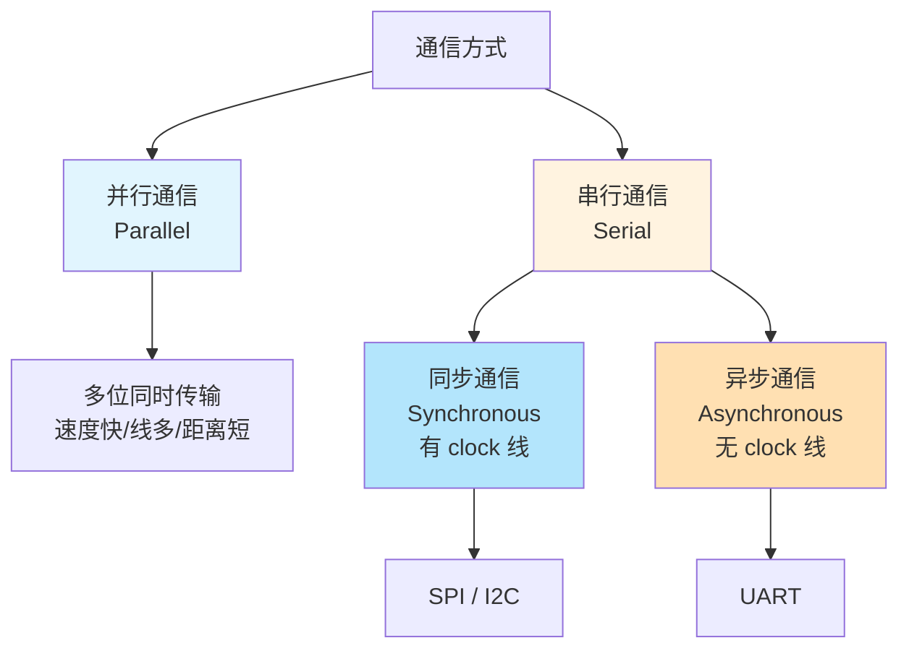
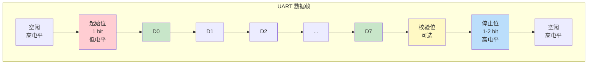
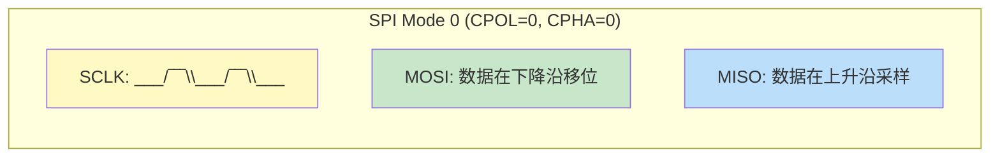
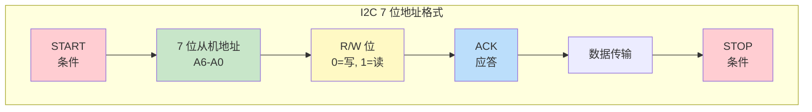
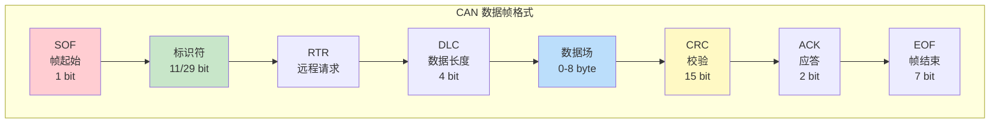
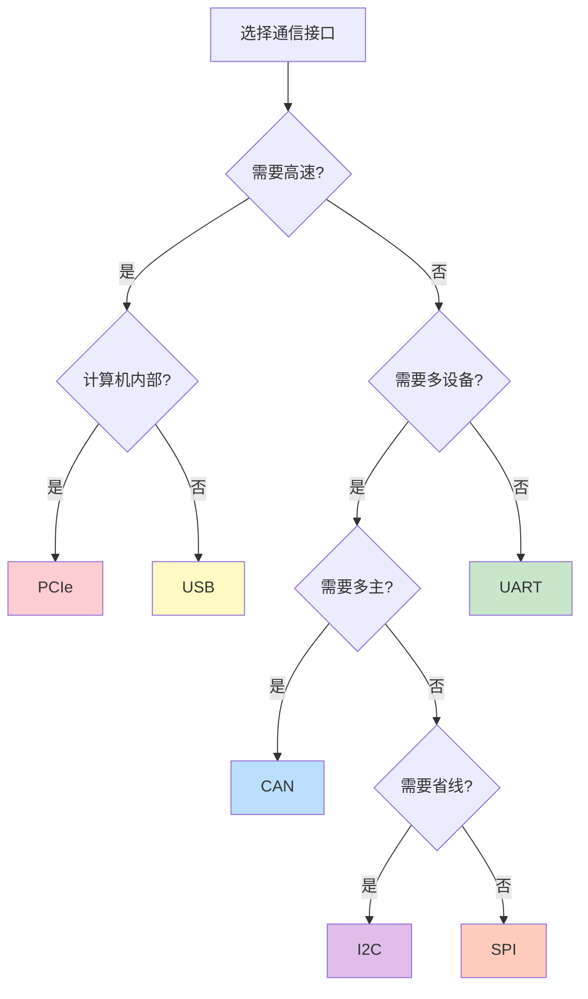

---
tags:
  - ate
  - digital-circuit
  - communication-interface
  - SPI
  - I2C
  - UART
  - USB
  - PCIe
  - CAN
  - chapter3
created: 2026-06-18
---

# 3.5 常见通信接口（SPI / I2C / UART / USB / PCIe / CAN）

> 🔗 文中的 **彩色高亮词** 均可点击跳转到文末 [[#术语解释|术语解释]] 查看详细说明。
> 📌 **前置要求**：建议先阅读 [[../02.半导体基础/02.MOSFET与CMOS原理|2.2 MOSFET/CMOS原理]] 理解底层器件，以及 [[01.组合逻辑与时序逻辑|3.1 组合逻辑与时序逻辑]] 理解时序基础。

## 为什么测试工程师要学通信接口？

作为 ATE 测试工程师，你每天接触的不只是"电压"和"电流"——你还需要理解芯片的**通信接口行为**：

| 如果你在做... | 你需要理解... | 为什么？ |
|:---|:---|:---|
| **接口功能测试** | 协议时序、电气特性 | 验证芯片能否正确发送/接收数据 |
| **Pattern 开发** | 协议帧格式、位序 | 测试向量需要按照协议格式生成 |
| **AC 参数测试** | 建立/保持时间、速率 | 验证接口时序是否满足规格 |
| **Debug 失效** | 信号完整性、阻抗匹配 | 定位通信失败的根因 |
| **量产测试** | 多通道并行测试 | 提高测试效率，降低测试成本 |

> 💡 **一句话总结**：通信接口 = 芯片的"嘴巴和耳朵"。ATE 测试本质上是**验证芯片能否正确"说话"和"听话"**。

---

## 第一部分：通信接口基础概念

### 1.1 通信分类

**核心区别**：
- **并行通信**：多位数据同时传输，速度快但线多、成本高、距离短
- **串行通信**：数据逐位传输，线少、成本低、距离远
- **同步通信**：有时钟线，收发双方同步
- **异步通信**：无时钟线，靠波特率约定

### 1.2 通信方向

| 方向 | 说明 | 示例 |
|:---|:---|:---|
| **单工** | 数据只能单向传输 | 广播、遥控器 |
| **半双工** | 数据可双向，但不能同时 | I2C |
| **全双工** | 数据可同时双向传输 | SPI、UART |

---

## 第二部分：UART（通用异步收发器）

### 2.1 UART 基本概念

**UART（Universal Asynchronous Receiver/Transmitter）** 是最基础的串行通信接口，**异步、全双工、点对点**。

> 图：UART 数据帧格式。包括起始位、数据位、校验位、停止位。[图片来源：嵌入式通信协议教程]

**UART 信号线**：

| 信号线 | 方向 | 功能 |
|:---|:---|:---|
| **TX** | 发送 | 发送数据 |
| **RX** | 接收 | 接收数据 |
| **GND** | - | 公共地（参考电平） |

### 2.2 UART 数据帧格式

**UART 配置参数**：

| 参数 | 说明 | 典型值 |
|:---|:---|:---|
| **波特率** | 每秒传输的比特数 | 9600, 115200 |
| **数据位** | 每帧数据位数 | 5-8 bit |
| **校验位** | 奇偶校验 | None, Odd, Even |
| **停止位** | 帧结束标志 | 1, 1.5, 2 bit |

### 2.3 UART 工作原理

**发送流程**：
1. 空闲状态：TX 线保持高电平
2. 发送起始位：拉低 TX 线（1 bit）
3. 发送数据位：从低位到高位逐位发送（5-8 bit）
4. 发送校验位（可选）：奇偶校验
5. 发送停止位：拉高 TX 线（1-2 bit）
6. 回到空闲状态

**接收流程**：
1. 检测起始位：检测到下降沿
2. 在数据位中间采样（避免毛刺）
3. 逐位接收数据
4. 检查校验位（可选）
5. 检查停止位
6. 数据送入接收缓冲区

### 2.4 UART ATE 测试要点

| 测试项目 | 测试方法 | 关键参数 | 失效模式 |
|:---|:---|:---|:---|
| **功能测试** | 发送/接收 Loopback | 数据正确性 | 数据错误、帧错误 |
| **波特率测试** | 测量实际波特率 | 误差 < ±2% | 时钟偏差 |
| **时序测试** | 测量起始位/停止位宽度 | 建立/保持时间 | 时序违规 |
| **电气测试** | 测量高/低电平 | VOH, VOL | 驱动能力不足 |

---

## 第三部分：SPI（串行外设接口）

### 3.1 SPI 基本概念

**SPI（Serial Peripheral Interface）** 是**同步、全双工、主从结构**的高速串行通信接口。

> 图：SPI 主从结构。一个主设备可连接多个从设备。[图片来源：SPI/I2C 教程]

**SPI 信号线**：

| 信号线 | 全称 | 方向 | 功能 |
|:---|:---|:---|:---|
| **SCLK** | Serial Clock | 主→从 | 时钟信号 |
| **MOSI** | Master Out Slave In | 主→从 | 主设备输出，从设备输入 |
| **MISO** | Master In Slave Out | 从→主 | 主设备输入，从设备输出 |
| **CS/SS** | Chip Select / Slave Select | 主→从 | 片选信号（低有效） |

> 📌 **新命名规范**：根据 OSHWA 决议，推荐使用 COPI（Controller Out Peripheral In）和 CIPO（Controller In Peripheral Out）替代 MOSI/MISO。

### 3.2 SPI 四种模式

SPI 通过 **CPOL（时钟极性）** 和 **CPHA（时钟相位）** 定义四种工作模式：

| 模式 | CPOL | CPHA | 时钟空闲 | 采样边沿 | 移位边沿 |
|:---|:---|:---|:---|:---|:---|
| **Mode 0** | 0 | 0 | 低电平 | 上升沿 | 下降沿 |
| **Mode 1** | 0 | 1 | 低电平 | 下降沿 | 上升沿 |
| **Mode 2** | 1 | 0 | 高电平 | 下降沿 | 上升沿 |
| **Mode 3** | 1 | 1 | 高电平 | 上升沿 | 下降沿 |

### 3.3 SPI 时序图

> 图：SPI 读写时序。主设备通过 CS 选择从设备，在 SCLK 控制下同时发送和接收数据。[图片来源：SPI 时序教程]

**SPI 读写流程**：
1. 主设备拉低 CS，选中从设备
2. 主设备在 MOSI 上发送数据，同时在 SCLK 控制下移位
3. 从设备在 MISO 上发送数据，主设备同时接收
4. 数据传输完成（全双工，同时收发）
5. 主设备拉高 CS，结束通信

### 3.4 SPI vs UART 对比

| 特性 | SPI | UART |
|:---|:---|:---|
| **同步/异步** | 同步 | 异步 |
| **信号线数** | 4 根（SCLK, MOSI, MISO, CS） | 2 根（TX, RX） |
| **通信方式** | 全双工 | 全双工 |
| **速度** | 高速（数 Mbps ~ 数十 Mbps） | 低速（通常 < 1 Mbps） |
| **多设备** | 支持（每个从设备需要独立 CS） | 不支持（点对点） |
| **硬件复杂度** | 中等 | 简单 |

### 3.5 SPI ATE 测试要点

| 测试项目 | 测试方法 | 关键参数 | 失效模式 |
|:---|:---|:---|:---|
| **功能测试** | Loopback 测试 | 数据正确性 | 数据错误、位序错误 |
| **时序测试** | 测量 SCLK 频率、建立/保持时间 | tSETUP, tHOLD | 时序违规 |
| **电气测试** | 测量 VOH, VOL, 上升/下降时间 | 电平、边沿速率 | 驱动能力不足 |
| **模式测试** | 测试四种 SPI 模式 | CPOL, CPHA | 模式配置错误 |

---

## 第四部分：I2C（集成电路总线）

### 4.1 I2C 基本概念

**I2C（Inter-Integrated Circuit）** 是**同步、半双工、多主多从**的两线制串行通信接口。

> 图：I2C 总线结构。SCL（时钟）和 SDA（数据）都需要上拉电阻。[图片来源：I2C 协议教程]

**I2C 信号线**：

| 信号线 | 全称 | 功能 | 特点 |
|:---|:---|:---|:---|
| **SCL** | Serial Clock | 时钟信号 | 开漏输出 + 上拉电阻 |
| **SDA** | Serial Data | 数据信号 | 开漏输出 + 上拉电阻 |

**I2C 电气特性**：
- **开漏输出**：只能拉低或高阻，不能主动输出高电平
- **上拉电阻**：提供高电平（通常 4.7kΩ ~ 10kΩ）
- **线与逻辑**：任一设备拉低，总线为低；所有设备释放，总线为高

### 4.2 I2C 寻址方式

I2C 使用 **7 位或 10 位地址** 寻址从设备：

**I2C 速度等级**：

| 模式 | 速率 | 应用场景 |
|:---|:---|:---|
| **标准模式** | 100 kbps | 低速外设 |
| **快速模式** | 400 kbps | 常用模式 |
| **快速模式+** | 1 Mbps | 高速外设 |
| **高速模式** | 3.4 Mbps | 高速数据传输 |

### 4.3 I2C 时序

> 图：I2C  START/STOP 条件和数据传输时序。[图片来源：I2C 协议详解]

**I2C 关键时序**：

| 时序参数 | 说明 | 标准模式 | 快速模式 |
|:---|:---|:---|:---|
| **fSCL** | 时钟频率 | ≤ 100 kHz | ≤ 400 kHz |
| **tHD:STA** | START 条件保持时间 | ≥ 4.0 μs | ≥ 0.6 μs |
| **tLOW** | SCL 低电平时间 | ≥ 4.7 μs | ≥ 1.3 μs |
| **tHIGH** | SCL 高电平时间 | ≥ 4.0 μs | ≥ 0.6 μs |
| **tSU:STO** | STOP 条件建立时间 | ≥ 4.0 μs | ≥ 0.6 μs |

**START 和 STOP 条件**：
- **START**：SCL 为高时，SDA 从高变低（↓）
- **STOP**：SCL 为高时，SDA 从低变高（↑）

### 4.4 I2C vs SPI 对比

| 特性 | I2C | SPI |
|:---|:---|:---|
| **信号线数** | 2 根（SCL, SDA） | 4 根（SCLK, MOSI, MISO, CS） |
| **通信方式** | 半双工 | 全双工 |
| **速度** | 低速（100 kbps ~ 3.4 Mbps） | 高速（数 Mbps ~ 数十 Mbps） |
| **多设备** | 支持（地址寻址） | 支持（独立 CS） |
| **多主设备** | 支持 | 不支持 |
| **硬件复杂度** | 简单（2 根线） | 中等（需要 CS 线） |
| **典型应用** | 传感器、EEPROM、RTC | Flash、显示屏、高速 ADC |

### 4.5 I2C ATE 测试要点

| 测试项目 | 测试方法 | 关键参数 | 失效模式 |
|:---|:---|:---|:---|
| **功能测试** | 读写寄存器 | 地址、数据正确性 | 地址错误、数据错误 |
| **时序测试** | 测量 SCL 频率、建立/保持时间 | tLOW, tHIGH | 时序违规 |
| **电气测试** | 测量 VOH, VOL、上升时间 | 电平、边沿速率 | 上拉电阻不当、驱动不足 |
| **仲裁测试** | 多主设备竞争 | 仲裁逻辑 | 仲裁失败 |

---

## 第五部分：USB（通用串行总线）

### 5.1 USB 基本概念

**USB（Universal Serial Bus）** 是**高速、串行、主从结构**的通用通信接口，广泛用于 PC、移动设备、外设连接。

> 图：USB 接口类型。包括 Type-A、Type-B、Micro-USB、Type-C 等。[图片来源：USB 接口标准]

**USB 版本对比**：

| 版本 | 发布年份 | 最大速率 | 典型应用 |
|:---|:---|:---|:---|
| **USB 1.1** | 1998 | 12 Mbps | 低速外设（键盘、鼠标） |
| **USB 2.0** | 2000 | 480 Mbps | 高速外设（U 盘、摄像头） |
| **USB 3.0** | 2008 | 5 Gbps | 超高速外设（SSD、外置硬盘） |
| **USB 3.1** | 2013 | 10 Gbps | 高速数据传输 |
| **USB 3.2** | 2017 | 20 Gbps | 高性能外设 |
| **USB4** | 2019 | 40 Gbps | 基于 Thunderbolt 3 |

### 5.2 USB 信号线

**USB 2.0 信号线**：

| 信号线 | 功能 | 电平 |
|:---|:---|:---|
| **VBUS** | 电源（+5V） | 5V |
| **D+** | 数据+ | 差分信号 |
| **D-** | 数据- | 差分信号 |
| **GND** | 地 | 0V |

**USB 差分信号**：
- **差分传输**：D+ 和 D- 信号相反，抗干扰能力强
- **逻辑 1（J 状态）**：D+ > D-（高速）或 D+ < D-（低速）
- **逻辑 0（K 状态）**：D+ < D-（高速）或 D+ > D-（低速）

### 5.3 USB 传输类型

| 传输类型 | 特点 | 应用场景 |
|:---|:---|:---|
| **控制传输** | 可靠、有确认、低延迟 | 设备枚举、配置 |
| **批量传输** | 可靠、无带宽保证、大数据量 | U 盘、打印机 |
| **中断传输** | 可靠、低延迟、小数据量 | 键盘、鼠标 |
| **等时传输** | 不可靠、固定带宽、实时 | 音视频流 |

### 5.4 USB ATE 测试要点

| 测试项目 | 测试方法 | 关键参数 | 失效模式 |
|:---|:---|:---|:---|
| **功能测试** | 设备枚举、数据传输 | 枚举成功、数据正确 | 枚举失败、数据错误 |
| **信号质量测试** | 眼图测试、抖动测试 | 眼图张开度、抖动 | 信号完整性问题 |
| **电气测试** | 测量 VBUS、差分电平 | 电压、电流 | 电源问题、驱动不足 |
| **速率测试** | 测量实际传输速率 | 带宽 | 速率不达标 |

---

## 第六部分：PCIe（外设组件快速互联）

### 6.1 PCIe 基本概念

**PCIe（Peripheral Component Interconnect Express）** 是**高速、串行、点对点**的计算机内部总线，用于连接 CPU、GPU、SSD 等高速设备。

> 图：PCIe 架构。包括 Root Complex、Switch、Endpoint 等。[图片来源：PCIe 架构教程]

**PCIe 版本对比**：

| 版本 | 发布年份 | 单通道带宽 | x16 带宽 | 典型应用 |
|:---|:---|:---|:---|:---|
| **PCIe 1.0** | 2003 | 250 MB/s | 4 GB/s | 早期显卡 |
| **PCIe 2.0** | 2007 | 500 MB/s | 8 GB/s | 中端显卡 |
| **PCIe 3.0** | 2010 | 985 MB/s | 15.75 GB/s | 高端显卡、NVMe SSD |
| **PCIe 4.0** | 2017 | 1.97 GB/s | 31.5 GB/s | 高性能 SSD、AI 加速器 |
| **PCIe 5.0** | 2019 | 3.94 GB/s | 63 GB/s | 下一代高性能设备 |
| **PCIe 6.0** | 2022 | 7.88 GB/s | 126 GB/s | 未来高性能计算 |

### 6.2 PCIe 信号线

**PCIe 信号线（每通道）**：

| 信号线 | 功能 | 特点 |
|:---|:---|:---|
| **TX+ / TX-** | 发送差分对 | 高速串行发送 |
| **RX+ / RX-** | 接收差分对 | 高速串行接收 |

**PCIe 通道数**：
- **x1**：1 通道
- **x4**：4 通道
- **x8**：8 通道
- **x16**：16 通道

### 6.3 PCIe 与 USB 对比

| 特性 | PCIe | USB |
|:---|:---|:---|
| **应用场景** | 计算机内部 | 外部设备连接 |
| **拓扑结构** | 点对点 | 主从（Hub） |
| **速度** | 超高速（数 GB/s ~ 数十 GB/s） | 高速（数 Mbps ~ 数 Gbps） |
| **延迟** | 极低 | 中等 |
| **热插拔** | 支持 | 支持 |
| **典型应用** | GPU、SSD、网卡 | 外设、存储、充电器 |

### 6.4 PCIe ATE 测试要点

| 测试项目 | 测试方法 | 关键参数 | 失效模式 |
|:---|:---|:---|:---|
| **功能测试** | 链路训练、数据传输 | 链路建立、数据正确性 | 链路训练失败 |
| **信号质量测试** | 眼图测试、抖动测试 | 眼图张开度、抖动 | 信号完整性问题 |
| **速率测试** | 测量实际带宽 | 吞吐量 | 速率不达标 |
| **误码率测试** | BER（Bit Error Rate）测试 | BER < 10⁻¹² | 误码率过高 |

---

## 第七部分：CAN（控制器局域网）

### 7.1 CAN 基本概念

**CAN（Controller Area Network）** 是**高可靠、多主、差分信号**的串行通信总线，广泛用于汽车电子和工业控制。

> 图：CAN 总线结构。多主设备、差分信号、终端电阻。[图片来源：CAN 总线详解]

**CAN 版本对比**：

| 版本 | 发布年份 | 最大速率 | 标识符长度 | 典型应用 |
|:---|:---|:---|:---|:---|
| **CAN 2.0A** | 1991 | 1 Mbps | 11 位 | 汽车车身控制 |
| **CAN 2.0B** | 1991 | 1 Mbps | 29 位 | 汽车动力总成 |
| **CAN FD** | 2012 | 8 Mbps | 11/29 位 | 高速数据传输 |

### 7.2 CAN 信号线

**CAN 信号线**：

| 信号线 | 功能 | 电平 |
|:---|:---|:---|
| **CAN_H** | 差分信号+ | 隐性（高）：2.5V，显性（低）：3.5V |
| **CAN_L** | 差分信号- | 隐性（高）：2.5V，显性（低）：1.5V |

**CAN 差分信号**：
- **差分传输**：CAN_H 和 CAN_L 信号相反，抗干扰能力强
- **隐性（Recessive）**：逻辑 1，CAN_H = CAN_L = 2.5V
- **显性（Dominant）**：逻辑 0，CAN_H > CAN_L

### 7.3 CAN 报文格式

**CAN 报文特点**：
- **短帧结构**：数据场 0-8 字节（CAN FD 可达 64 字节）
- **优先级仲裁**：标识符越小，优先级越高
- **错误检测**：CRC 校验、ACK 应答
- **广播通信**：所有节点同时接收相同数据

### 7.4 CAN vs 其他总线对比

| 特性 | CAN | SPI | I2C | UART |
|:---|:---|:---|:---|:---|
| **应用场景** | 汽车、工业 | 板级通信 | 板级通信 | 点对点通信 |
| **信号线数** | 2 根（差分） | 4 根 | 2 根 | 2 根 |
| **速度** | 1 Mbps（CAN FD: 8 Mbps） | 数 Mbps ~ 数十 Mbps | 100 kbps ~ 3.4 Mbps | 通常 < 1 Mbps |
| **多主设备** | 支持 | 不支持 | 支持 | 不支持 |
| **差分信号** | 支持 | 不支持 | 不支持 | 不支持 |
| **抗干扰能力** | 极强 | 一般 | 一般 | 较差 |
| **通信距离** | 最长 10 km | 短距离 | 短距离 | 中等距离 |

### 7.5 CAN ATE 测试要点

| 测试项目 | 测试方法 | 关键参数 | 失效模式 |
|:---|:---|:---|:---|
| **功能测试** | 报文发送/接收 | 数据正确性 | 数据错误、帧错误 |
| **时序测试** | 测量位时间、位速率 | 位速率误差 < ±0.5% | 时序偏差 |
| **电气测试** | 测量差分电平、共模电压 | CAN_H, CAN_L 电平 | 电平异常、驱动不足 |
| **错误处理测试** | 注入错误、测试错误恢复 | 错误帧、总线关闭 | 错误处理失效 |

---

## 第八部分：通信接口综合对比

### 8.1 核心特性对比表

| 特性 | UART | SPI | I2C | USB | PCIe | CAN |
|:---|:---|:---|:---|:---|:---|:---|
| **同步/异步** | 异步 | 同步 | 同步 | 同步 | 同步 | 异步 |
| **信号线数** | 2 | 4 | 2 | 4 | 2/通道 | 2 |
| **通信方式** | 全双工 | 全双工 | 半双工 | 半双工 | 全双工 | 半双工 |
| **速度** | 低速 | 高速 | 中速 | 高速 | 超高速 | 中速 |
| **多设备** | 不支持 | 支持 | 支持 | 支持 | 不支持 | 支持 |
| **多主设备** | 不支持 | 不支持 | 支持 | 不支持 | 不支持 | 支持 |
| **差分信号** | 不支持 | 不支持 | 不支持 | 支持 | 支持 | 支持 |
| **通信距离** | 短 | 短 | 短 | 中 | 短 | 长 |
| **典型应用** | 调试 | Flash、ADC | 传感器 | 外设 | GPU、SSD | 汽车、工业 |

### 8.2 选择指南

### 8.3 ATE 测试策略总结

| 接口类型 | 测试重点 | 常见失效模式 |
|:---|:---|:---|
| **UART** | 波特率、帧格式、电平 | 数据错误、帧错误 |
| **SPI** | 时钟、模式、全双工 | 数据错误、时序违规 |
| **I2C** | 地址、时序、上拉 | 地址冲突、时序违规 |
| **USB** | 枚举、信号质量、速率 | 枚举失败、信号完整性 |
| **PCIe** | 链路训练、带宽、误码率 | 链路失败、误码率高 |
| **CAN** | 差分电平、报文、错误处理 | 电平异常、错误处理失效 |

---

## 术语解释

| 术语 | 英文 | 解释 |
|:---|:---|:---|
| **UART** | Universal Asynchronous Receiver/Transmitter | 通用异步收发器，异步串行通信 |
| **SPI** | Serial Peripheral Interface | 串行外设接口，同步全双工通信 |
| **I2C** | Inter-Integrated Circuit | 集成电路总线，同步半双工通信 |
| **USB** | Universal Serial Bus | 通用串行总线，高速串行通信 |
| **PCIe** | Peripheral Component Interconnect Express | 外设组件快速互联，超高速串行总线 |
| **CAN** | Controller Area Network | 控制器局域网，高可靠差分总线 |
| **波特率** | Baud Rate | 每秒传输的符号数，单位 bps |
| **全双工** | Full Duplex | 可同时双向传输 |
| **半双工** | Half Duplex | 可双向但不能同时 |
| **差分信号** | Differential Signal | 两根线传输相反信号，抗干扰强 |
| **开漏输出** | Open Drain | 只能拉低或高阻，需上拉电阻 |
| **片选** | Chip Select (CS) | 选择从设备的信号线 |
| **时钟极性** | Clock Polarity (CPOL) | 时钟空闲时的电平 |
| **时钟相位** | Clock Phase (CPHA) | 数据采样的时钟边沿 |
| **眼图** | Eye Diagram | 信号质量的图形化表示 |
| **误码率** | Bit Error Rate (BER) | 传输错误比特数与总比特数之比 |

---

## 参考资料

- [嵌入式通信协议全解析：SPI、I²C、UART详解 - 阿里云开发者社区](https://developer.aliyun.com/article/1561532)
- [STM32 通信接口：SPI、I²C、USART原理 - CSDN](https://blog.csdn.net/liubo4396/article/details/156580568)
- [通信篇（三大协议之UART,I2C,SPI详细篇）- CSDN](https://blog.csdn.net/yang424625/article/details/144570650)
- [串口通信及对比(SPI,I2C,UART,CAN) - Bilibili](https://www.bilibili.com/opus/1039457367863853064)
- [嵌入式常见接口协议总结 - CSDN](https://blog.csdn.net/qq_28576837/article/details/126482447)
- [CAN总线详解 - CSDN](https://blog.csdn.net/harlen018/article/details/102777371)
- [基于FPGA的CAN总线控制器的设计 - 电子工程专辑](https://www.eet-china.com/mp/a422159.html)

---

> ✅ **本章完成**：3.5 常见通信接口（SPI / I2C / UART / USB / PCIe / CAN）
> 
> 📝 **下一章预告**：4.1 ATE 系统架构
> 
> 🔍 **请审核本章内容**，如需修改或补充，请告知。确认后我将继续编写下一章。
