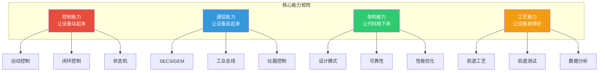
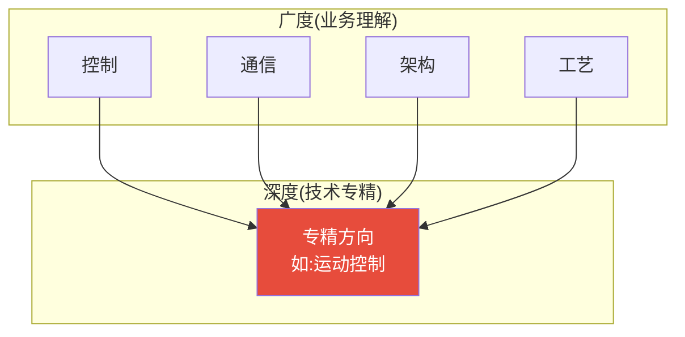

# 0.1.3 软件设备工程师的核心能力矩阵

## 📍 学习目标

- 掌握半导体设备软件工程师的四大核心能力维度
- 理解每个能力维度的具体技能要求和学习路径
- 根据自身定位(OEM/Fab)制定能力发展优先级
- 建立"技术深度+业务广度"的T型人才观

> [!info] 本节定位
> 半导体设备软件不是"会写代码就行",它是一个高度专业化的领域,需要控制、通信、架构、工艺四大能力的复合。本节帮你建立清晰的能力地图,避免"学了三年还在门外"。

---

## 🎯 一、核心能力矩阵总览

半导体设备软件工程师的能力可以分为四大维度:

**四大能力的关系:**
- **控制能力**是基础:设备不会动,其他都是空谈
- **通信能力**是桥梁:设备不联网,就是信息孤岛
- **架构能力**是骨架:代码不稳健,设备随时崩溃
- **工艺能力**是灵魂:不懂工艺,写不出好软件

> [!tip] 一句话总结
> 控制能力让你"能干活",通信能力让你"能协作",架构能力让你"干得稳",工艺能力让你"干得好"。

---

## 🔧 二、控制能力:让设备动起来

### 2.1 能力定义

控制能力是指**让设备的机械、电气、流体等硬件按预期动作的能力**。这是设备软件工程师的"看家本领"。

### 2.2 核心技能

#### 2.2.1 运动控制(Motion Control)

**为什么重要:**
半导体设备里有大量的电机、气缸、机械臂。晶圆从A点搬到B点,精度要求微米级,速度要求毫秒级。写不好运动控制,晶圆就碎了、撞机了、良率崩了。

**实际怎么用:**
- 点位控制(PTP):机械臂从A点到B点,不关心中间轨迹
- 连续控制(CP):切割设备需要严格的轨迹规划
- 多轴联动:光刻机的工件台需要6自由度同步运动

**学习路径:**
1. 基础:电机原理(步进/伺服)、驱动器配置、运动学正逆解
2. 进阶:S曲线加减速、轨迹规划、防振控制
3. 高级:多轴同步、龙门控制、视觉引导运动

**推荐工具:**
- 硬件:固高(GTS)、雷赛(DMC)、ACS、Aerotech
- 软件:G代码、C++运动控制库、MATLAB仿真

#### 2.2.2 闭环控制(Closed-Loop Control)

**为什么重要:**
设备里的温度、压力、流量、真空度,都需要精确控制。比如刻蚀工艺要求温度波动<±0.1℃,写不好PID,工艺就废了。

**实际怎么用:**
- PID控制:最经典的闭环算法,90%的工业场景够用
- 前馈控制:提前补偿已知干扰(如开门导致的温度下降)
- 自适应控制:参数自动调整(如MFC老化后增益变化)

**学习路径:**
1. 基础:PID原理、参数整定(Ziegler-Nichols方法)
2. 进阶:级联PID、前馈-反馈复合、死区补偿
3. 高级:模型预测控制(MPC)、模糊控制、神经网络控制

**推荐工具:**
- 仿真:MATLAB/Simulink、Python control库
- 实战:PLC编程(西门子/倍福)、C++实时控制

#### 2.2.3 状态机(State Machine)

**为什么重要:**
设备有复杂的运行状态(Idle/Setup/Execute/Pause/Abort/Error)。状态机写不好,设备就会"卡死"、"乱跳"、"无法恢复"。

**实际怎么用:**
- 设备状态:Idle(空闲) → Setup(准备) → Execute(执行) → Complete(完成)
- 异常处理:Error(错误) → Recovery(恢复) → Idle(空闲)
- 分层状态机:主控状态机 + 模块状态机 + 执行状态机

**学习路径:**
1. 基础:有限状态机(FSM)、状态转换图、状态表
2. 进阶:分层状态机(HSM)、并发状态机、状态机框架
3. 高级:状态机代码生成、形式化验证、实时状态机

**推荐工具:**
- 框架:Boost.Statechart(C++)、Qt State Machine
- 工具:Stateflow(Matlab)、PlantUML(画图)

### 2.3 能力评估标准

| 级别 | 控制能力要求 |
|------|------------|
| **初级** | 能写简单的点位运动、单回路PID、基础状态机 |
| **中级** | 能做多轴联动、复杂PID调优、分层状态机 |
| **高级** | 能设计运动控制架构、自适应控制、状态机形式化验证 |

---

## 📡 三、通信能力:让设备连起来

### 3.1 能力定义

通信能力是指**让设备与设备、设备与工厂系统之间能够交换数据的能力**。这是设备融入工厂自动化的"通行证"。

### 3.2 核心技能

#### 3.2.1 SECS/GEM通信

**为什么重要:**
所有前道设备必须支持SECS/GEM,否则进不了Fab。这是半导体行业的"普通话",不会说就被淘汰。

**实际怎么用:**
- HSMS(TCP/IP):物理层传输,处理连接、心跳、超时
- SECS-II:消息层格式,定义数据结构(List/Item/ASCII/Binary)
- GEM:行为层状态机,定义设备的通信行为(Online/Offline/Remote/Local)

**学习路径:**
1. 基础:SECS/GEM协议族(E4/E5/E30/E37)、消息结构
2. 进阶:GEM状态机、Stream/Function、S1F3/S2F21/S6F11等核心消息
3. 高级:GEM300(E87/E40/E94)、EDA/Interface A、自定义扩展

**推荐工具:**
- 开源:SECS4J(Java)、secs-gem(C++)
- 商业:Communications Suite(ULTRA)、SECS/GEM SDK

#### 3.2.2 工业总线

**为什么重要:**
设备内部的板卡、传感器、执行器需要通过总线通信。总线选不好,实时性不够,设备就"卡顿"。

**实际怎么用:**
- EtherCAT:高速以太网,适合多轴联动,1ms级同步
- Modbus:简单串口/以太网,适合传感器采集
- CANopen:嵌入式总线,适合小型设备

**学习路径:**
1. 基础:串口(RS232/485)、TCP/IP、Modbus RTU/TCP
2. 进阶:EtherCAT主站开发、CANopen主从通信
3. 高级:实时以太网优化、分布式时钟同步

**推荐工具:**
- 硬件:倍福(EtherCAT)、研华(Modbus)
- 软件:SOEM(开源EtherCAT主站)、libmodbus

#### 3.2.3 仪器控制

**为什么重要:**
后道测试设备需要控制各种仪器(电源、万用表、示波器)。不会控制仪器,测试程序就写不了。

**实际怎么用:**
- VISA:统一的仪器控制API,支持GPIB/USB/以太网
- SCPI:标准仪器指令集,如`*RST`(复位)、`MEAS:VOLT:DC?`(测电压)
- 异步通信:仪器响应慢,需要异步读取,避免阻塞

**学习路径:**
1. 基础:VISA库使用、SCPI指令、GPIB/USB通信
2. 进阶:仪器驱动封装、多仪器同步、数据采集
3. 高级:自定义仪器协议、高速数据流、仪器虚拟化

**推荐工具:**
- 库:PyVISA(Python)、NI-VISA(C/C++)
- 仪器:Keysight、Tektronix、Keithley

### 3.3 能力评估标准

| 级别 | 通信能力要求 |
|------|------------|
| **初级** | 能用VISA控制仪器、理解SECS/GEM消息、会写Modbus |
| **中级** | 能实现GEM状态机、开发EtherCAT主站、封装仪器驱动 |
| **高级** | 能设计通信架构、优化实时性、扩展SECS/GEM |

---

## 🏗️ 四、架构能力:让代码稳下来

### 4.1 能力定义

架构能力是指**设计稳健、可扩展、可维护的软件系统的能力**。这是设备软件从"能跑"到"跑得稳"的关键。

### 4.2 核心技能

#### 4.2.1 设计模式

**为什么重要:**
设备软件代码量大(10万~100万行),不用设计模式,代码就会变成"屎山",改一个bug出三个bug。

**实际怎么用:**
- 单例模式:设备管理器、日志系统全局唯一
- 观察者模式:传感器数据变化通知多个UI组件
- 工厂模式:创建不同类型的硬件驱动
- 状态模式:用类封装状态机逻辑

**学习路径:**
1. 基础:GoF 23种设计模式、UML类图
2. 进阶:设计原则(SOLID)、重构技巧、代码坏味道
3. 高级:架构模式(MVC/MVP/MVVM)、领域驱动设计(DDD)

**推荐书籍:**
- 《设计模式:可复用面向对象软件的基础》
- 《重构:改善既有代码的设计》
- 《架构整洁之道》

#### 4.2.2 可靠性设计

**为什么重要:**
设备软件崩溃=产线停机=损失几万块/分钟。必须设计"不会崩"的系统。

**实际怎么用:**
- 异常安全:RAII、智能指针、异常捕获
- 故障恢复:Watchdog看门狗、心跳监测、自动重启
- 冗余设计:关键数据双备份、双机热备

**学习路径:**
1. 基础:C++异常处理、智能指针、RAII
2. 进阶:Watchdog机制、日志系统、崩溃转储分析
3. 高级:容错架构、故障注入测试、混沌工程

**推荐工具:**
- 日志:spdlog(C++)、log4net(C#)
- 监控:Valgrind(内存泄漏)、GDB(崩溃调试)

#### 4.2.3 性能优化

**为什么重要:**
设备软件有实时性要求,控制周期1ms,数据处理延迟<100ms。性能不够,设备就"卡顿"。

**实际怎么用:**
- 内存优化:内存池、对象池、避免频繁分配
- 多线程:线程池、无锁队列、CPU亲和性
- 算法优化:缓存友好、SIMD指令、并行计算

**学习路径:**
1. 基础:时间/空间复杂度、缓存原理、多线程基础
2. 进阶:性能分析工具、内存池、无锁编程
3. 高级:实时系统优化、WCET分析、确定性调度

**推荐工具:**
- 分析:perf(Linux)、VTune(Intel)、Valgrind
- 优化:OpenMP、TBB、CUDA

### 4.3 能力评估标准

| 级别 | 架构能力要求 |
|------|------------|
| **初级** | 会用设计模式、理解异常处理、能写多线程 |
| **中级** | 能设计模块架构、实现可靠性机制、做性能分析 |
| **高级** | 能设计系统架构、优化实时性、指导团队 |

---

## 🧪 五、工艺能力:让设备跑得好

### 5.1 能力定义

工艺能力是指**理解半导体制造工艺,并能将工艺需求转化为软件功能的能力**。这是设备软件工程师的"灵魂"。

### 5.2 核心技能

#### 5.2.1 前道工艺基础

**为什么重要:**
不懂工艺,就不知道设备为什么要这么设计。比如刻蚀机为什么要控制压力、流量、温度?因为工艺需要。

**实际怎么用:**
- 光刻:涂胶→曝光→显影,需要精密运动控制
- 刻蚀:等离子体反应,需要真空/气体/温度控制
- 薄膜:CVD/PVD沉积,需要压力/温度/功率控制

**学习路径:**
1. 基础:半导体物理、PN结、MOSFET原理
2. 进阶:光刻/刻蚀/薄膜/CVD工艺原理
3. 高级:工艺集成、良率分析、工艺优化

**推荐书籍:**
- 《半导体制造技术》(Quirk)
- 《硅超大规模集成电路工艺技术》(Zhipeng)

#### 5.2.2 后道测试基础

**为什么重要:**
后道测试设备软件工程师必须懂测试原理,否则写不出好的测试程序。

**实际怎么用:**
- DC测试:开短路、漏电流、阈值电压
- AC测试:频率、时序、建立/保持时间
- 功能测试:Pattern激励、真值表验证

**学习路径:**
1. 基础:数字电路、模拟电路、测试原理
2. 进阶:ATE架构、测试程序开发、良率分析
3. 高级:测试优化、DFT设计、测试成本分析

**推荐书籍:**
- 《半导体测试手册》(Boyd)
- 《VLSI测试原理》(Agrawal)

#### 5.2.3 数据分析

**为什么重要:**
设备产生海量数据(温度、压力、良率),不会分析就是"数据垃圾"。

**实际怎么用:**
- 统计过程控制(SPC):CPK、控制图、过程能力
- 故障检测(FDC):Trace数据特征提取、异常识别
- 良率分析:Wafer Map、缺陷聚类、根因分析

**学习路径:**
1. 基础:统计学基础、Python数据分析(Pandas/Numpy)
2. 进阶:SPC/FDC原理、Wafer Map可视化
3. 高级:机器学习(PCA/LSTM)、虚拟量测、R2R控制

**推荐工具:**
- Python:Pandas、Numpy、Scikit-learn
- 可视化:Matplotlib、Plotly、Tableau

### 5.3 能力评估标准

| 级别 | 工艺能力要求 |
|------|------------|
| **初级** | 理解基本工艺原理、会看工艺图纸、能做基础数据分析 |
| **中级** | 能独立分析工艺问题、开发FDC/SPC工具、优化测试程序 |
| **高级** | 能主导工艺-设备联合优化、开发智能算法、指导工艺实验 |

---

## 🎓 六、能力发展路径

### 6.1 OEM工程师的能力优先级

**优先级说明:**
- **控制能力(★★★★★)**:OEM的核心,必须精通
- **通信能力(★★★★☆)**:SECS/GEM是刚需,必须掌握
- **架构能力(★★★☆☆)**:代码要稳,但不需要架构师级别
- **工艺能力(★★☆☆☆)**:了解即可,工艺工程师会告诉你需求

### 6.2 Fab工程师的能力优先级

**优先级说明:**
- **通信能力(★★★★★)**:SECS/GEM是日常,必须精通
- **架构能力(★★★★☆)**:系统集成,代码要稳
- **工艺能力(★★★☆☆)**:要懂工艺,才能分析数据
- **控制能力(★★☆☆☆)**:了解即可,设备内部逻辑是OEM的事

### 6.3 T型人才模型

**T型人才:**
- **横向(广度)**:四大能力都要懂,才能和不同角色沟通
- **纵向(深度)**:选择一个方向深耕,成为专家

**推荐专精方向:**
- OEM:运动控制、闭环控制、状态机
- Fab:SECS/GEM、数据分析、系统集成

---

## 💡 七、工程师视角:能力培养的"坑"

### 7.1 常见误区

> [!warning] 误区1:只学编程语言
> "我会C++,所以能做设备软件"——错!C++只是工具,控制算法、通信协议、架构设计才是核心。**编程语言是"笔",能力是"写作技巧"。**

> [!warning] 误区2:只学理论不动手
> "我看过PID的书,所以会PID"——错!PID参数整定需要实战,需要在真实设备上调试。**理论是"地图",实战是"走路"。**

> [!warning] 误区3:只学单一技能
> "我只会运动控制,所以只做运动控制"——错!设备软件是系统工程,需要复合能力。**单一技能是"螺丝刀",复合能力是"工具箱"。**

### 7.2 高效学习路径

**第一阶段(0-6个月):打基础**
- 学C++/Python基础
- 学控制理论(PID、状态机)
- 学通信基础(SECS/GEM、Modbus)
- 做小项目:控制一个电机、读写一个传感器

**第二阶段(6-12个月):做项目**
- 参与真实项目(实习/工作)
- 深入一个方向(如运动控制)
- 学习架构设计(设计模式、可靠性)
- 做中型项目:开发一个设备控制模块

**第三阶段(1-2年):成专家**
- 主导一个子系统
- 学习工艺基础(前道/后道)
- 学习数据分析(SPC/FDC)
- 做大型项目:开发一个完整设备

### 7.3 推荐学习资源

**书籍:**
- 《半导体制造技术》(Quirk) - 工艺基础
- 《C++ Primer》 - 语言基础
- 《设计模式》 - 架构基础
- 《控制工程基础》 - 控制基础

**在线课程:**
- Coursera: Semiconductor Manufacturing
- Udemy: PLC Programming
- B站: 半导体设备控制、SECS/GEM教程

**社区:**
- GitHub: 开源SECS/GEM实现
- 知乎: 半导体设备软件专栏
- CSDN: 设备控制博客

---

## 📚 参考资料

**能力模型**
- [半导体设备软件工程师技能树 - 知乎](https://zhuanlan.zhihu.com/p/skills)
- [T型人才在半导体行业的价值 - CSDN](https://blog.csdn.net/talent)
- [如何成为优秀的设备软件工程师 - 微信公众号](https://mp.weixin.qq.com/s/engineer)

**技术学习**
- [运动控制入门教程 - 固高科技](https://www.googoltech.com.cn/)
- [SECS/GEM协议详解 - 知乎专栏](https://zhuanlan.zhihu.com/p/secs)
- [PID控制从入门到精通 - CSDN](https://blog.csdn.net/pid)

**职业发展**
- [半导体工程师职业规划 - 知乎](https://zhuanlan.zhihu.com/p/career)
- [从初级到架构师的成长路径 - 微信公众号](https://mp.weixin.qq.com/s/growth)

---

## 📖 专有名词

| 名词 | 解释 |
|------|------|
| **Motion Control** | 运动控制,控制电机按预期轨迹运动 |
| **PID** | 比例-积分-微分控制,最经典的闭环控制算法 |
| **State Machine** | 状态机,描述系统状态及其转换的数学模型 |
| **SECS/GEM** | 半导体设备通信标准/通用设备模型 |
| **EtherCAT** | 工业以太网实时总线 |
| **VISA** | 虚拟仪器软件架构,仪器控制标准API |
| **SCPI** | 标准仪器指令集 |
| **Design Pattern** | 设计模式,软件设计的通用解决方案 |
| **RAII** | 资源获取即初始化,C++资源管理技术 |
| **SPC** | 统计过程控制,质量管控方法 |
| **FDC** | 故障检测与分类,设备监控系统 |
| **T型人才** | 既有广度又有深度的人才模型 |

---

## 🔗 相关章节

- 上一节: [[阶段0-0.1.2 OEM与Fab软件工程师职责差异|0.1.2 OEM与Fab软件工程师职责差异]]
- 下一节: [[阶段0-0.1.4 核心生产指标认知|0.1.4 核心生产指标认知]]
