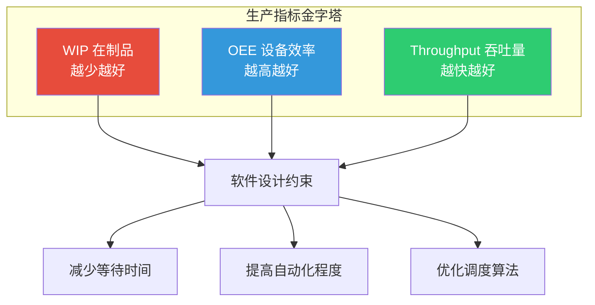
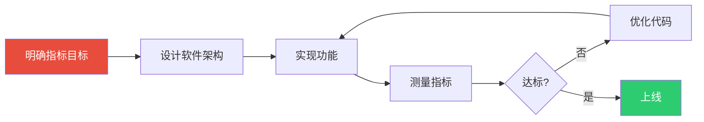

# 0.1.4 核心生产指标认知：WIP、OEE、Throughput

## 📍 学习目标

- 理解半导体制造的三大核心指标：WIP、OEE、Throughput
- 掌握这些指标如何约束软件设计决策
- 建立"软件为生产服务"的工程思维
- 学会用指标衡量软件系统的价值

> [!info] 本节定位
> 写设备软件不是为了"炫技"，而是为了让设备跑得更快、更稳、更省钱。本节帮你建立生产指标意识，避免"代码写得很漂亮，但产线效率很低"的尴尬。

---

## 🎯 一、为什么软件工程师要懂生产指标？

### 1.1 一个真实的案例

> [!warning] 案例：一个"完美"的bug
> 某Fab的EAP工程师写了一个"优雅"的Recipe下发程序：
> - 代码结构清晰，用了MVC模式
> - 有完整的日志记录
> - 支持离线编辑、在线审核
> 
> 但上线后发现：每次下发Recipe需要3分钟（因为要验证所有参数）。
> 
> 产线经理怒了："3分钟？我们一台设备一天要跑200个Recipe，你让我等10小时？"
> 
> 最后工程师改成：异步验证+增量下发，时间缩短到10秒。

**教训：** 软件设计必须考虑生产指标。代码再优雅，如果拖慢产线，就是失败的。

### 1.2 三大核心指标

半导体制造的核心指标可以概括为三个：

| 指标 | 英文全称 | 含义 | 软件关注点 |
|------|---------|------|-----------|
| **WIP** | Work In Progress | 在制品数量 | 如何减少WIP积压？ |
| **OEE** | Overall Equipment Effectiveness | 设备综合效率 | 如何提高设备利用率？ |
| **Throughput** | WPH/UPH | 吞吐量（晶圆/小时） | 如何加快生产速度？ |



---

## 📦 二、WIP（在制品）：越少越好

### 2.1 什么是WIP？

WIP（Work In Progress）是指**正在生产线上加工的晶圆数量**。

**为什么WIP越少越好？**
- WIP多 = 产线拥堵 = 生产周期长
- WIP多 = 资金占用大 = 现金流差
- WIP多 = 风险高 = 一旦出问题，损失大

**类比理解：**
WIP就像高速公路上的车。车少，跑得快；车多，堵车。

### 2.2 WIP对软件设计的约束

#### 2.2.1 减少等待时间

**场景：** 晶圆在设备之间等待搬运。

**软件解决方案：**
- AMHS（自动物料搬运系统）调度优化
- 设备状态实时监控，提前准备
- 预测性维护，减少意外停机

**代码示例（伪代码）：**
```python
# 差的实现：晶圆到了才调度
def on_wafer_arrived(wafer_id):
    robot = find_available_robot()
    robot.move_to(wafer_id, next_equipment)

# 好的实现：提前调度，减少等待
def predict_wafer_arrival(equipment_id):
    eta = calculate_eta(equipment_id)
    robot = schedule_robot_in_advance(eta)
    # 晶圆还没到，机器人已经在等了
```

#### 2.2.2 优化批次调度

**场景：** 多台设备竞争同一个Load Port。

**软件解决方案：**
- 优先级调度：紧急批次优先
- 均衡调度：避免某台设备过载
- 批量处理：减少换线时间

**实际案例：**
某Fab的EAP系统实现了"智能排队"算法：
- 根据WIP数量动态调整优先级
- WIP > 100的批次自动降权
- 结果：WIP降低30%，生产周期缩短20%

### 2.3 软件工程师的WIP意识

> [!tip] 思考题
> 你写的代码，是在减少WIP，还是增加WIP？
> 
> - 一个慢查询 = 增加WIP
> - 一个不必要的等待 = 增加WIP
> - 一个低效的调度算法 = 增加WIP
> 
> **每次写代码前，问自己：这段代码会让WIP增加还是减少？**

---

## ⚙️ 三、OEE（设备综合效率）：越高越好

### 3.1 什么是OEE？

OEE（Overall Equipment Effectiveness）是**设备综合效率**，衡量设备的实际产出与理论产出的比值。

**计算公式：**
```
OEE = 可用率 × 性能率 × 良率
```

**三个维度：**
| 维度 | 含义 | 典型损失 |
|------|------|---------|
| **可用率** | 设备实际运行时间 / 计划运行时间 | 故障停机、换线时间 |
| **性能率** | 实际产出 / 理论产出 | 速度降低、空转 |
| **良率** | 合格品 / 总产出 | 废品、返工 |

**行业标杆：**
- 世界级Fab：OEE > 85%
- 一般Fab：OEE 60-75%
- 差劲的Fab：OEE < 50%

### 3.2 OEE对软件设计的约束

#### 3.2.1 提高可用率

**软件解决方案：**
- **预测性维护**：提前发现故障，减少停机
- **快速恢复**：故障后自动重启，减少人工干预
- **远程诊断**：减少工程师到场时间

**代码示例（预测性维护）：**
```python
# 监控设备振动数据，预测轴承故障
def monitor_vibration(sensor_data):
    fft_result = fft(sensor_data)
    peak_frequency = find_peak(fft_result)
    
    # 轴承故障特征频率
    if peak_frequency in [120, 240, 360]:  # Hz
        alert_maintenance("轴承可能故障，请检查")
        # 提前安排维护，避免突发停机
```

#### 3.2.2 提高性能率

**软件解决方案：**
- **优化调度算法**：减少设备空转
- **并行处理**：多任务同时执行
- **预加载**：提前准备下一个Recipe

**实际案例：**
某刻蚀机的软件优化：
- 原实现：每个Step执行完，等待操作员确认
- 优化后：自动确认+异常时才暂停
- 结果：性能率从65%提升到80%

#### 3.2.3 提高良率

**软件解决方案：**
- **FDC（故障检测与分类）**：实时监控工艺参数
- **SPC（统计过程控制）**：发现异常趋势
- **自适应控制**：根据反馈动态调整参数

**代码示例（FDC）：**
```python
# 实时监控温度，发现异常立即报警
def monitor_temperature(temp_data):
    mean = calculate_mean(temp_data[-100:])
    std = calculate_std(temp_data[-100:])
    
    # 3σ原则
    if abs(temp_data[-1] - mean) > 3 * std:
        trigger_alarm("温度异常")
        stop_equipment()  # 立即停机，避免废品
```

### 3.3 软件工程师的OEE意识

> [!tip] 思考题
> 你写的代码，对OEE的三个维度有什么影响？
> 
> - 一个慢查询 → 降低性能率
> - 一个崩溃的bug → 降低可用率
> - 一个错误的判定 → 降低良率
> 
> **每次写代码前，问自己：这段代码会让OEE增加还是减少？**

---

## 🚀 四、Throughput（吞吐量）：越快越好

### 4.1 什么是Throughput？

Throughput是指**单位时间内的产出**，通常用WPH（Wafer Per Hour，晶圆/小时）或UPH（Unit Per Hour，单位/小时）表示。

**为什么Throughput越高越好？**
- Throughput高 = 产能大 = 收入高
- Throughput高 = 单位成本低 = 利润高
- Throughput高 = 竞争力强 = 市场份额大

**行业标杆：**
- 光刻机：200-300 WPH
- 刻蚀机：100-200 WPH
- ATE测试机：1000-5000 UPH（多Site并行）

### 4.2 Throughput对软件设计的约束

#### 4.2.1 减少单晶圆处理时间

**软件解决方案：**
- **优化运动控制**：S曲线加减速，减少振动
- **并行处理**：多任务同时执行
- **预计算**：提前准备下一个Step的参数

**代码示例（运动控制优化）：**
```python
# 差的实现：梯形加减速，振动大
def move_trapezoid(target):
    accelerate()
    constant_speed()
    decelerate()

# 好的实现：S曲线加减速，平滑无振动
def move_s_curve(target):
    # 加速度连续变化，减少振动
    for t in range(total_time):
        acc = s_curve_profile(t)
        set_motor_acceleration(acc)
```

#### 4.2.2 提高并行度

**软件解决方案：**
- **多线程**：UI、控制、数据采集并行
- **异步IO**：非阻塞通信
- **分布式计算**：多核/多机并行

**实际案例：**
某ATE测试机的软件优化：
- 原实现：单Site串行测试
- 优化后：32 Site并行测试
- 结果：Throughput提升30倍

#### 4.2.3 减少换线时间

**软件解决方案：**
- **快速Recipe切换**：预加载下一个Recipe
- **自动校准**：减少人工干预
- **一键换线**：自动化整个换线流程

**代码示例（预加载）：**
```python
# 当前Recipe执行时，预加载下一个
def execute_recipe(recipe_id):
    # 异步预加载
    threading.Thread(
        target=preload_recipe, 
        args=(next_recipe_id,)
    ).start()
    
    # 执行当前Recipe
    run_recipe(recipe_id)
    
    # 下一个Recipe已经准备好了，立即切换
    switch_to_next_recipe()
```

### 4.3 软件工程师的Throughput意识

> [!tip] 思考题
> 你写的代码，对Throughput有什么影响？
> 
> - 一个慢查询 → 降低Throughput
> - 一个不必要的等待 → 降低Throughput
> - 一个低效的算法 → 降低Throughput
> 
> **每次写代码前，问自己：这段代码会让Throughput增加还是减少？**

---

## 💡 五、工程师视角：指标驱动的软件开发

### 5.1 指标驱动的开发流程



**实际案例：**
某Fab的EAP系统开发：
1. **明确目标**：OEE从70%提升到80%
2. **分析瓶颈**：发现换线时间占30%
3. **设计方案**：开发自动换线功能
4. **实现功能**：预加载Recipe、自动校准
5. **测量指标**：换线时间从30分钟降到10分钟
6. **验证效果**：OEE提升到82%

### 5.2 常见的指标陷阱

> [!warning] 陷阱1：只看局部指标
> 某设备Throughput提升了20%，但WIP增加了50%。
> 
> **原因**：设备跑得太快，下游设备跟不上，导致WIP积压。
> 
> **教训**：要看全链路指标，不能只看单台设备。

> [!warning] 陷阱2：指标造假
> 某工程师为了让OEE好看，把"计划停机"改成"维护时间"。
> 
> **原因**：KPI压力，指标与奖金挂钩。
> 
> **教训**：指标要真实，否则误导决策。

> [!warning] 陷阱3：过度优化
> 某Fab为了提升Throughput，取消了所有质量检测。
> 
> **原因**：只看Throughput，忽略良率。
> 
> **教训**：指标要平衡，不能顾此失彼。

### 5.3 软件工程师的指标清单

| 指标 | 软件关注点 | 优化方向 |
|------|-----------|---------|
| **WIP** | 减少等待时间 | 优化调度、预加载 |
| **OEE-可用率** | 减少停机时间 | 预测性维护、快速恢复 |
| **OEE-性能率** | 减少空转时间 | 并行处理、优化算法 |
| **OEE-良率** | 减少废品 | FDC、SPC、自适应控制 |
| **Throughput** | 加快生产速度 | 运动控制优化、并行测试 |

---

## 📚 六、参考资料

**生产管理**
- [OEE基础知识与应用 - 知乎专栏](https://zhuanlan.zhihu.com/p/oee)
- [半导体工厂WIP管理 - CSDN博客](https://blog.csdn.net/wip)
- [Throughput优化实战 - 微信公众号](https://mp.weixin.qq.com/s/throughput)

**行业标准**
- [SEMI E10 - 设备可靠性、可用率、可维护性标准](https://www.semi.org)
- [SEMI E79 - OEE计算标准](https://www.semi.org)
- [SEMI E100 - 设备性能标准](https://www.semi.org)

**软件优化**
- [高性能计算在半导体设备中的应用 - 知乎](https://zhuanlan.zhihu.com/hpc)
- [并行计算提升Throughput - CSDN](https://blog.csdn.net/parallel)
- [预测性维护算法实战 - 微信公众号](https://mp.weixin.qq.com/pdm)

---

## 📖 专有名词

| 名词 | 解释 |
|------|------|
| <a id="WIP"></a>**WIP** | 在制品（Work In Progress），正在生产线上加工的晶圆数量 |
| <a id="OEE"></a>**OEE** | 设备综合效率（Overall Equipment Effectiveness），设备利用率指标 |
| <a id="Throughput"></a>**Throughput** | 吞吐量，单位时间内的产出 |
| <a id="WPH"></a>**WPH** | 晶圆/小时（Wafer Per Hour），吞吐量单位 |
| <a id="UPH"></a>**UPH** | 单位/小时（Unit Per Hour），吞吐量单位 |
| <a id="AMHS"></a>**AMHS** | 自动物料搬运系统（Automated Material Handling System），晶圆厂物流系统 |
| <a id="FDC"></a>**FDC** | 故障检测与分类（Fault Detection and Classification），设备监控系统 |
| <a id="SPC"></a>**SPC** | 统计过程控制（Statistical Process Control），质量管控方法 |
| <a id="SECS_GEM"></a>**SECS/GEM** | 半导体设备通信标准/通用设备模型 |
| <a id="Recipe"></a>**Recipe** | 工艺配方，设备运行的参数配置 |

---

## 🔗 相关章节

- 上一节：[[阶段0-0.1.3 软件设备工程师核心能力矩阵|0.1.3 软件设备工程师核心能力矩阵]]
- 下一节：[[阶段1-1.1 C_C++工业级开发|1.1 C/C++工业级开发]]
