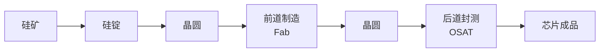
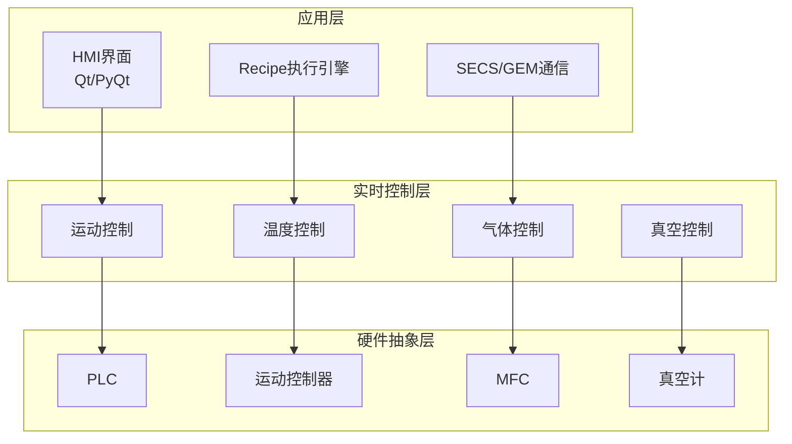
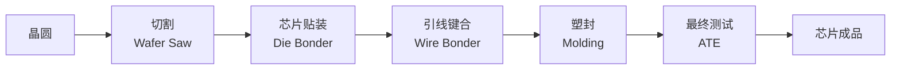
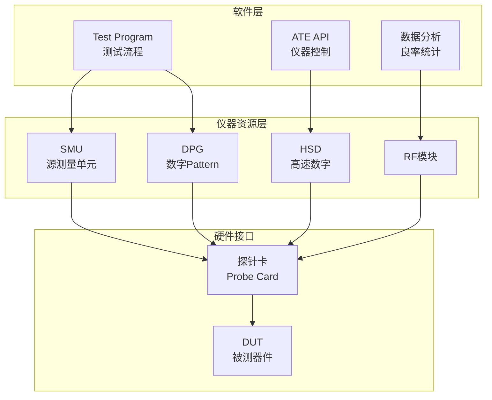
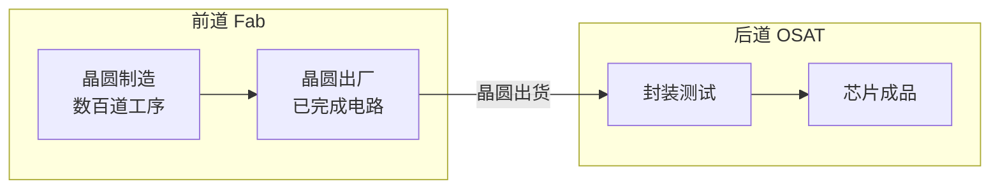
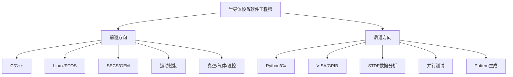

# 0.1.1 前道晶圆制造 vs 后道封测（OSAT）的边界与协同

## 📍 学习目标

- 理解半导体制造的两大核心环节：前道（Front-End）与后道（Back-End）
- 掌握Fab与OSAT在设备、工艺、软件上的本质差异
- 建立"软件工程师视角"的半导体产业链全局观

> [!info] 本节定位
> 这是整个课程的起点。无论你将来是写前道设备控制，还是后道测试系统，都需要先搞清楚：**你在产业链的哪个位置？你的代码最终影响的是哪个环节？**

---

## 🏭 一、半导体制造全景图

半导体芯片从沙子到手机，需要经历数百道工序。整个制造过程可分为两大阶段：

| 阶段 | 名称 | 核心任务 | 典型设备 | 占总成本比例 |
|------|------|----------|----------|-------------|
| **前道** | Front-End + Back-End of Line | 在晶圆上制造电路 | 光刻机、刻蚀机、CVD、PVD | 60-70% |
| **后道** | Assembly & Test | 封装保护、测试筛选 | 引线键合机、塑封机、ATE测试机 | 30-40% |

> **成本视角**：前道是"重资产"环节，一台EUV光刻机1.5亿美元；后道是"重人工"环节，但测试设备也不便宜，一台高端ATE要500万美元。

---

## 🔬 二、前道晶圆制造（Fab）

### 2.1 什么是前道？

前道制造是在**超净环境**中，通过数百道工艺步骤，在硅晶圆上构建晶体管、互连线等微纳结构的过程。

> **环境要求**：前道车间是Class 1~100级洁净室——每立方米空气中≥0.5μm的颗粒不超过100个。一粒灰尘落在晶圆上，就可能报废一个芯片。

> [!tip] 为什么光刻机这么贵？
> 光刻是把电路图案"印"到晶圆上。图案越小（制程越先进），需要的光波长越短（EUV=13.5nm），设备越复杂。ASML的EUV光刻机有10万+零件，需要40个集装箱运输。

**关键特征：**
- 环境要求：Class 1~100级洁净室
- 工艺精度：纳米级（5nm、3nm制程）
- 设备投资：单台EUV光刻机售价超1.5亿美元
- 生产周期：2-3个月/批次（几百道工序）

### 2.2 前道核心工序

| 工序 | 功能 | 代表设备 | 软件关注点 |
|------|------|----------|------------|
| **光刻** | 图案转移 | ASML光刻机 | 运动控制、套刻对准 |
| **刻蚀** | 材料去除 | Lam/KLA刻蚀机 | 等离子体控制、终点检测 |
| **薄膜沉积** | 材料生长 | AMAT CVD/PVD | 气体流量、温度控制 |
| **离子注入** | 掺杂改性 | AMAT注入机 | 束流控制、剂量精度 |
| **CMP** | 平坦化 | CMP设备 | 压力/转速闭环 |
| **清洗** | 去除污染 | 清洗设备 | 溶液浓度、温度控制 |

### 2.3 前道设备软件特点

核心挑战：实时控制 + 硬件强耦合 + 状态机驱动 + SECS/GEM联网

**软件工程师需要关注的：**
1. **实时性**：设备动作必须在毫秒级响应，否则可能损坏晶圆
2. **状态机**：设备有复杂的运行状态（Idle/Setup/Execute/Pause/Abort/Error）
3. **互锁逻辑**：真空没到禁止开阀，温度没到禁止通气——写错一行可能炸设备
4. **联网协议**：所有前道设备必须支持SECS/GEM，否则进不了Fab

---

## 📦 三、后道封测（OSAT）

### 3.1 什么是后道？

后道封测是将前道制造完成的晶圆进行切割、封装、测试，最终形成可使用的芯片成品。

**关键特征：**
- 环境要求：Class 1000~10000级（相对宽松）
- 工艺精度：微米级
- 设备投资：单台ATE测试机约50-500万美元
- 生产周期：数小时~数天

### 3.2 后道核心工序

| 工序 | 功能 | 代表设备 | 软件关注点 |
|------|------|----------|------------|
| **晶圆切割** | 划片分离 | DISCO激光切割机 | 运动控制、视觉对准 |
| **芯片贴装** | 固定芯片 | Die Bonder | 精密运动、拾放控制 |
| **引线键合** | 电气连接 | Wire Bonder | 超声波控制、轨迹规划 |
| **最终测试** | 筛选分Bin | ATE测试机 | 高速测试、并行控制 |

### 3.3 后道ATE测试设备特点

核心挑战：高频高速 + Pattern驱动 + 纳秒级时序 + 海量数据吞吐

> **什么是Pattern？** Pattern是测试向量的集合，用于验证芯片的逻辑功能是否正确。比如测试一个与门，需要输入所有可能的组合（00, 01, 10, 11），检查输出是否符合预期。

---

## 🔄 四、前道与后道的边界与协同

### 4.1 物理边界

### 4.2 软件工程师视角的差异

| 维度 | 前道设备软件 | 后道测试软件 |
|------|-------------|-------------|
| **编程语言** | C/C++为主 | Python/C#为主 |
| **操作系统** | Linux/RTOS | Windows |
| **通信协议** | SECS/GEM | GPIB/VISA |
| **时间要求** | 毫秒级 | 纳秒级 |
| **开发重点** | 状态机、闭环控制 | Pattern、并行测试 |
| **代码规模** | 10万~100万行 | 1万~10万行 |
| **调试方式** | 看设备日志、传感器数据 | 看测试报告、波形图 |

> **全链路追溯**：当一颗芯片在手机里坏了，需要追溯到：1）测试数据（哪道测试FAIL？）；2）工艺数据（哪道工序有问题？）；3）设备数据（哪台设备异常？）；4）批次数据（同批次其他芯片呢？）——这需要前道和后道的数据打通。

---

## 🎯 五、为什么软件工程师要理解这个差异？

1. **职业定位**：明确自己是在Fab写设备控制，还是在OSAT写测试系统
2. **技能储备**：前道偏重实时控制，后道偏重数据处理
3. **通信协议**：SECS/GEM vs GPIB/VISA是两条不同的技术路线
4. **质量意识**：理解芯片从制造到测试的全链路，才能写出可靠的设备软件

**前道方向**：设备控制、运动控制、真空/气体/温控、SECS/GEM
- 技能：C/C++、Linux、RTOS、状态机、PID控制
- 代表公司：ASML、AMAT、Lam、KLA、中微、北方华创

**后道方向**：ATE测试、测试程序开发、数据分析、并行测试
- 技能：Python/C#、VISA/GPIB、STDF、Wafer Map、并行算法
- 代表公司：Teradyne、Advantest、长电科技、通富微电

---

## 📚 参考资料

**知识文章**
- [半导体制造工艺全流程详解 - 知乎专栏](https://zhuanlan.zhihu.com/p/368954913)
- [ATE自动测试设备原理与应用 - CSDN博客](https://blog.csdn.net/qq_37555391/article/details/120881610)
- [SECS/GEM通信协议入门 - CSDN博客](https://blog.csdn.net/weixin_42583445/article/details/108881692)
- [半导体设备概览 - 电子发烧友](https://www.elecfans.com/tags/半导体)
- [芯片制造流程图文详解 - 微信公众号](https://mp.weixin.qq.com/s/半导体制造)

**行业标准**
- [SEMI - 半导体设备与材料国际组织](https://www.semi.org)

**前道设备厂商**
- [Lam Research - 刻蚀与薄膜沉积设备](https://www.lamresearch.com/)
- [KLA - 检测与量测设备](https://www.kla.com/)

**后道测试设备厂商**
- [Teradyne - ATE自动测试设备](https://www.teradyne.com/)
- [Advantest - 半导体测试设备](https://www.advantest.com/)

**封测设备厂商**
- [DISCO - 晶圆切割与研磨设备](https://www.disco.co.jp/en/)

---

## 📖 专有名词

| 名词 | 解释 |
|------|------|
| **Fab** | 晶圆制造工厂（Fabrication），前道制造的核心场所 |
| **OSAT** | 外包封装测试厂商（Outsourced Semiconductor Assembly and Test） |
| **FEOL** | 前道工序（Front-End of Line），晶体管形成阶段 |
| **BEOL** | 后道工序（Back-End of Line），互连线形成阶段 |
| **WIP** | 在制品（Work In Progress），正在生产线上加工的晶圆数量 |
| **ATE** | 自动测试设备（Automatic Test Equipment），后道测试核心设备 |
| **SECS/GEM** | 半导体设备通信标准/通用设备模型，前道设备联网协议 |
| **VISA** | 虚拟仪器软件架构（Virtual Instrument Software Architecture），仪器控制标准 |
| **GPIB** | 通用接口总线（General Purpose Interface Bus），IEEE-488标准 |
| **MFC** | 质量流量控制器（Mass Flow Controller），气体流量控制设备 |
| **SMU** | 源测量单元（Source Measure Unit），ATE中的核心测试资源 |
| **Die** | 芯片颗粒，晶圆切割后的单个芯片 |
| **Bin** | 分类，测试后根据结果将芯片分为不同等级 |
| **Probe Card** | 探针卡，ATE与被测器件之间的物理接口 |
| **DUT** | 被测器件（Device Under Test），测试对象 |
| **CMP** | 化学机械抛光（Chemical Mechanical Planarization），晶圆平坦化工艺 |
| **EUV** | 极紫外光刻（Extreme Ultraviolet Lithography），先进制程光刻技术 |
| **OEE** | 设备综合效率（Overall Equipment Effectiveness），设备利用率指标 |

---

## 🔗 相关章节

- 上一节：[[目录|回到目录]]
- 下一节：[[阶段0-0.1.2 OEM与Fab软件工程师职责差异|0.1.2 OEM与Fab软件工程师职责差异]]
